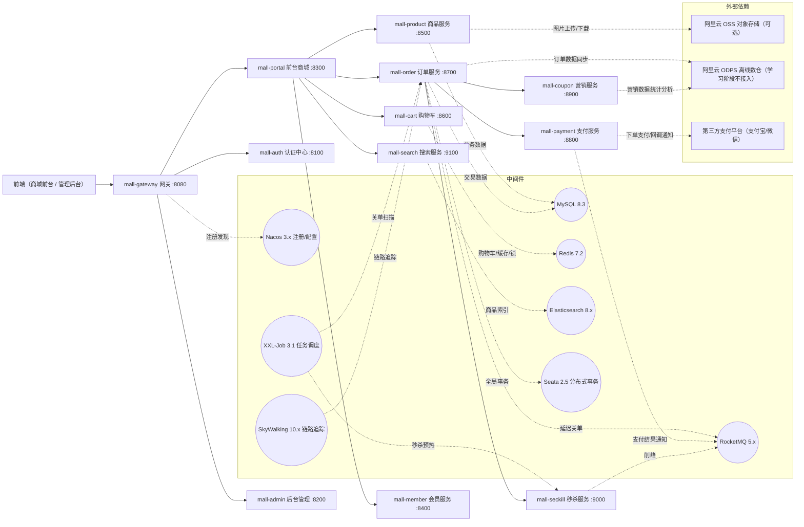
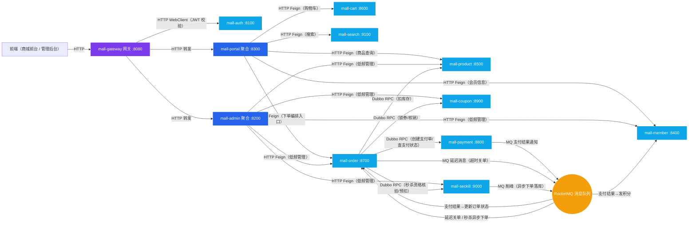
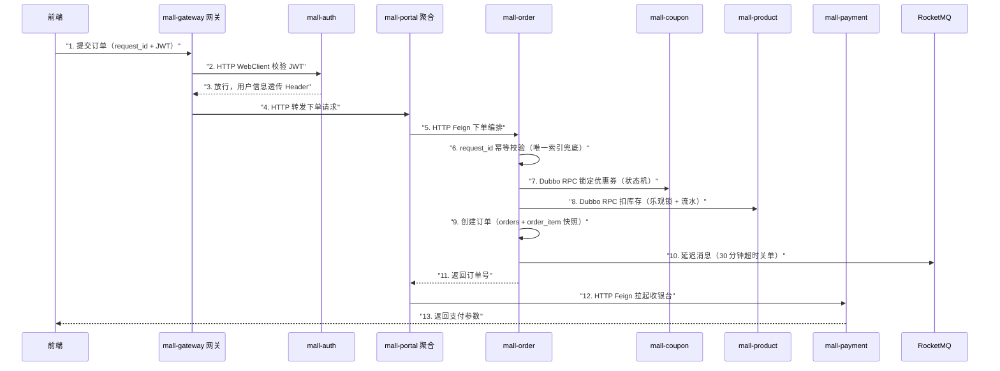

# mall-practice

电商商城实战项目，覆盖微服务、分布式事务、消息队列、缓存、搜索、任务调度、链路追踪等电商核心技术。单仓库多模块 Maven 工程，支持本地一键启动与 Docker 独立镜像部署。

> **开发运行环境：Windows 10**
> 本文所有安装方式、命令、端口配置均基于 Windows 10（Docker Desktop 使用 Hyper-V 后端；Docker Desktop 在 Windows 上支持 WSL2 / Hyper-V 两种后端，任选其一即可，其余内容通用）。

## 目录

### 技术篇

- [快速开始](#快速开始)
- [环境准备详解（选读）](#环境准备详解选读)
- [端口规划总表](#端口规划总表)
- [系统架构（架构图汇总）](#系统架构架构图汇总)
- [技术栈](#技术栈)
- [工程结构（模块架构）](#工程结构模块架构)
- [服务间通信](#服务间通信)
- [分布式事务策略](#分布式事务策略)
- [搭建踩坑记录（均已修复，供避坑参考）](#搭建踩坑记录均已修复供避坑参考)
- [常见问题（FAQ）](#常见问题faq)

### 业务篇

- [业务表设计总览](#业务表设计总览)
- [电商面试场景清单](#电商面试场景清单)

## 快速开始

> 第一次接触本项目？按下面 **5 个步骤**顺序操作即可把整套系统跑起来。环境安装的完整版本说明在随后的「环境准备详解」，按需查阅。

### 第 1 步：安装基础环境（一次性）

本机必须安装 2 样（JDK + Maven），另外 2 项按需决定（Docker Desktop 强烈推荐、云服务可选）：

| 组件 | 版本 | 是否必须 | 说明 |
|---|---|---|---|
| JDK | 17 | 必须 | IDEA 编译、Maven 打包、断点调试都直接调用本机 JDK，Docker 无法替代 |
| Maven | 3.9.x（推荐 3.9.16） | 必须 | IDEA 自带 Bundled 3.9.x 可直接选用，或独立安装 3.9.16（最低 3.6.3） |
| Docker Desktop | 最新版 | 非必须（强烈推荐） | 中间件一键部署 + `--scale` 多实例模拟；Hyper-V 后端，内存建议分配 8GB |
| 阿里云 OSS / ODPS | 云服务 | 非必须（可选，可后补） | 商品图片对象存储 / 离线数仓，学习阶段可不接入 |

> 8 个中间件（MySQL / Redis / Nacos / RocketMQ / Seata / Elasticsearch / XXL-Job / SkyWalking）不用本机安装：**装了 Docker Desktop 由第 3 步 `docker compose up -d` 一键启动；没装 Docker 则需自行下载 8 个中间件的 Windows 版本逐个安装配置**（均有 Windows 版，但较繁琐，且无法模拟多实例部署）。本机已安装哪个服务，记得从 docker-compose.yml 删除对应的服务段（避免端口冲突，规则详见「环境准备详解」）。
>
> OSS 未接入时商品图片走本地文件存储，功能照常可用；ODPS 学习阶段不建议接入——两者均可跳过（详见「环境准备详解」）。

### 第 2 步：初始化数据库（必须）

仓库 `sql/` 目录有两个初始化脚本，**必须先执行**（XXL-Job 依赖 `xxl_job` 库，不执行则 xxl-job 容器起不来）：

```powershell
# 使用容器版 MySQL：先单独拉起 MySQL 容器（本机已装 MySQL 则跳过本行，直接在本机客户端执行两个 sql 文件）
docker compose up -d mysql

# 导入 xxl_job 库（XXL-Job 调度中心表，3.1.0 版）
Get-Content .\sql\xxl_job.sql -Raw -Encoding UTF8 | docker exec -i mall-mysql mysql -uroot -p123456

# 导入 mall 业务库（第三版：25 张表，详见业务篇「业务表设计总览」）
Get-Content .\sql\mall.sql -Raw -Encoding UTF8 | docker exec -i mall-mysql mysql -uroot -p123456
```

> 账号说明：MySQL root/123456、Redis 123456、XXL-Job 控制台 root/123456——以上均为作者本地环境账密，不是通用默认值，请按各自环境修改：MySQL 账号变更需同步修改 `docker-compose.yml` 中 xxl-job 的 `spring.datasource.username/password`；Redis 密码变更需同步修改各模块 application.yml 的 redis.password。
>
> 两个脚本均为一次性初始化脚本（建表语句不带 IF NOT EXISTS），重复执行会报"表已存在"，属正常现象，可忽略。

### 第 3 步：启动中间件

启动前准备（其余中间件开箱即用）：

1. **按需删除**：docker-compose.yml 为完整版，本机已安装哪个服务就删除对应的服务段（如已装 MySQL/Redis 则删除 mysql/redis 段）；若改用本机 MySQL，xxl-job 的连接地址需从 `mysql:3306` 改回 `host.docker.internal:3306`
2. **镜像无需手动下载**：`docker compose up -d` 会自动拉取（约 3GB）；网络较慢可先执行 `docker compose pull` 预拉取

```bash
docker compose up -d
```

验证（均为浏览器访问）：

- Nacos 控制台：http://localhost:8849/
- XXL-Job 控制台：http://localhost:9080/xxl-job-admin
- SkyWalking UI：http://localhost:9090
- RocketMQ Dashboard：http://localhost:9081

**中间件运维常用命令**（Docker 容器版中间件的日常启停/排查）：

```bash
docker compose ps                            # 查看全部容器状态
docker compose up -d                         # 启动全部中间件（已运行的自动跳过）
docker compose up -d redis nacos             # 只启动指定服务
docker compose restart mysql                 # 重启指定服务
docker compose logs -f nacos                 # 跟踪某服务日志
docker compose stop seckill                  # 停止某服务（不删容器）
docker compose down                          # 停止并删除全部容器（数据在宿主机卷 H:\docker-db 不丢）
docker compose up -d --force-recreate nacos  # 修改 yaml 后强制重建某服务
```

### 第 4 步：启动微服务

#### IDEA 一键启动全部（推荐）

1. **为 12 个服务各建一个 Spring Boot 运行配置**：`Edit Configurations → + → Spring Boot`，按下方对照表逐个选择各模块的启动类，名称填模块名（mall-auth、mall-admin……），共 12 个
2. **创建复合配置（Compound）**：`Edit Configurations → + → Compound`，命名如 `mall-all`，把上一步的 12 个配置全部勾选加入
3. **一键启动**：之后每次点 `mall-all` 即并行拉起全部服务；单独调试某服务时，直接运行它自己的配置即可

| 模块 | 启动类（main class） |
|---|---|
| mall-gateway | MallGatewayApplication |
| mall-auth | MallAuthApplication |
| mall-admin | MallAdminApplication |
| mall-portal | MallPortalApplication |
| mall-member | MallMemberApplication |
| mall-product | MallProductApplication |
| mall-cart | MallCartApplication |
| mall-order | MallOrderApplication |
| mall-payment | MallPaymentApplication |
| mall-coupon | MallCouponApplication |
| mall-seckill | MallSeckillApplication |
| mall-search | MallSearchApplication |

#### 命令行方式（备选）

```powershell
# 首次或基础模块有改动时，先把 4 个基础模块安装到本地仓库
mvn install -DskipTests

# 单独启动某个服务（根目录执行，以 mall-product 为例）
mvn -pl mall-product spring-boot:run

# 全部启动：每个服务开一个窗口（PowerShell 脚本）
$services = 'mall-gateway','mall-auth','mall-admin','mall-portal','mall-member','mall-product','mall-cart','mall-order','mall-payment','mall-coupon','mall-seckill','mall-search'
foreach ($s in $services) { Start-Process mvn -ArgumentList "-pl",$s,"spring-boot:run" }
```

> 资源提醒：12 个 JVM 约占用 4~6GB 内存；机器吃紧可分组勾选（未启动的服务不影响其他服务运行）。
>
> **模块可任意单独启动**：服务间调用发生在运行时，启动时只依赖中间件（Nacos/MySQL/Redis 等）。无微服务依赖的模块（product/cart/auth/member/search）单独启动即可用；聚合层模块（portal/admin/order 等）单独启动正常，仅在调用缺失的下游服务时对应功能不可用。

### 第 5 步：验证

- 网关接口访问：http://localhost:8080
- 接口文档：各服务 `http://localhost:{端口}/doc.html`
- Nacos 服务列表应看到全部已启动服务

### （进阶）Docker 独立部署（规划中，待业务代码完成后补充）

本地稳定后，每个模块独立打包镜像部署（模块 Dockerfile 与 compose 微服务段随业务代码开发阶段补充，当前 docker-compose.yml 仅含中间件编排）：

```bash
# 注意：当前 compose 仅含中间件，微服务镜像构建需先补齐各模块 Dockerfile 与 compose 服务段
mvn package -DskipTests
docker compose up -d --build          # 全量部署
docker compose up -d --scale mall-order=3   # 订单服务 3 副本
docker compose up -d --scale mall-gateway=2 # 网关 2 副本
```

- 每个模块独立 `Dockerfile`（基础镜像 `eclipse-temurin:17-jre`）
- 全部容器加入同一 bridge 网络（如 `mall-net`），服务间用容器名互访
- 容器内访问宿主机中间件（MySQL/Redis）使用 `host.docker.internal`

## 环境准备详解（选读）

> 「快速开始」第 1 步已覆盖最小安装集；本节能回答"为什么"，并提供完整版本表与可选组件说明。

### 必须安装

| 组件 | 版本 | 安装方式 |
|---|---|---|
| JDK | 17 | 必须本机安装（见下方说明） |
| Maven | 3.9.x（推荐 3.9.16） | 必须本机安装：IDEA 自带 Bundled 3.9.x 可直接选用，或独立安装 3.9.16（最低要求 3.6.3，见下方说明） |
| MySQL | 8.3 | 本机安装 或 Docker 容器版（二选一） |
| Redis | 7.2 | 本机安装 或 Docker 容器版（二选一） |
| Nacos | 3.x | 本机安装 或 `docker compose up -d` 容器版（二选一） |
| RocketMQ | 5.x | 本机安装 或 `docker compose up -d` 容器版（二选一） |
| Seata | 2.x | 本机安装 或 `docker compose up -d` 容器版（二选一） |
| Elasticsearch | 8.x | 本机安装 或 `docker compose up -d` 容器版（二选一） |
| XXL-Job | 3.x | 本机安装 或 `docker compose up -d` 容器版（二选一） |
| SkyWalking | 10.x | 本机安装 或 `docker compose up -d` 容器版（二选一） |

> **JDK 为什么必须本机安装**：IDEA 编译、Maven 打包、单元测试、断点调试都直接调用本机 JDK，Docker 无法替代开发工具链；Docker 中的 `eclipse-temurin:17-jre` 镜像只承载部署期的运行环境。
>
> **Maven 版本要求**：最低 3.6.3（3.6.0 无法运行新版 maven-compiler-plugin，详见“搭建踩坑记录”）。建议直接用 IDEA 自带 Bundled Maven（3.9.x），或独立安装 3.9.16（当前 3.9 线最新正式版）并配置到 IDEA / PATH；暂不推荐 3.10.x / 4.0（均处 RC 阶段，官方标注不建议正式使用）。
>
> **中间件 8 个组件的安装方式**：本机安装（Windows 版）与 Docker 容器版二选一。推荐 Docker——一条命令、版本统一、免手工配置。
>
> **按需删除规则**：本机已安装哪个服务，就从 docker-compose.yml 删除对应的服务段（避免端口冲突）。仓库中的该文件为完整版（含全部 8 个组件的容器定义），按本机情况删除后即可使用。

### 强烈推荐：Docker Desktop

| 组件 | 版本 | 安装方式 |
|---|---|---|
| Docker Desktop | 最新版 | [Docker Desktop for Windows](https://www.docker.com/products/docker-desktop/)（Hyper-V 后端，需在 BIOS/系统功能中开启虚拟化），验证 `docker --version` |

> 微服务本身不依赖 Docker（IDEA 直跑即可），但 Docker 承担两件事：
> 1. **中间件一键部署**：MySQL/Redis/Nacos/RocketMQ/Seata/ES/XXL-Job/SkyWalking 共 8 个组件通过 `docker compose up -d` 一条命令启动，无需逐个手动安装（本机已装的可从 yaml 删除对应段）
> 2. **镜像化与多实例**：微服务独立打包镜像、`--scale` 模拟多实例部署（学习分布式负载均衡的关键手段）
>
> 不装 Docker 的代价：8 个组件需手动下载 Windows 版本逐个安装配置（均有 Windows 版，但较繁琐），且无法模拟多实例部署；微服务开发调试不受影响。

### 可选安装（云服务，可后补）

| 组件 | 用途 | 说明 |
|---|---|---|
| 阿里云 OSS | 对象存储（商品图片上传） | 需开通 OSS 并配置 AK/SK；按量付费，学习用量每月几分钱（新用户有免费额度）。**零成本降级**：代码默认本地文件存储实现，未开通 OSS 时功能照常可用，开通后切换配置即可 |
| 阿里云 ODPS | 离线数仓 | 按量付费，学习阶段不建议接入（数据量小无意义）；仅保留为大数据量演进方向，本项目不实现 |

### 中间件（docker-compose 一键启动）

编排文件位于仓库根目录 `docker-compose.yml`。以下中间件无需手动安装，`docker compose up -d` 会自动拉取镜像并部署（首次约 3GB，无需手动 pull）：

| 中间件 | 端口 | 用途 |
|---|---|---|
| MySQL 8.3 | 3306 | 核心交易数据（作者本地账密 root/123456，数据持久化到 H:\docker-db\mysql） |
| Redis 7.2 | 6379 | 缓存/购物车/秒杀预扣库存（作者本地账密 123456，AOF 持久化到 H:\docker-db\redis） |
| Nacos 3.x | 8848 / 9848（控制台 8849） | 注册中心 + 配置中心 |
| RocketMQ 5.x | 9876 / 10909 / 10911（Dashboard 9081） | 消息队列 |
| Seata 2.x | 7091 / 8091 | 分布式事务 |
| Elasticsearch 8.x | 9200 | 商品搜索 |
| XXL-Job 3.x | 9080 | 任务调度 |
| SkyWalking 10.x | 11800 / 12800（UI 9090） | 链路追踪 |

> **客户端依赖 vs 服务端**：以上中间件均分为两部分，缺一不可：
> - **客户端**：pom 依赖形式引入代码（如 nacos-discovery starter、rocketmq-spring-boot-starter、seata starter、ES Java Client、xxl-job-core 执行器）；SkyWalking 特殊——agent 是 JVM 参数挂载的 jar，连 pom 依赖都不是
> - **服务端**：独立运行的进程，必须本地安装/启动，即 docker-compose 部署的部分
>
> 类比 MySQL：`mysql-connector-j` 是依赖，MySQL 服务器是独立服务。代码里光有客户端依赖、没有服务端进程是连不上的。

<details>
<summary>点击展开 docker-compose.yml 完整内容</summary>

```yaml
# ============================================================
# mall-practice 中间件编排文件（完整版）
# 使用方式：docker compose up -d
# 按需删除规则：本机已安装哪个服务（如 MySQL/Redis），就删除下方对应的服务段，避免端口冲突
# 首次执行会自动拉取镜像（共约 3GB，建议先配置国内镜像加速器）
#
# ---------- 连接本机数据库 vs Docker 容器数据库的区别 ----------
# 本机已装 MySQL/Redis（从 yaml 删除 mysql/redis 段）：容器内应用访问宿主机数据库
#   必须使用 host.docker.internal（Docker Desktop 专用域名，指向宿主机），如：
#   jdbc:mysql://host.docker.internal:3306/xxl_job
# 未装 MySQL/Redis（保留容器版）：容器与应用同处一个 compose 网络
#   直接用服务名互访（Compose 网络内置 DNS），如：jdbc:mysql://mysql:3306/xxl_job
#   注意：启用容器版 MySQL 时，需同步将下方 xxl-job 的 PARAMS 改为 mysql:3306
# ============================================================

services:
  # ---------- 注册中心 + 配置中心 ----------
  nacos:
    image: nacos/nacos-server:v3.0.0
    container_name: mall-nacos
    environment:
      - MODE=standalone
      - NACOS_AUTH_ENABLE=false   # 学习环境关闭鉴权；但 3.x 启动脚本强制要求下面三个变量非空
      - NACOS_AUTH_TOKEN=SecretKey012345678901234567890123456789012345678901234567890123456789
      - NACOS_AUTH_IDENTITY_KEY=serverIdentity
      - NACOS_AUTH_IDENTITY_VALUE=security
      - JVM_XMS=256m
      - JVM_XMX=256m
      - JVM_XMN=128m
    ports:
      - "8848:8848"   # 服务端 HTTP API
      - "8849:8080"   # Nacos 3.x 控制台 UI（拆分为独立 8080 端口，映射到宿主机 8849）
      - "9848:9848"   # gRPC（客户端注册）
    restart: unless-stopped

  # ---------- 消息队列 ----------
  rocketmq-namesrv:
    image: apache/rocketmq:5.3.2
    container_name: mall-rocketmq-namesrv
    environment:
      - JAVA_OPT_EXT=-Xms256m -Xmx256m -Xmn128m
    ports:
      - "9876:9876"
    command: sh mqnamesrv
    restart: unless-stopped

  rocketmq-broker:
    image: apache/rocketmq:5.3.2
    container_name: mall-rocketmq-broker
    depends_on:
      - rocketmq-namesrv
    environment:
      - JAVA_OPT_EXT=-Xms512m -Xmx512m -Xmn256m
    ports:
      - "10909:10909"  # VIP 通道
      - "10911:10911"  # 客户端连接端口
    volumes:
      # brokerIP1=127.0.0.1 保证宿主机客户端经端口映射可达 Broker
      - ./docker/rocketmq/broker.conf:/home/rocketmq/rocketmq-5.3.2/conf/broker.conf
    command: sh mqbroker -c /home/rocketmq/rocketmq-5.3.2/conf/broker.conf
    restart: unless-stopped

  rocketmq-dashboard:
    image: apacherocketmq/rocketmq-dashboard:latest
    container_name: mall-rocketmq-dashboard
    depends_on:
      - rocketmq-namesrv
    environment:
      - JAVA_OPTS=-Drocketmq.namesrv.addr=rocketmq-namesrv:9876 -Dserver.port=8080 -Xms256m -Xmx256m
    ports:
      - "9081:8080"   # http://localhost:9081
    restart: unless-stopped

  # ---------- 分布式事务 ----------
  seata:
    image: apache/seata-server:2.5.0   # 与 SCA（Spring Cloud Alibaba 简写）2025.1.0.0 管理的客户端版本对齐
    container_name: mall-seata
    environment:
      - SEATA_IP=127.0.0.1
      - SEATA_PORT=8091
      - STORE_MODE=file   # 学习环境用文件存储，生产建议 DB
      - JVM_XMS=256m
      - JVM_XMX=256m
    ports:
      - "7091:7091"
      - "8091:8091"       # 事务 RPC 端口（客户端配置指向 127.0.0.1:8091）
    restart: unless-stopped

  # ---------- 搜索 ----------
  elasticsearch:
    image: docker.elastic.co/elasticsearch/elasticsearch:8.17.0
    container_name: mall-elasticsearch
    environment:
      - discovery.type=single-node
      - xpack.security.enabled=false   # 学习环境关闭安全认证（生产勿关）
      - ES_JAVA_OPTS=-Xms512m -Xmx512m
    ports:
      - "9200:9200"
    restart: unless-stopped

  # ---------- 任务调度 ----------
  # 注意：启动前需在 MySQL 创建 xxl_job 库并导入仓库 sql/xxl_job.sql（3.1.0 版表结构），
  # 并将下方 spring.datasource.username/password 改为你的 MySQL 账号密码（当前为 root/123456，作者本地账密）。
  # 连接地址：当前使用容器版 MySQL（mysql:3306）；若改回本机 MySQL 则换回 host.docker.internal:3306。
  xxl-job:
    image: xuxueli/xxl-job-admin:3.1.0   # 3.x 基于 JDK17，与项目技术栈对齐（表结构用 sql/xxl_job.sql 3.1.0 版）
    container_name: mall-xxl-job
    depends_on:
      - mysql
    environment:
      - JAVA_OPTS=-Xms256m -Xmx256m
      - PARAMS=--spring.datasource.url=jdbc:mysql://mysql:3306/xxl_job?useUnicode=true&characterEncoding=UTF-8&autoReconnect=true&serverTimezone=Asia/Shanghai&useSSL=false&allowPublicKeyRetrieval=true --spring.datasource.username=root --spring.datasource.password=123456 --server.port=8080
    ports:
      - "9080:8080"   # 控制台 http://localhost:9080/xxl-job-admin
    restart: unless-stopped

  # ---------- 链路追踪 ----------
  skywalking-oap:
    image: apache/skywalking-oap-server:10.1.0
    container_name: mall-skywalking-oap
    environment:
      - SW_HEAP=512m
      - SW_STORAGE=h2        # 学习环境用 H2 存储，生产建议 ES
    ports:
      - "11800:11800"  # gRPC（agent 上报）
      - "12800:12800"  # HTTP（UI 查询）
    restart: unless-stopped

  skywalking-ui:
    image: apache/skywalking-ui:10.1.0
    container_name: mall-skywalking-ui
    depends_on:
      - skywalking-oap
    environment:
      - SW_OAP_ADDRESS=http://skywalking-oap:12800
    ports:
      - "9090:8080"    # http://localhost:9090
    restart: unless-stopped

  # ---------- MySQL / Redis（容器版；若改用本机安装则删除对应服务段） ----------
  # 数据通过 bind mount 持久化到宿主机 H:\docker-db 下的各自目录
  mysql:
    image: mysql:8.3
    container_name: mall-mysql
    environment:
      - MYSQL_ROOT_PASSWORD=123456   # 作者本地账密
    ports:
      - "3306:3306"
    volumes:
      - H:/docker-db/mysql:/var/lib/mysql   # 宿主机目录 H:\docker-db\mysql
    restart: unless-stopped

  redis:
    image: redis:7.2
    container_name: mall-redis
    command: redis-server --appendonly yes --requirepass 123456   # 开启 AOF 持久化 + 访问密码（作者本地账密；需与各模块 application.yml 的 redis.password 一致）
    ports:
      - "6379:6379"
    volumes:
      - H:/docker-db/redis:/data             # 宿主机目录 H:\docker-db\redis
    restart: unless-stopped
```

</details>

> **按需删除规则**：仓库中的 `docker-compose.yml` 为完整版（含全部 8 个组件的容器定义）。本机已安装哪个服务，就删除对应的服务段，避免端口冲突。例如本机已装 MySQL/Redis，则删除文件末尾的 `mysql`、`redis` 两段；若改用本机 MySQL，需将 xxl-job 的连接地址 `mysql:3306` 改回 `host.docker.internal:3306`。


## 端口规划总表

### 微服务

| 模块 | HTTP 端口 | Dubbo 端口（本地，预留） | 容器内端口（Docker 部署） |
|---|---|---|---|
| mall-gateway | 8080 | - | 8080 |
| mall-auth | 8100 | 20881 | 8080 |
| mall-admin | 8200 | 20882 | 8080 |
| mall-portal | 8300 | 20883 | 8080 |
| mall-member | 8400 | 20884 | 8080 |
| mall-product | 8500 | 20885 | 8080 |
| mall-cart | 8600 | 20886 | 8080 |
| mall-order | 8700 | 20887 | 8080 |
| mall-payment | 8800 | 20888 | 8080 |
| mall-coupon | 8900 | 20889 | 8080 |
| mall-seckill | 9000 | 20890 | 8080 |
| mall-search | 9100 | 20891 | 8080 |

### 中间件

| 中间件 | 端口 |
|---|---|
| MySQL（本机复用或容器版） | 3306 |
| Redis（本机复用或容器版） | 6379 |
| Nacos | 8848 / 9848（控制台 8849） |
| RocketMQ | 9876 / 10909 / 10911（Dashboard 9081） |
| Seata | 7091 / 8091 |
| Elasticsearch | 9200 |
| XXL-Job | 9080 |
| SkyWalking | 11800 / 12800（UI 9090） |

端口规则：

- **本地直跑**：各服务 HTTP/Dubbo 端口均不同，互不冲突（同一宿主机进程共享端口空间）；Dubbo 端口仅核心链路服务启用（product/order/payment/coupon/seckill），其余为预留
- **Docker 单机部署**：每个容器独立网络命名空间，容器内统一 8080 互不影响；仅宿主机映射端口需唯一
- **多实例/多主机**：容器内端口可全部相同；`docker compose up -d --scale mall-order=3` 即可模拟多实例，Nacos 控制台可见同名多实例自动负载均衡

## 系统架构（架构图汇总）

> 本章汇总 5 张架构图，按编号连读即完整架构视图：系统拓扑 → 调用协议 → 核心链路时序 → 工程结构 → 模块依赖。
> Mermaid 图渲染提示：GitHub 网页可直接渲染成图；IDEA 默认不渲染 Mermaid，需先安装 Mermaid 插件（Settings → Plugins → Marketplace 搜 Mermaid，安装后重启 IDEA，再打开 Preview/Split 面板）；编辑器源码视图中看到的是代码文本，属正常现象。

### 1. 系统架构图（整体拓扑）



- 所有请求经 `mall-gateway` 统一入口，网关过滤器调用 `mall-auth` 校验 JWT 后转发到业务服务
- `mall-portal` / `mall-admin` 为聚合层，服务间通过 Nacos 注册发现
- 支付链路：`mall-payment` 对接第三方支付平台（支付宝/微信），完成下单支付与回调通知
- OSS / ODPS 为阿里云公网服务，虚线表示外部依赖（均按需开通，详见"可选安装"）
- 中间件连线为代表性画法：MySQL 连 auth/member/product/order/payment/coupon/seckill 共 7 个业务服务；Redis 供全部业务服务使用（缓存/锁/购物车）；Nacos 注册发现与 SkyWalking 链路追踪覆盖全部 12 服务；admin 对下游的管理调用见下图 2

### 2. 应用调用链路图（服务间调用方式：HTTP / Dubbo RPC / MQ）

> 一眼看清每个服务间调用用的什么协议：核心链路走 Dubbo RPC（扣库存/锁券/支付/秒杀），边缘链路走 HTTP Feign（查询/管理/聚合），异步场景走 RocketMQ。



- **调用规则**：聚合层（portal/admin）与网关全部走 HTTP；order 作为核心链路发起方对下游（product/coupon/payment/seckill）走 Dubbo RPC；支付结果通知、超时关单、秒杀削峰走 RocketMQ 异步（消费方：order 更新状态/关单/落库，member 发积分）
- **演进路线**：第一阶段全 Feign 打通链路，第二阶段将 order → product/payment/coupon/seckill 切换 Dubbo 3 压测对比（详见「服务间通信」）

### 3. 核心业务链路时序图（下单主链路：覆盖 HTTP / Dubbo RPC / MQ 三种协议）

> 对照业务篇「核心业务链路」文字版阅读；支付回调、超时关单、退款、秒杀链路都是本图主链路的变体（详见各面试场景小节）。



- 步骤 6~9 处于 Seata AT 全局事务范围（详见「分布式事务策略」）；步骤 10 的延迟消息超时未支付则触发关单：回补库存 + 退回优惠券
- 步骤 1~4 即「登录后进商城还是后台」的答案：入口天然分离（商城/后台是不同站点与路由前缀），登录后网关按 JWT 角色 + 路径前缀分流，不存在登录后二选一

### 4. 工程结构图（16 模块分组树）

> 模块职责明细见「工程结构」章节速查表；谁依赖谁见下图 5。

```mermaid
graph TB
    ROOT["mall-practice（Maven 聚合工程，16 模块）"]
    ROOT --> BASE["基础 / 契约模块（4 个）"]
    ROOT --> SVC["服务模块（12 个）"]
    ROOT --> CFG["工程配置（非 Maven 模块）"]

    BASE --> COMMON["mall-common<br/>统一返回 / 异常 / 工具 / Redis<br/>（MQ / 存储封装待引入）"]
    BASE --> MBG["mall-mbg<br/>实体 / Mapper 生成"]
    BASE --> API["mall-api<br/>Feign 接口契约"]
    BASE --> DUBBOAPI["mall-dubbo-api<br/>Dubbo 接口契约"]

    SVC --> GW["mall-gateway 网关 :8080"]
    SVC --> AUTH["mall-auth 认证中心 :8100"]
    SVC --> ADMIN["mall-admin 后台管理 :8200"]
    SVC --> PORTAL["mall-portal 前台商城 :8300"]
    SVC --> MEMBER["mall-member 会员服务 :8400"]
    SVC --> PRODUCT["mall-product 商品服务 :8500"]
    SVC --> CART["mall-cart 购物车服务 :8600"]
    SVC --> ORDER["mall-order 订单服务 :8700"]
    SVC --> PAY["mall-payment 支付服务 :8800"]
    SVC --> COUPON["mall-coupon 营销服务 :8900"]
    SVC --> SECKILL["mall-seckill 秒杀服务 :9000"]
    SVC --> SEARCH["mall-search 搜索服务 :9100"]

    CFG --> SQLDIR["sql/<br/>mall.sql（25 张表）<br/>xxl_job.sql（调度中心库）"]
    CFG --> DOCKERDIR["docker/ + docker-compose.yml<br/>8 个中间件一键编排"]

    classDef root fill:#1e293b,stroke:none,color:#fff
    classDef base fill:#059669,stroke:none,color:#fff
    classDef svc fill:#0ea5e9,stroke:none,color:#fff
    classDef cfg fill:#64748b,stroke:none,color:#fff
    class ROOT root
    class COMMON,MBG,API,DUBBOAPI base
    class GW,AUTH,ADMIN,PORTAL,MEMBER,PRODUCT,CART,ORDER,PAY,COUPON,SECKILL,SEARCH svc
    class SQLDIR,DOCKERDIR cfg
```



### 5. 模块依赖关系图（编译期 vs 运行时）

**核心规则：服务模块之间互不依赖，A 服务不能 import B 服务的类**（微服务与单体架构的分水岭）。跨服务协作只能走两层：

1. **编译期**：依赖基础模块共享类（当前唯一的是 mall-common；将来还有 mall-mbg 实体、mall-api/mall-dubbo-api 接口契约）
2. **运行时**：HTTP / Dubbo RPC / MQ 调用（调用协议见上图 2）

契约消费模式：调用方依赖 mall-api 拿到 Feign 接口 → 运行时经 Nacos 找到提供方实例发起 HTTP 调用；提供方实现同款接口（契约定义在 mall-api，双方共享类）。

```mermaid
graph TB
    COMMON["mall-common<br/>统一返回 / 全局异常 / Redis 工具"]

    subgraph 服务模块
        GW["mall-gateway"]
        AUTH["mall-auth"]
        ADMIN["mall-admin"]
        PORTAL["mall-portal"]
        MEMBER["mall-member"]
        PRODUCT["mall-product"]
        CART["mall-cart"]
        COUPON["mall-coupon"]
        ORDER["mall-order"]
        PAY["mall-payment"]
        SECKILL["mall-seckill"]
        SEARCH["mall-search"]
    end

    MBG["mall-mbg<br/>实体 / Mapper 生成"]
    API["mall-api<br/>Feign 接口契约"]
    DUBBOAPI["mall-dubbo-api<br/>Dubbo 接口契约"]

    AUTH --> COMMON
    ADMIN --> COMMON
    PORTAL --> COMMON
    MEMBER --> COMMON
    PRODUCT --> COMMON
    CART --> COMMON
    COUPON --> COMMON
    ORDER --> COMMON
    PAY --> COMMON
    SECKILL --> COMMON
    SEARCH --> COMMON

    PORTAL -.->|调用契约 待引入| API
    ADMIN -.->|调用契约 待引入| API
    ORDER -.->|调用+实现 待引入| API
    PRODUCT -.->|实现契约 待引入| API
    CART -.->|实现契约 待引入| API
    SEARCH -.->|实现契约 待引入| API
    MEMBER -.->|实现契约 待引入| API
    COUPON -.->|实现契约 待引入| API
    SECKILL -.->|实现契约 待引入| API
    PAY -.->|实现契约 待引入| API
    ORDER -.->|调用 第三阶段| DUBBOAPI
    PRODUCT -.->|实现 第三阶段| DUBBOAPI
    COUPON -.->|实现 第三阶段| DUBBOAPI
    PAY -.->|实现 第三阶段| DUBBOAPI
    SECKILL -.->|实现 第三阶段| DUBBOAPI
    AUTH -.->|实体待引入| MBG
    MEMBER -.->|实体待引入| MBG
    PRODUCT -.->|实体待引入| MBG
    COUPON -.->|实体待引入| MBG
    ORDER -.->|实体待引入| MBG
    PAY -.->|实体待引入| MBG
    SECKILL -.->|实体待引入| MBG

    classDef base fill:#059669,stroke:none,color:#fff
    classDef svc fill:#0ea5e9,stroke:none,color:#fff
    class COMMON,MBG,API,DUBBOAPI base
    class GW,AUTH,ADMIN,PORTAL,MEMBER,PRODUCT,CART,COUPON,ORDER,PAY,SECKILL,SEARCH svc
```



- **实线**：当前编译期依赖（代码里可直接 import 对方的类）；**虚线**：规划中待引入的依赖（写对应模块代码时加）
- mall-gateway 零依赖（图中无任何边，属正常）：网关是 WebFlux 反应式栈，mall-common 含 web 注解不兼容
- mall-cart（纯 Redis）/ mall-search（ES 索引）/ 聚合层（portal/admin）不连 MySQL，因此无 mall-mbg 依赖
- Feign / Dubbo 契约双方共享契约模块：调用方拿接口、提供方实现接口（各自依赖一份，并非服务间直接依赖）
- 目前无人依赖 mall-mbg / mall-api / mall-dubbo-api：骨架阶段正常，写业务代码时按上图虚线引入
- mall-api 已内置 openfeign 依赖（服务依赖 mall-api 即获得 Feign 能力）；mall-dubbo-api 当前为空模块（连 Dubbo 依赖都随第三阶段一起引入）

## 技术栈

### 后端基础

| 技术 | 版本 | 用途 |
|---|---|---|
| JDK | 17 | 运行环境 |
| Maven | 3.9.x（3.9.16） | 构建工具（IDEA Bundled 或独立安装，最低 3.6.3） |
| Spring Boot | 4.0.7 | 核心框架，基于 Spring Framework 7 |
| Spring Cloud | 2025.1.0 | 微服务框架本体（官方组件：网关 Gateway、负载均衡、OpenFeign） |
| Spring Cloud Alibaba | 2025.1.0.0 | 阿里中间件的 Spring Cloud 适配实现：Nacos 注册/配置、Sentinel 限流、Seata 事务（版本前三位跟随 Spring Cloud 2025.1.0） |

### 微服务治理

| 技术 | 版本 | 用途 |
|---|---|---|
| Nacos | 3.x（服务端 3.0.0；客户端 3.1.1 由 SCA（Spring Cloud Alibaba 简写）管理） | 注册中心 + 配置中心 |
| Spring Cloud Gateway | 5.0.0（独立版本线，starter 为 spring-cloud-starter-gateway-server-webflux） | API 网关：路由转发、JWT 校验、跨域 |
| Sentinel | 由 SCA 管理 | 限流、熔断、降级（秒杀流量保护） |
| Apache Dubbo | 3.x（Boot 4 适配待官方支持，第三阶段引入时验证） | 核心链路 RPC 调用（长连接 + 二进制序列化，低延迟高吞吐） |
| OpenFeign | - | 边缘链路 HTTP 调用（契约定义在 `mall-api`） |
| Seata | 2.5.0（客户端与服务端版本已对齐） | 分布式事务：AT 模式（普通链路）+ TCC 模式（秒杀链路） |
| XXL-Job | 3.1.0（客户端 core 与服务端镜像版本对齐） | 分布式任务调度：关单扫描、秒杀预热 |
| SkyWalking | 10.x | 全链路追踪：调用链可视化、性能分析（javaagent 无侵入接入） |

### 数据与中间件

| 技术 | 版本 | 用途 |
|---|---|---|
| MySQL | 8.3 | 核心交易数据 |
| Redis | 7.2 | 缓存、分布式锁、购物车、秒杀预扣库存 |
| Elasticsearch | 8.x | 商品全文搜索 |
| RocketMQ | 5.x | 消息队列：延迟消息关单、削峰、事务消息 |
| 阿里云 OSS | 云服务 | 对象存储（商品图片上传），默认本地文件存储降级，开通后 aliyun-sdk-oss 切换 |
| 阿里云 ODPS | 云服务 | 离线数仓（演进方向，学习阶段不接入） |

### 安全与开发

| 技术 | 版本 | 用途 |
|---|---|---|
| Spring Security | 7.x | 认证（登录/token 校验）+ 授权（角色权限） |
| JWT | - | 无状态令牌，网关校验、服务间传递用户信息 |
| MyBatis-Plus | 3.5.17 | ORM（必须用 Boot 4 专属 starter：mybatis-plus-spring-boot4-starter，3.5.13 起支持 Boot 4） |
| Knife4j | 4.x（Boot 4 适配待验证，备选 springdoc 3.x） | 接口文档（基于 springdoc-openapi） |
| JUnit 5 + Mockito | 最新版 | 单元测试（各模块 src/test 内，不建独立测试模块）；全链路联调用 Knife4j 页面手动验证 |

### 前端（前后端分离，独立仓库规划中）

| 端 | 技术栈 | 部署 |
|---|---|---|
| 管理后台 | Vue 3.5 + TypeScript + Vite 6 + Pinia + Element Plus | Nginx 独立镜像 |
| 前台商城 | Vue 3.5 + TypeScript + Vite 6 + Pinia + Vant | Nginx 独立镜像 |

> 本仓库为纯后端工程；前端两个端为独立仓库规划，业务代码阶段先用 Knife4j 接口文档联调，前端仓库待后端核心链路完成后另建。

### 依赖引入状态（骨架 vs 业务开发阶段）

> 判断依据：当前 16 个模块 pom 的实际依赖。**✅ 已引入**的依赖写代码可直接使用；**⏳ 待引入**的依赖在对应场景开发时添加（版本见上方技术栈表，个别适配待验证的已标注）。

| 依赖 | 当前状态 | 归属模块 | 引入时机 |
|---|---|---|---|
| Spring Web / Actuator / Nacos 注册发现 / Lombok | ✅ 已引入 | 全部 12 服务 | - |
| OpenFeign + LoadBalancer | ✅ 已引入 | mall-portal / mall-admin（mall-api 内置 openfeign，被依赖后自动获得） | - |
| MyBatis-Plus + MySQL 驱动 | ✅ 已引入 | auth / member / product / order / payment / coupon / seckill 共 7 个 | - |
| Redis（spring-data-redis） | ✅ 已引入 | mall-common（其余服务经 common 传递获得；gateway 不依赖 common 故无） | - |
| Redisson 分布式锁 | ⏳ 待引入 | mall-common | 优惠券/库存/秒杀场景（锁） |
| RocketMQ 客户端 | ⏳ 待引入 | mall-common（封装）+ order/payment/seckill（使用） | MQ 消息场景 |
| Spring Security + JWT | ⏳ 待引入 | mall-auth（登录/签发/校验）+ mall-gateway（过滤器校验） | 用户模块场景 |
| Sentinel 限流 | ⏳ 待引入 | 网关 / 秒杀 / 高频接口所在服务 | 高并发与安全场景 |
| Seata 客户端 | ⏳ 待引入 | order（@GlobalTransactional 发起方）及下游参与方 | 分布式事务场景 |
| XXL-Job core | ⏳ 待引入 | order（关单扫描）/ seckill（秒杀预热） | 订单/秒杀场景 |
| Elasticsearch 客户端 | ⏳ 待引入（Boot 4 兼容版待验证） | mall-search | 搜索场景 |
| Knife4j 接口文档 | ⏳ 待引入（Boot 4 适配待验证，备选 springdoc） | 各服务 | 接口联调前 |
| Apache Dubbo 3 | ⏳ 待引入（Boot 4 适配待官方支持） | order + product/coupon/payment/seckill + mall-dubbo-api | 演进第三阶段 |
| SkyWalking | 无需 pom 依赖（javaagent 无侵入） | 全部服务 | 链路追踪演示 |

## 工程结构（模块架构）

模块职责速查表（工程结构树见「系统架构」图 4，编译期 / 运行时依赖关系见「系统架构」图 5）：

| 模块 | 职责 |
|---|---|
| mall-common | 统一返回结构、全局异常、工具类、Redis 配置（依赖已就绪）；RocketMQ 消息封装、存储封装为规划职责（rocketmq/oss 依赖待对应章节引入） |
| mall-mbg | MyBatis Generator 代码生成，产出实体类与 Mapper |
| mall-api / mall-dubbo-api | 服务间调用接口契约，Feign 与 Dubbo 各自独立定义（mall-api 已内置 openfeign 依赖；mall-dubbo-api 当前空模块，Dubbo 依赖随第三阶段一起引入） |
| mall-gateway | 统一入口：路由、鉴权、限流、跨域 |
| mall-auth | 前后台账号认证（买家复用 member + 后台 sys_user）、JWT 签发/校验、RBAC 角色权限 |
| mall-admin | 管理后台聚合服务：商品管理、订单管理等 |
| mall-portal | 前台商城聚合服务：首页、商品详情、下单流程编排 |
| mall-member | 会员信息、收货地址、积分 |
| mall-product | 商品、分类、品牌、库存 |
| mall-cart | 购物车（Redis 存储） |
| mall-order | 订单、关单延迟消息 |
| mall-payment | 支付对接、支付回调 |
| mall-coupon | 优惠券发放与核销 |
| mall-seckill | 秒杀活动（Redis 预扣 + 限流 + 削峰） |
| mall-search | 商品搜索（ES 索引与检索） |

> 骨架阶段说明：当前 12 个服务模块仅含启动类 + application.yml（可直接启动并注册 Nacos），基础模块仅含 pom 依赖定义；全部业务代码（实体/Mapper/Service/Controller、mall-common 工具类）按业务篇「电商面试场景清单」逐场景实现，依赖引入时机见「技术栈 → 依赖引入状态」小节。

## 服务间通信

**最终形态：核心 Dubbo + 边缘 Feign 混用**

- **核心链路（Dubbo 3）**：下单、扣库存、扣优惠券、支付等强性能场景
- **边缘链路（OpenFeign）**：查询、管理端等低频场景，契约定义在 `mall-api`
- **异步解耦**：RocketMQ（延迟消息关单、库存扣减、秒杀削峰）
- **认证链路**：网关全局过滤器调 `mall-auth` 校验 JWT 后放行

演进路线（三阶段）：

1. 全部 OpenFeign 走通全链路
2. 核心链路（order → product/payment/coupon/seckill）切换 Dubbo 3，压测对比
3. 定稿"核心 Dubbo + 边缘 Feign"混合形态

> 双协议共存：核心链路服务（product/coupon/payment/seckill/order）同时暴露 HTTP 与 Dubbo（本地 20881~20891 递增，容器内统一 20880）；聚合层（portal/admin）与网关纯 HTTP 不暴露 Dubbo（端口总表已预留不启用）；注册中心统一 Nacos；Sentinel/SkyWalking 均支持两种协议。

## 分布式事务策略

- **普通业务链路**（下单扣库存、扣优惠券）：Seata AT 模式，`@GlobalTransactional` 注解声明，框架自动反向 SQL 回滚
- **秒杀链路**（Redis 预扣 + DB 落单）：Seata TCC 模式，Try-Confirm-Cancel 资源预留，无全局锁
- **进阶对比**：RocketMQ 事务消息（半消息 + 回查）实现"本地事务 + 消息"原子性

## 搭建踩坑记录（均已修复，供避坑参考）

| 坑 | 现象 | 解法 |
|---|---|---|
| Spring Cloud Gateway 5.0 starter 改名 | `spring-cloud-starter-gateway` 依赖版本缺失，编译报错 | 2025.1 起 Gateway 拆出独立版本线 5.0.0，starter 拆分为 `spring-cloud-starter-gateway-server-webflux` / `-server-webmvc`；父 pom 需单独 import `spring-cloud-gateway-dependencies` BOM |
| Seata 镜像命名空间迁移 | `seataio/seata-server` 拉取报 denied | 进入 Apache 孵化器后镜像迁移至 `apache/seata-server`（2.1.0 起） |
| Seata 客户端与服务端版本不对齐 | 运行时协议不匹配风险 | SCA 2025.1.0.0 管理的客户端为 2.5.0，服务端镜像已同步使用 `apache/seata-server:2.5.0` |
| MyBatis-Plus 在 Boot 4 下启动失败 | 普通 starter 不适配 Boot 4 | 必须使用 `mybatis-plus-spring-boot4-starter`（3.5.13 起支持 Boot 4，本工程 3.5.17） |
| Maven 3.6.0 编译报插件版本要求错误 | maven-compiler-plugin 3.13.0 要求 Maven ≥ 3.6.3 | 升级 Maven 3.9.16 后使用 3.13.0（旧 Maven 低于 3.6.3 时需降插件到 3.10.1） |
| Dubbo / Knife4j / RocketMQ starter 的 Boot 4 适配未确认 | 引入可能启动失败 | 骨架阶段不引入（演进路线第一阶段全 Feign 不受影响），对应章节开发时验证适配版本再引入 |

## 常见问题（FAQ）

**Q：本机已有 MySQL/Redis 占用 3306/6379，会与容器冲突吗？**
A：docker-compose.yml 为完整版，直接启动会冲突。按规则处理：本机已安装哪个服务，就删除对应的服务段（如删除 mysql/redis 段），删除后再 `docker compose up -d`。

**Q：微服务跑在容器里，连不上本机的 MySQL/Redis？**
A：容器内将连接地址改为 `host.docker.internal`。

**Q：不装 Docker 能跑项目吗？**
A：能。微服务在 IDEA 直跑即可；但 Nacos/RocketMQ/Seata/ES/XXL-Job/SkyWalking 需手动下载 Windows 版逐个安装，且无法模拟多实例部署，建议安装。

**Q：启动时报内存不足？**
A：Docker Desktop 设置（Resources）中把虚拟机内存调到 8GB；本地直跑时按需勾选部分服务。

**Q：为什么容器内端口都是 8080 不冲突？**
A：端口冲突只在两种情况下发生：同一容器内的多进程、以及宿主机映射端口。不同容器之间各自有独立的网络命名空间和 IP，互不影响，所以 12 个容器内都用 8080 可行；宿主机映射端口必须唯一（如 8080→网关、9080→xxl-job）。类比：每栋楼都有 101 房间，房号相同但互不冲突，园区前台的登记册（端口映射）才需要唯一。

---

# 业务篇

## 业务表设计总览

`sql/mall.sql` 共 **25 张表**，表名前缀 = 模块名，见表名即知所属服务：

| 域 | 模块 | 表 | 支撑场景 |
|---|---|---|---|
| 认证域 | mall-auth | sys_user、sys_role、sys_menu、sys_user_role、sys_role_menu | 后台管理员账号 + RBAC 角色权限（买家账号复用 member） |
| 会员域 | mall-member | member、member_address、member_point_log、member_favorite | 注册登录、收货地址、积分流水、收藏 |
| 商品域 | mall-product | product_category、product_brand、product_spu、product_sku、product_stock_log、product_comment | 分类/品牌/SPU/SKU、库存流水对账、商品评价 |
| 订单域 | mall-order | orders、order_item、order_status_log | 订单主表（幂等 request_id、类型 order_type）、快照明细、状态流转审计 |
| 支付域 | mall-payment | payment、refund | 支付流水（回调幂等）、退款单（退款状态机） |
| 营销域 | mall-coupon | coupon、coupon_user | 优惠券（发行总量/每人限领 per_limit）、领取/锁定/核销记录 |
| 秒杀域 | mall-seckill | seckill_session、seckill_product | 秒杀场次、秒杀商品（限购/秒杀价/秒杀库存） |
| 公共域（组件） | mall-common | tx_message | 本地消息表（事务消息/最终一致性；表由使用事务消息的服务操作，如 order/payment，mall-common 本身不连 MySQL） |

无表模块：mall-cart（购物车纯 Redis Hash）、mall-search（ES 索引）、聚合层（gateway/admin/portal）；认证域 sys_* 五表归 mall-auth。

**核心业务链路**：

1. **下单主链路**：下单（request_id 幂等）→ 锁定优惠券（coupon_user 状态→已锁定）→ 扣库存（乐观锁 version + stock_log 流水）→ 创建订单（orders + order_item 快照）→ 分布式事务（Seata AT）→ 支付
2. **支付链路**：支付回调（trade_no 幂等）→ 更新订单状态（order_status_log 记录流转）→ MQ 异步通知（发积分/短信等非核心动作；库存已在下单时乐观锁扣减，此处无需再动）
3. **超时关单**：RocketMQ 延迟消息 → 关单 → 回补库存（stock_log）→ 退回优惠券（coupon_user 已锁定→未使用）
4. **退款链路**：申请退款（refund 创建）→ 审核 → 第三方退款 → 回补库存 + 退回优惠券 + 订单状态→已退款
5. **秒杀链路**：预热（Redis 预扣）→ Lua 原子扣减 → MQ 削峰异步下单（orders.order_type=2）→ 异步扣 sku.stock

## 电商面试场景清单

> 覆盖近两年电商面试高频场景，按模块列出「业务功能 → 面试点 → 落地表/方案」。

### 1. 用户模块（mall-member / mall-auth）

- **功能**：买家注册登录（BCrypt 加密）、JWT 签发/刷新、网关 JWT 鉴权、信息修改、收货地址管理；后台管理员登录 + RBAC 角色权限
- **面试点**：密码为什么不用 MD5（加盐/慢哈希）；JWT 优缺点（无状态 vs 无法主动失效）；JWT 黑名单（Redis 存储，网关过滤校验）；网关鉴权 vs 业务服务鉴权区别；**前后台账号为什么分离**（买家 vs 运营：人员属性/密码策略/登录入口不同——member 状态+等级权益模型 vs sys_user RBAC 权限模型）；**RBAC 五表**（用户-角色-菜单，权限粒度到按钮，@PreAuthorize 校验 perms）；买家侧"权限"= 账号状态（禁用/拉黑）+ 会员等级权益（level 折扣/免运费/积分倍率），为什么买家不用 RBAC（扁平权益 vs 树形权限）
- **表**：member（含 level）、member_address、sys_user/sys_role/sys_menu/sys_user_role/sys_role_menu

### 2. 商品模块（mall-product）

- **功能**：SPU/SKU 模型、上下架、列表/详情、Redis 缓存商品详情、缓存预热
- **面试点**：SPU/SKU 模型设计（面试必问）；缓存穿透（布隆过滤器/缓存空值）；缓存击穿（互斥锁/逻辑过期）；缓存雪崩（TTL 随机偏移）；DB 与 Redis 双写一致性（先更 DB 再删缓存/延迟双删/Canal）；热点 key 高并发读
- **表**：product_category/brand/spu/sku

### 3. 购物车模块（mall-cart）

- **功能**：增删改查，Redis Hash 存储（key=cart:{memberId}）
- **面试点**：购物车为什么放 Redis（读写频繁/非强一致）；购物车与 DB 同步方案
- **表**：无（纯 Redis）

### 4. 优惠券模块（mall-coupon）

- **功能**：创建/发放/领取/锁定/核销/过期作废/退款退回
- **面试点**：**超领问题**（Redisson 分布式锁 + Lua 原子扣减，received_count < total_count）；每人限领 per_limit；领取幂等（Redis SETNX + 分布式锁，因 per_limit 可 >1 无法用唯一键兜底）；下单锁券/取消退回（coupon_user 状态机）；过期处理（Redis 过期 key + xxl-job 定时兜底）；Redisson 可重入/锁续期/锁失效
- **表**：coupon（per_limit）、coupon_user（0未使用 1已锁定 2已使用 3已过期）

### 5. 库存模块（mall-product）【面试必问】

- **功能**：库存查询/扣减/回滚，下单扣库存、超时未支付释放，库存预警
- **面试点**：**超卖三方案**——MySQL 乐观锁（`update ... where stock>=n and version=?`）、悲观锁（`select for update`）、Redis 预扣 + MQ 异步落库；扣减失败事务回滚（Seata）；延迟消息释放库存；库存流水对账（每笔变动记录 stock_before/stock_after）；为什么会超卖（check-then-act 非原子）；乐观锁优缺点（无锁等待 vs ABA/重试风暴）
- **表**：product_sku（version 乐观锁）、product_stock_log（流水对账）

### 6. 订单模块（mall-order）【电商核心】

- **功能**：下单 → 预扣库存 → 创建订单 → 支付 → 超时关单；订单列表/详情/取消
- **面试点**：**下单幂等**（request_id 唯一索引 + 前端 token 机制）；**订单状态机**（0待付款 1待发货 2待收货 3已完成 4已取消 5已退款，流转校验 + order_status_log 审计防乱改）；超时关单（RocketMQ 延迟消息，释放库存+退回券）；雪花算法订单号（时间回拨问题：时钟回拨用回拨等待/备用生成器）；订单分库分表（按 member_id 哈希，ShardingSphere）；大流量接口防刷（Sentinel）
- **表**：orders（request_id/order_type）、order_item（快照）、order_status_log

### 7. 支付模块（mall-payment）

- **功能**：模拟第三方支付回调（支付宝/微信）、回调更新订单状态、MQ 异步处理支付结果
- **面试点**：**回调幂等**（trade_no 唯一 + 状态前置校验 + 加锁）；回调接口为什么不能耗时（第三方重试机制/超时，耗时操作 MQ 异步）；消息可靠性
- **表**：payment（trade_no 唯一）

### 8. 退款模块（mall-payment）

- **功能**：申请退款 → 审核 → 第三方退款 → 回补库存 + 退回优惠券，MQ 异步通知业务更新
- **面试点**：退款状态机（0申请中 1审核通过 2退款中 3已退款 4已拒绝）；部分退款；退款幂等
- **表**：refund、product_stock_log（回补流水）、coupon_user（已使用→未使用）

### 9. MQ 消息场景（RocketMQ）【面试高频，坑全部复现】

- **贯穿场景**：下单、支付、关单、库存回滚、优惠券过期
- **面试点**：**消息丢失**（生产者确认/刷盘/消费 ACK 重试）；**重复消费**（业务幂等：数据库唯一索引）；**消息积压**（消费扩容 + 临时 topic 转发）；延迟消息（18 个延迟级别）；事务消息（半消息 + 回查，本地事务与消息原子性）
- **表**：tx_message（本地消息表：biz_id 唯一幂等、重试次数）

### 10. Redis 高频场景

- **落地**：Redisson 分布式锁（优惠券领取/库存扣减）、缓存穿透/击穿/雪崩（商品详情）、Hash 购物车、热点 key、缓存预热（xxl-job）、Lua 脚本扣库存原子、Redis 过期策略
- **面试点**：分布式锁实现与锁失效；Lua 原子性；Redis 持久化 RDB/AOF；过期删除策略（惰性+定期）

### 11. 数据统计场景（在线人数 / UV / 签到 / 排行榜）

- **功能**：实时在线人数、商品浏览量 PV/UV、会员日活、连续签到、销量/秒杀排行榜、点赞
- **面试点**：
  - **在线人数**——ZSET 滑动窗口：`ZADD online_users <时间戳> <用户ID>`（请求时刷新心跳），统计 `ZCOUNT online_users (now-5min) +inf` 即 5 分钟活跃在线人数，`ZREMRANGEBYSCORE` 清理离线；另一种做法是 Bitmap（用户 ID 即位偏移，SETBIT + BITCOUNT，适合 UV/DAU 去重统计）
  - **PV/UV**——PV 用 `INCR page:view:{spuId}`（计数加一）；UV 用 HyperLogLog `PFADD/PFCOUNT`（12KB 固定内存统计亿级 UV，误差 0.81%，去重但非精确）
  - **签到**——Bitmap：`SETBIT sign:{memberId}:{yyyyMM} <day> 1`，`BITCOUNT` 当月签到天数，`BITFIELD` 求连续签到
  - **排行榜**——ZSET：`ZINCRBY rank:sales 1 skuId` 销量榜，`ZREVRANGE` Top N，本质是排序树
  - **点赞**——Set：`SADD/SREM/SCARD` + `SISMEMBER` 判是否点过（天然幂等）
  - 为什么不用 MySQL 做计数器（行锁热点/写放大），Redis 计数器异步落库（销量回写 product_sku.sale_count）
- **表**：纯 Redis 无新表，需持久化的计数异步落 product_sku.sale_count / product_spu.sales

### 12. 数据库高频场景

- **落地**：订单/商品/优惠券表索引设计（幂等唯一键：uk_request_id、uk_trade_no 回调幂等兜底、uk_order_item_id 防重复评价、uk_biz_id 事务消息幂等；后台扫描组合索引：orders(status,create_time) 关单扫描、tx_message(status) 补偿重发；查询索引：member_id、spu_id、sku_id、order_id）
- 慢 SQL explain 分析；乐观锁 version 扣库存；悲观锁 select for update 对比；事务隔离级别（幻读/不可重复读）演示；大表分页优化（延迟关联）
- **表**：全业务表索引设计

### 13. 高并发与安全

- **落地**：Sentinel 接口限流 + 热点参数限流；接口防刷（Redis 用户访问频率计数）；幂等 token（防重复请求）；Jmeter 压测复现超卖 → 验证乐观锁/Redis 方案

### 14. 技术点速查（横切面）

- 全局异常处理器（统一捕获业务异常返回 JSON）；统一返回封装 Result<T>；JSR-303 @Valid 参数校验（分组校验）；SLF4J + Logback + MDC 链路 traceId（日志链路追踪）；雪花算法 ID 生成器

### 15. 扩展加分项（可选）

- Canal 监听 MySQL binlog 同步缓存；ES 商品搜索（分词/高亮）；Caffeine 本地缓存多级缓存；网关层限流鉴权；订单分库分表（ShardingSphere）；SkyWalking 链路排查慢调用
