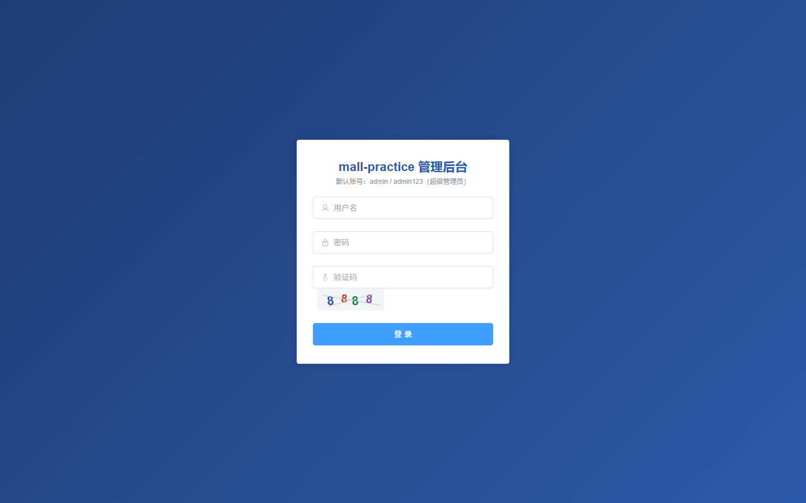
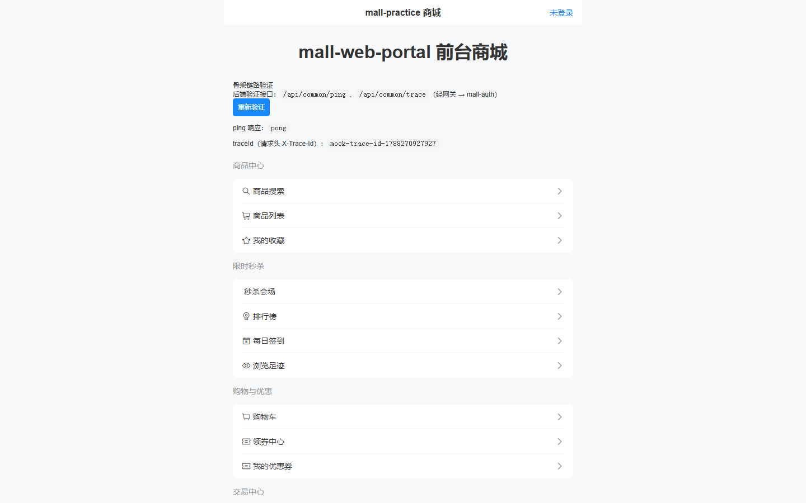
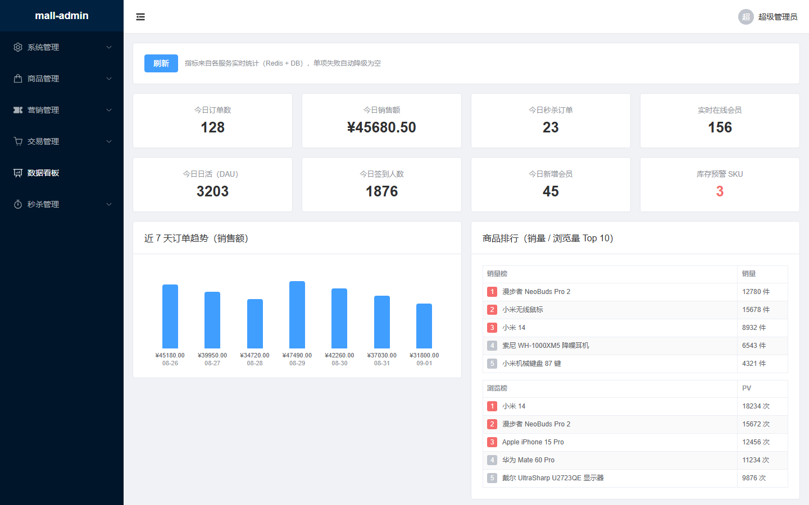
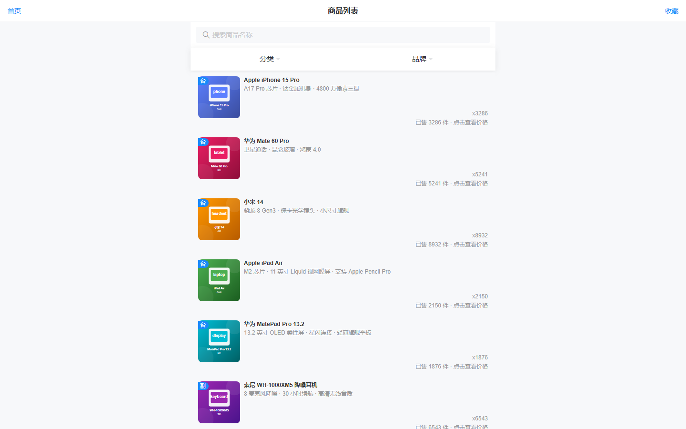
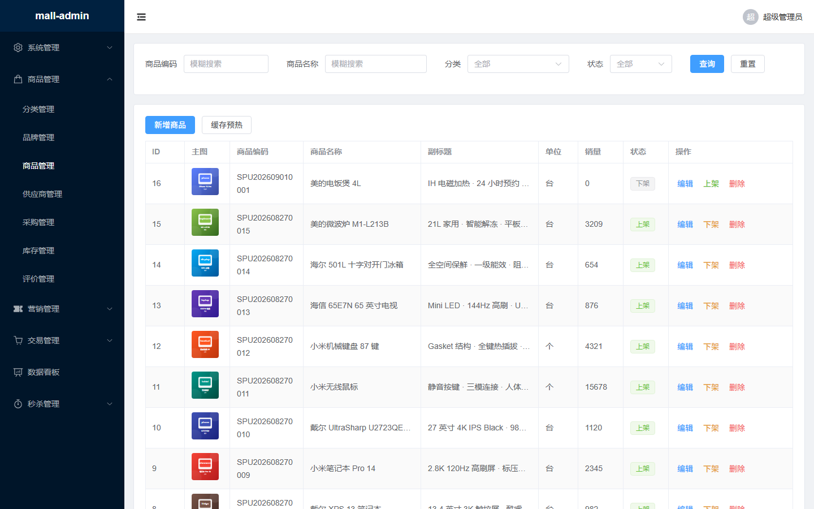
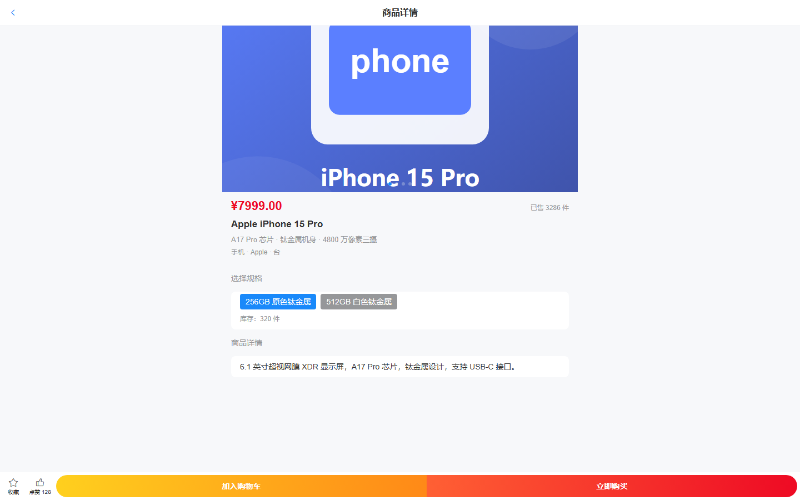
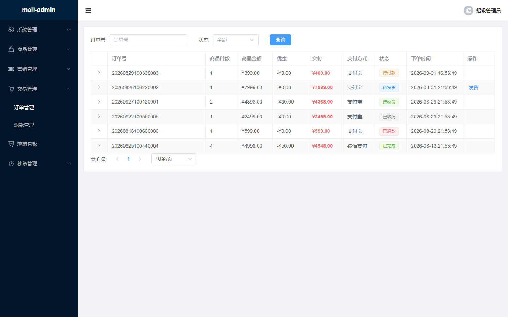
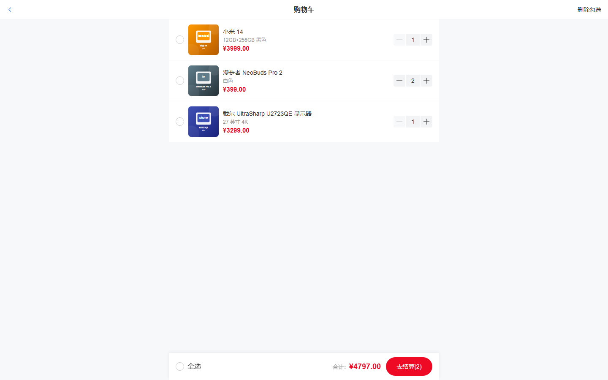

# mall-practice

电商商城实战项目，覆盖微服务、分布式事务、消息队列、缓存、搜索、任务调度、链路追踪等电商核心技术。单仓库多模块工程：17 个 Maven 后端模块 + 2 个 npm 前端模块（mall-web-admin 管理后台 / mall-web-portal 前台商城），支持本地一键启动与 Docker 独立镜像部署。

> **跨平台支持**：Windows / macOS / Linux 三平台均可运行（作者验证环境：Windows 10 + Docker Desktop）。本文安装方式、命令、端口配置三平台通用；唯一差异是 Docker 安装（见「环境准备详解」——Windows 用 Docker Desktop，支持 WSL2 / Hyper-V 两种后端任选其一）。文中标注「Windows 特有」的段落仅 Windows 用户需要关注，其余平台直接跳过即可。

## 技术点

学习型电商全栈项目，覆盖以下核心技术点（完整版本与依赖引入状态见 [docs/architecture.md](docs/architecture.md)「技术栈」）：

- **后端框架**：Spring Boot 4.0.7 · Spring Cloud 2025.1.0 · Spring Cloud Alibaba 2025.1.0.0 · JDK 17
- **微服务治理**：Nacos 注册/配置中心 · Spring Cloud Gateway 网关 · Sentinel 限流熔断 · Apache Dubbo 3 双通道 RPC · OpenFeign · Seata AT 分布式事务 · XXL-Job 任务调度 · SkyWalking 链路追踪
- **数据与中间件**：MySQL 8.3 · Redis 7.2（缓存/分布式锁/购物车/秒杀预扣）· Elasticsearch 8 全文搜索 · RocketMQ 5（延迟消息/削峰/事务消息）· Canal binlog 增量同步 · Caffeine 多级缓存 · Redisson 分布式锁 · 阿里云 OSS 对象存储
- **安全与开发**：Spring Security + JWT · MyBatis-Plus · springdoc-openapi 接口文档 · JUnit 5 + Mockito
- **AI 能力**：OpenAI 兼容多模型接入（mall-ai 服务，内置 DeepSeek / 通义千问 / OpenAI / 智谱 4 家预设），API Key 由使用者自配、未配置的模型自动禁用
- **前端**：Vue 3.5 + TypeScript + Vite 6 + Pinia（管理后台 Element Plus / 前台商城 Vant）

## 目录

- [技术点](#技术点)：全栈技术点速览
- [快速开始](#快速开始)：第 1～5 步 + 启动前端 + 验证
- [不启动后端浏览页面（Mock 演示模式）](#不启动后端浏览页面mock-演示模式)：无需任何后端服务，前端内置演示数据，全部页面可浏览可点击，附实拍截图
- [本地打包运行（Docker 镜像化部署）](#本地打包运行docker-镜像化部署)：中间件与应用拆分两个 yaml，一键脚本 / 手动命令 / 免构建拉取三种方式
- [AI 助手（可选）](#ai-助手可选)：OpenAI 兼容多模型问答，API Key 使用者自配、未配置的模型自动禁用
- [专题文档（docs/）](#专题文档docs)：全部解释性内容按专题拆分到 docs/，README 只保留可直接照抄的操作步骤

## 快速开始

> 第一次接触本项目？按下面 **5 个步骤**顺序操作即可把整套系统跑起来。环境安装的完整版本说明见 [docs/environment.md](docs/environment.md)「环境准备详解」，按需查阅。

> 硬件配置要求与极限内存压缩方案（内存明细 / 配置分档 / 降载 / 云服务器 / 16GB 实测压缩）见 [docs/hardware.md](docs/hardware.md)「硬件配置要求」与「极限内存压缩方案」两节。

### 第 1 步：安装基础环境（一次性）

本机必须安装 3 样（JDK + Maven + Node.js），另外 2 项按需决定（Docker 强烈推荐、云服务可选）：

| 组件 | 版本 | 是否必须 | 说明 |
|---|---|---|---|
| JDK | 17 | 必须 | IDEA 编译、Maven 打包、断点调试都直接调用本机 JDK，Docker 无法替代 |
| Maven | 3.9.x（推荐 3.9.16） | 必须 | IDEA 自带 Bundled 3.9.x 可直接选用，或独立安装 3.9.16（最低 3.6.3） |
| Node.js | 20.x LTS 及以上 | 必须 | 前端两个模块（mall-web-admin / mall-web-portal）的开发与构建；安装后自带 npm |
| Docker | 最新版 | 非必须（强烈推荐） | 9 个中间件（12 容器）一键部署 + `--scale` 多实例模拟；内存建议分配 4～8GB（默认 3 件套约 1GB，全量约 5GB+）；Windows/mac/Linux 三平台安装方式见 [docs/environment.md](docs/environment.md)「强烈推荐：Docker 容器化」节（Windows 用 Docker Desktop，支持 WSL2 / Hyper-V 两种后端任选其一） |
| 阿里云 OSS / ODPS | 云服务 | 非必须（可选，可后补） | 商品图片对象存储（配置 `mall.product.oss.enabled=true` 即启用，未配置默认本地存储）/ 离线数仓，学习阶段可不接入 |
> 本项目 9 个中间件 = 12 个容器（MySQL / Redis / Nacos / RocketMQ / Seata / Elasticsearch / Canal / XXL-Job / SkyWalking），安装方式见 [docs/environment.md](docs/environment.md)「中间件（docker-compose 按需启动）」节，启动见「第 3 步」。图片上传为配置驱动双通道（本地默认 / 阿里云 OSS 可选），见上表 OSS 行。

### 第 2 步：初始化数据库（必须）

仓库 `sql/` 目录有两个初始化脚本，**必须先执行**（XXL-Job 依赖 `xxl_job` 库，不执行则 xxl-job 容器起不来）：

```powershell
# 本步在仓库根目录执行（compose 文件在 docker/ 目录，用 -f 指定；sql 文件在 ./sql）
# 使用容器版 MySQL：先单独拉起 MySQL 容器（本机已装 MySQL 则跳过本行，直接在本机客户端执行两个 sql 文件）
docker compose -f docker/docker-compose.yml up -d mysql

# 导入 xxl_job 库（XXL-Job 调度中心表，3.1.0 版；-p 后为你的 MySQL root 密码）
Get-Content .\sql\xxl_job.sql -Raw -Encoding UTF8 | docker exec -i mall-mysql mysql -uroot -p<密码>

# 导入 mall 业务库（第三版：30 张表，详见 docs/business.md「业务表设计总览」；-p 后为你的 MySQL root 密码）
Get-Content .\sql\mall.sql -Raw -Encoding UTF8 | docker exec -i mall-mysql mysql -uroot -p<密码>
```

> 中间件账密（Redis/Nacos/XXL-Job）统一在 `docker/.env` 配置，模板见 `docker/.env.example`；MySQL 密码变更需同步其中 `XXL_JOB_DB_PASSWORD`，Redis 密码变更需同步各模块 application.yml。
>
> 两个脚本均为一次性初始化（建表不带 IF NOT EXISTS），重复执行报“表已存在”可忽略；mall.sql 自带种子数据，默认账号 **admin / admin123** 见「第 5 步」。

### 第 3 步：启动中间件

编排文件与 .env 统一位于 `docker/` 目录（docker-compose.yml + .env + 各中间件配置文件，compose 自动读取同目录 .env）：**下文所有 `docker compose` 命令均在 `docker/` 目录下执行**（先 `cd docker`；在仓库根目录执行时需带 `-f docker/docker-compose.yml`）。

docker/docker-compose.yml 采用 **profile 按需启动**：默认只启动 3 个基础中间件（Nacos + MySQL + Redis，合计约 1GB 内存），其余中间件等学到对应章节再拉起，避免低配机器带不动全部容器。

启动前准备（其余中间件开箱即用）：

1. **按需删除**：本机已安装哪个服务就删除 docker/docker-compose.yml 中对应的服务段（如已装 MySQL/Redis 则删除 mysql/redis 段）；若改用本机 MySQL，xxl-job 的连接地址需从 `mysql:3306` 改回 `host.docker.internal:3306`
2. **镜像无需手动下载**：`docker compose up -d` 会自动拉取（约 3GB）；网络较慢可先执行 `docker compose pull` 预拉取

```bash
cd docker    # 进入编排目录（compose + .env 同处此目录）

# 基础中间件（默认，日常开发只需这三个）：Nacos + MySQL + Redis
# 约 1GB 内存，16GB 机器轻松跑

docker compose up -d

# 按学习阶段按需启动（不启动不占内存）：
docker compose --profile rocketmq up -d     # 消息队列：RocketMQ Namesrv/Broker/Dashboard

docker compose --profile seata up -d        # 分布式事务：Seata

docker compose --profile search up -d       # 搜索：Elasticsearch + Canal（binlog 增量同步）

docker compose --profile task up -d         # 任务调度：XXL-Job（自动带起 MySQL）

docker compose --profile trace up -d        # 链路追踪：SkyWalking OAP/UI

# 需要全部中间件时（约 5GB+ 内存，低配机器建议分批启动）：
docker compose --profile rocketmq --profile seata --profile search --profile task --profile trace up -d
```

验证（均为浏览器访问，仅限已启动的中间件）：

- Nacos 控制台：http://localhost:8849/
- XXL-Job 控制台：http://localhost:9080/xxl-job-admin（需 `--profile task`）
- SkyWalking UI：http://localhost:9090（需 `--profile trace`）
- RocketMQ Dashboard：http://localhost:9081（需 `--profile rocketmq`）

### 第 4 步：启动微服务

#### IDEA 一键启动全部（推荐）

1. **为 13 个服务各建一个 Spring Boot 运行配置**：`Edit Configurations → + → Spring Boot`，按下方对照表逐个选择各模块的启动类，名称填模块名（mall-auth、mall-admin……），共 13 个
2. **创建复合配置（Compound）**：`Edit Configurations → + → Compound`，命名如 `mall-all`，把上一步的 13 个配置全部勾选加入
3. **一键启动**：之后每次点 `mall-all` 即并行拉起全部服务；单独调试某服务时，直接运行它自己的配置即可

| 模块 | 启动类（main class） | 模块作用 |
|---|---|---|
| mall-gateway | MallGatewayApplication | 统一入口：路由转发、JWT 校验、限流、跨域 |
| mall-auth | MallAuthApplication | 认证中心：登录认证、JWT 签发/校验、RBAC 角色权限 |
| mall-admin | MallAdminApplication | 管理后台聚合层：数据看板（Feign 聚合订单/会员/商品），无表 |
| mall-portal | MallPortalApplication | 前台商城聚合层：首页/商品详情/购物车/下单流程编排，无表 |
| mall-member | MallMemberApplication | 会员信息、收货地址、积分 |
| mall-product | MallProductApplication | 商品/分类/品牌/库存/供应商采购（进销存） |
| mall-cart | MallCartApplication | 购物车（Redis 存储） |
| mall-order | MallOrderApplication | 订单、关单延迟消息、下单分布式事务编排 |
| mall-payment | MallPaymentApplication | 支付对接、支付回调、退款 |
| mall-coupon | MallCouponApplication | 优惠券发放与核销 |
| mall-seckill | MallSeckillApplication | 秒杀活动（Redis 预扣 + 限流 + MQ 削峰） |
| mall-search | MallSearchApplication | 商品搜索（ES 索引与检索） |
| mall-ai | MallAiApplication | AI 助手：OpenAI 兼容多模型问答（Key 由使用者自配） |

#### 命令行方式（备选）

```powershell
# 首次或基础模块有改动时，先把 4 个基础模块安装到本地仓库
mvn install -DskipTests

# 单独启动某个服务（根目录执行，以 mall-product 为例）
mvn -pl mall-product spring-boot:run

# 全部启动：每个服务开一个窗口（PowerShell 脚本）
$services = 'mall-gateway','mall-auth','mall-admin','mall-portal','mall-member','mall-product','mall-cart','mall-order','mall-payment','mall-coupon','mall-seckill','mall-search','mall-ai'
foreach ($s in $services) { Start-Process mvn -ArgumentList "-pl",$s,"spring-boot:run" }
```

> 资源提醒：13 个 JVM 约 4～6GB 内存，机器吃紧可分组勾选；服务间调用发生在运行时，无下游依赖的模块（product/cart/auth/member/search）可单独启动，有下游调用的模块（portal/admin/order 等）单独启动时对应功能暂不可用。

### 启动前端（可选，骨架验证）

> 前端为仓库内 npm 模块（非 Maven 模块），与后端互不依赖，可单独启动或与后端一起联调；开发期 `/api` 请求由 Vite 代理到网关 8080（见各模块 `vite.config.ts`）。**只想看不启动后端？** 见下文「不启动后端浏览页面（Mock 演示模式）」。

```bash
# 终端 1：管理后台（mall-web-admin，开发端口 5173）
cd mall-web-admin
npm install   # 仅首次（或 package.json 变更后）需要
npm run dev    # 开发模式，热更新；保持终端运行

# 终端 2：前台商城（mall-web-portal，开发端口 5174）
cd mall-web-portal
npm install   # 仅首次（或 package.json 变更后）需要
npm run dev    # 开发模式，热更新；保持终端运行
```

> **停止前端**：运行 `npm run dev` 的终端按 `Ctrl + C` 即停止；若提示 `Port 5173 is already in use`（残留进程），按端口查 PID 结束——PowerShell：`Get-NetTCPConnection -LocalPort 5173 | Select-Object -ExpandProperty OwningProcess` 后 `Stop-Process -Id <PID>`；CMD：`netstat -ano | findstr :5173` 后 `taskkill /PID <PID> /F`。

### 不启动后端浏览页面（Mock 演示模式）

> 前端内置 **Mock 演示数据层**（Vite 中间件在 dev server 内拦截 `/api` 请求，返回与真实业务语义对齐的演示数据），**无需启动任何后端服务**即可浏览全部页面、点击全部按钮（新增/修改真实生效）。演示数据与 `sql/mall.sql` 业务对齐（商品/分类/品牌/订单/优惠券/秒杀/进销存/看板等），商品图来自各前端 `public/mock-imgs/` 下的 SVG 演示图。

**开启方式**（默认关闭；关闭时 `/api` 走真实网关代理，与后端正常联调）：

```bash
# 前台商城（终端 1，端口 5174）
cd mall-web-portal
$env:VITE_MOCK='true'; npm run dev    # PowerShell；bash 用 VITE_MOCK=true npm run dev

# 管理后台（终端 2，端口 5173）
cd mall-web-admin
$env:VITE_MOCK='true'; npm run dev
```

**演示说明**：

- **登录**：图形验证码固定 `8888`，账号密码任意填写即可登录（后台建议 `admin / admin123`；前台为演示买家账号体系，与后台互不影响）
- **数据状态**：演示数据保存在 dev server 内存中——刷新页面恢复初始、重启 dev server 完全重置；管理端支持**新增/修改**（删除接口返回成功但数据保留，便于演示），买家端购物车/地址/收藏/签到/领券等操作真实生效
- **浏览**：两端全部页面可访问可点击；Mock 模式自动注入演示登录态，免登录直达业务页（URL 追加 `?mockNoLogin=1` 可查看未登录入口页，如登录页）

**页面截图**（Mock 演示模式 headless 实拍，点击查看大图）：

| 管理后台（mall-web-admin） | 前台商城（mall-web-portal） |
|---|---|
| [](docs/images/mock-admin-login.png) | [](docs/images/mock-portal-home.png) |
| [](docs/images/mock-admin-dashboard.png) | [](docs/images/mock-portal-list.png) |
| [](docs/images/mock-admin-product.png) | [](docs/images/mock-portal-detail.png) |
| [](docs/images/mock-admin-order.png) | [](docs/images/mock-portal-cart.png) |

### 第 5 步：验证

- 网关接口访问：http://localhost:8080
- 接口文档：各服务 `http://localhost:{端口}/doc.html`
- Nacos 服务列表应看到全部已启动服务
- 管理后台前端（mall-web-admin）：http://localhost:5173（/api 代理到网关 8080）
- 前台商城前端（mall-web-portal）：http://localhost:5174（/api 代理到网关 8080）

前后台统一默认账号（同账密、好记；种子数据随 mall.sql 首次导入自动生效）：

| 端 | 地址 | 账号 | 密码 | 说明 |
|---|---|---|---|---|
| 管理后台 | http://localhost:5173 | admin | admin123 | 超级管理员（RBAC 全部权限） |
| 前台商城 | http://localhost:5174 | admin | admin123 | 演示买家（双账号体系分表，两处 admin 互不影响） |

> 两端登录均需图形验证码；商城可自行注册新账号（手机号可选，注册即登录）。短信验证码仅用于“找回密码”，为开发期模拟（Redis 存码，接口直接返回，未接入真实短信网关）。

## 本地打包运行（Docker 镜像化部署）

> 与上方「第 3～4 步 + 启动前端」的源码直跑方式不同，本方式把 **13 个后端微服务 + 2 个前端**打成 Docker 镜像运行，宿主机只需安装 Docker（JDK/Maven/Node 均在构建容器内完成，无需本机安装）。详细端口规划、扩缩容与注意事项见 [docs/deployment.md](docs/deployment.md)。

编排拆分为**两个 yaml**（均在 `docker/` 目录，同目录运行项目名相同、共享同一默认网络）：

| 文件 | 内容 | 镜像来源 |
|---|---|---|
| `docker-compose.yml` | 中间件：Nacos/MySQL/Redis/RocketMQ/Seata/ES/Canal/XXL-Job/SkyWalking 共 12 容器，profile 按需启动 | Docker Hub 直接拉取 |
| `docker-compose.apps.yml` | 应用：13 微服务 + 2 前端共 15 个（含环境变量锚点，自动覆盖各模块连接地址） | 源码构建（`docker compose build`） |

**方式一：一键脚本**（适合部署机/全新机器：本机无源码，脚本从 GitHub 拉取 master 代码 → 构建 → 启动一条命令）：

```powershell
.\docker\build-and-run.cmd                        # Windows：默认拉取 GitHub master 分支（双击或命令行运行）
./docker/build-and-run.sh                         # Linux/macOS
set SKIP_BUILD=1 && .\docker\build-and-run.cmd    # 已有镜像，只启动容器
```

**方式二：手动命令**（本机开发推荐：**直接构建当前工作区代码——未提交的改动也会打进镜像，无需 git commit**）：

```bash
cd docker
cp .env.example .env                              # 首次：修改 DOCKER_DATA_DIR 与各账密

docker compose -f docker-compose.apps.yml build   # 构建应用镜像（中间件镜像无需构建，up 时自动拉取）
# 启动：中间件 + 业务中间件（RocketMQ/Seata/XXL-Job）+ 全部应用
docker compose -f docker-compose.yml -f docker-compose.apps.yml --profile rocketmq --profile seata --profile task up -d
```

**方式三：免构建直接运行**（使用者/部署机推荐：无需源码、无需 JDK/Maven/Node，直接拉取 CI 已推送的现成镜像）：

```powershell
$env:IMAGE_PREFIX="ghcr.io/renmingl"       # 固定地址（仓库主命名空间；公共镜像无需登录）
cd docker
docker compose -f docker-compose.apps.yml pull   # 拉取应用镜像（中间件仍从 Docker Hub 拉取）
docker compose -f docker-compose.yml -f docker-compose.apps.yml --profile rocketmq --profile seata --profile task up -d
```

> 镜像由仓库主 push 到 master 后 CI 自动构建推送，`latest` 标签随每次发布更新；`ghcr.io/renmingl/...` 是固定地址，公共仓库任何人可拉取。若 fork 自建 CI，地址变为 `ghcr.io/<你的用户名>/...`，相应修改 IMAGE_PREFIX。
>
> 三种方式的本质区别：**方式一构建的是 git 上已提交的代码，方式二构建的是本地磁盘上的代码（含未提交修改），方式三不构建、直接拉取 CI 推送的现成镜像**。本机改代码后用方式二验证镜像，改完提交 push 后由 CI 自动构建发布，形成闭环。

**启动后访问**：与上方「第 5 步：验证」一致（端口映射与源码直跑相同）；搜索功能需追加 `--profile search`。

**停止全部**：`docker compose -f docker-compose.yml -f docker-compose.apps.yml down`；只想停应用：`docker compose -f docker-compose.apps.yml stop`。

## AI 助手（可选）

mall-ai 是第 13 个微服务（端口 9200，网关路由 `/api/ai/**`），提供 **OpenAI 兼容协议的多模型问答 + 登录态能力分层 + 会话历史**——内置 DeepSeek / 通义千问 / OpenAI / 智谱 4 家模型预设。**API Key 由你自己申请与配置**（各模型官网注册即得，按量计费）：Key 不会出现在代码与镜像里，作者也不代持任何 Key，配了哪家哪家可用，未配置的模型自动禁用。

**双入口**：管理后台「AI 助手」页（`/ai` 菜单，仅管理员可见，可查今日订单 / 趋势 / 库存预警 / 销量排行 / 会员运营）；前台商城右下角 AI 客服浮窗（游客通用问答，登录会员可查本人券 / 积分 / 最近订单 / 购物车）。问答采用 SSE 流式打字机输出；**对话历史自动入库** `ai_chat_message`（仅登录态，按 scene+userId 隔离，会话上下文自动取最近 6 轮），游客无状态不落库。意图路由：命中「订单/库存/销量…」等关键词才经 Feign 取实时数据（单服务故障降级不阻断），未命中按项目知识库（docs/ 专题文档自动分块，双字滑窗检索 Top-3）回答。Mock 演示模式（`VITE_MOCK=true`）内置演示回复，无需后端即可体验双端页面。

**配置 Key**（Docker 部署）：在 `docker/.env` 中填写以下 4 项（模板见 `docker/.env.example`，可只配一家），然后执行 `docker compose -f docker-compose.apps.yml up -d mall-ai` 重启生效：

```
DEEPSEEK_API_KEY=sk-xxx     # DeepSeek（默认模型 deepseek-chat）
QWEN_API_KEY=sk-xxx         # 通义千问（qwen-plus）
OPENAI_API_KEY=sk-xxx       # OpenAI（gpt-4o-mini）
ZHIPU_API_KEY=sk-xxx        # 智谱 GLM（glm-4-flash）
```

**配置 Key**（源码直跑）：给 mall-ai 的 IDEA 运行配置加同名环境变量即可，或启动前在终端执行 `$env:DEEPSEEK_API_KEY='sk-xxx'`（PowerShell；bash 用 `export DEEPSEEK_API_KEY=sk-xxx`）。

**验证**：`GET http://localhost:9200/api/ai/config` 返回 4 家模型与可用状态（未配 Key 的 `available=false`）；对话 / 流式 / 历史会话接口均可在 http://localhost:9200/doc.html 调试。

## 专题文档（docs/）

README 只保留操作步骤；解释性内容已按专题拆分到 `docs/` 目录，按需查阅：

| 文档 | 内容 |
|---|---|
| [docs/hardware.md](docs/hardware.md) | 硬件配置要求（内存明细 / 配置分档 / 降载 / 云服务器）+ 极限内存压缩方案 |
| [docs/environment.md](docs/environment.md) | 环境准备详解（三平台 Docker、中间件配置、账密与持久化）+ 中间件运维常用命令 |
| [docs/deployment.md](docs/deployment.md) | 端口规划总表 + Docker 镜像化部署（构建/启动/访问/CI 自动构建/注意事项） |
| [docs/architecture.md](docs/architecture.md) | 5 张架构图 + 技术栈 / 依赖引入状态 |
| [docs/engineering.md](docs/engineering.md) | 工程结构 / 服务间通信 / 分布式事务策略 / 日志方案 / 链路追踪接入 |
| [docs/api.md](docs/api.md) | 接口文档：全部 HTTP 接口按模块 + 功能点分类总览（参数详见运行期 doc.html） |
| [docs/business.md](docs/business.md) | 业务篇：30 张表设计 / 两平台菜单 / 技术场景清单 |
| [docs/faq.md](docs/faq.md) | 常见问题（FAQ）+ 搭建踩坑记录 |

