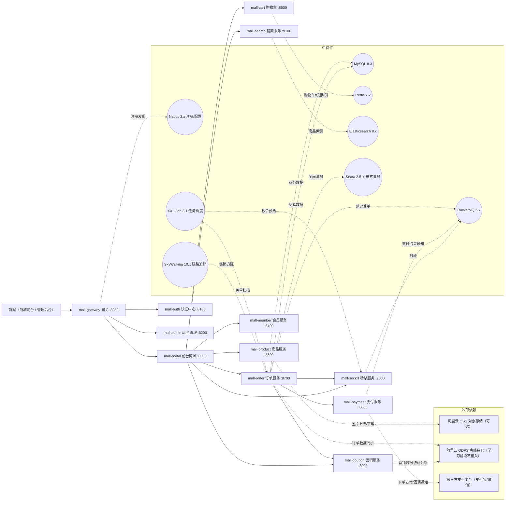
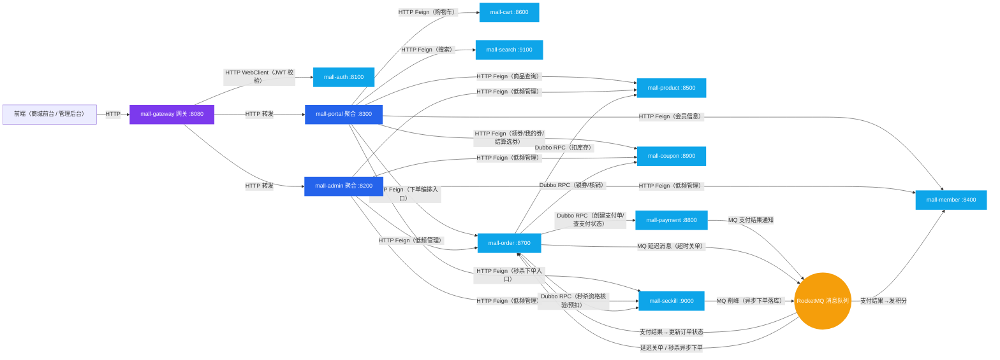
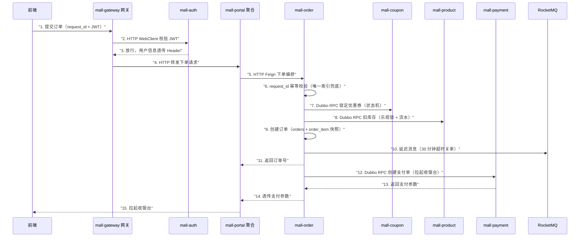

# mall-practice

电商商城实战项目，覆盖微服务、分布式事务、消息队列、缓存、搜索、任务调度、链路追踪等电商核心技术。单仓库多模块工程：16 个 Maven 后端模块 + 2 个 npm 前端模块（mall-web-admin 管理后台 / mall-web-portal 前台商城），支持本地一键启动与 Docker 独立镜像部署。

> **开发运行环境：Windows 10**
> 本文所有安装方式、命令、端口配置均基于 Windows 10（Docker Desktop 使用 Hyper-V 后端；Docker Desktop 在 Windows 上支持 WSL2 / Hyper-V 两种后端，任选其一即可，其余内容通用）。

## 目录

### 技术篇

- [快速开始](#快速开始)
  - [硬件配置要求](#硬件配置要求)
    - [内存占用明细（按 docker-compose.yml 配置与各服务默认 JVM 估算）](#内存占用明细按-docker-composeyml-配置与各服务默认-jvm-估算)
    - [配置分档](#配置分档)
    - [低配机器降载策略](#低配机器降载策略)
    - [云服务器部署建议（以阿里云为例）](#云服务器部署建议以阿里云为例)
  - [极限内存压缩方案](#极限内存压缩方案)
    - [实测配置与占用（16GB 机器）](#实测配置与占用16gb-机器)
    - [压缩手段（按收益排序）](#压缩手段按收益排序)
    - [启动方式经验（本机特有）](#启动方式经验本机特有)
  - [第 1 步：安装基础环境（一次性）](#第-1-步安装基础环境一次性)
  - [第 2 步：初始化数据库（必须）](#第-2-步初始化数据库必须)
  - [第 3 步：启动中间件](#第-3-步启动中间件)
  - [第 4 步：启动微服务](#第-4-步启动微服务)
    - [IDEA 一键启动全部（推荐）](#idea-一键启动全部推荐)
    - [命令行方式（备选）](#命令行方式备选)
  - [启动前端（可选，骨架验证）](#启动前端可选骨架验证)
  - [第 5 步：验证](#第-5-步验证)
  - [（进阶）Docker 独立部署](#进阶docker-独立部署)
- [环境准备详解（选读）](#环境准备详解选读)
  - [必须安装](#必须安装)
  - [强烈推荐：Docker Desktop](#强烈推荐docker-desktop)
  - [可选安装（云服务，可后补）](#可选安装云服务可后补)
  - [中间件（docker-compose 按需启动）](#中间件docker-compose-按需启动)
- [端口规划总表](#端口规划总表)
  - [微服务](#微服务)
  - [前端（npm 模块，独立部署）](#前端npm-模块独立部署)
  - [中间件](#中间件)
- [系统架构（架构图汇总）](#系统架构架构图汇总)
  - [1. 系统架构图](#1-系统架构图)
  - [2. 应用调用链路图](#2-应用调用链路图)
  - [3. 核心业务链路时序图](#3-核心业务链路时序图)
  - [4. 工程结构图](#4-工程结构图)
  - [5. 模块依赖关系图](#5-模块依赖关系图)
- [技术栈](#技术栈)
  - [后端基础](#后端基础)
  - [微服务治理](#微服务治理)
  - [数据与中间件](#数据与中间件)
  - [安全与开发](#安全与开发)
  - [前端（仓库内 npm 模块，独立部署）](#前端仓库内-npm-模块独立部署)
  - [依赖引入状态（骨架 vs 业务开发阶段）](#依赖引入状态骨架-vs-业务开发阶段)
  - [可选增强（暂不引入，刻意精简）](#可选增强暂不引入刻意精简)
- [工程结构（模块架构）](#工程结构模块架构)
- [服务间通信](#服务间通信)
- [分布式事务策略](#分布式事务策略)
- [日志方案](#日志方案)
- [搭建踩坑记录（均已修复，供避坑参考）](#搭建踩坑记录均已修复供避坑参考)
- [常见问题（FAQ）](#常见问题faq)

### 业务篇

  - [业务表设计总览](#业务表设计总览)
  - [两平台功能菜单总览](#两平台功能菜单总览)
    - [管理后台（mall-admin）](#管理后台mall-admin)
    - [前台商城（mall-portal）](#前台商城mall-portal)
  - [电商技术场景清单](#电商技术场景清单)
  - [开发排期计划](#开发排期计划)

## 快速开始

> 第一次接触本项目？按下面 **5 个步骤**顺序操作即可把整套系统跑起来。环境安装的完整版本说明在随后的「环境准备详解」，按需查阅。

### 硬件配置要求

> 本项目 = 8 个中间件（Docker 容器）+ 10+ 个后端微服务（JVM）+ 2 个前端（Node），**全量同时拉起的峰值内存远超普通单体项目**。先对照下表判断你的机器档位，再决定按哪种方式启动（16GB 机器实测：全量拉起时内存触顶、系统卡死，必须按需分批启动，降载策略见下文）。

#### 内存占用明细（按 docker-compose.yml 配置与各服务默认 JVM 估算）

| 组件 | JVM/堆配置 | 实际占用估算 | 说明 |
|---|---|---|---|
| Nacos（注册/配置中心） | 256MB | ≈0.5GB | 3.x 含内嵌 Derby |
| MySQL 8.3 | 默认 | ≈0.5GB | 容器默认缓冲池 |
| Redis 7.2（AOF 持久化） | — | ≈0.2GB | |
| RocketMQ Namesrv | 256MB | ≈0.4GB | |
| RocketMQ Broker | 512MB | ≈0.8GB | commitlog 页缓存占用偏高 |
| RocketMQ Dashboard | 256MB | ≈0.4GB | |
| Seata（事务协调器） | 256MB | ≈0.5GB | |
| Elasticsearch（search profile） | 512MB | ≈1GB | mmap 占用高 |
| XXL-Job（task profile） | 256MB | ≈0.4GB | |
| SkyWalking OAP/UI（trace profile） | 512MB/256MB | ≈1.2GB | |
| 后端微服务 ×10（gateway/auth/admin/portal/member/product/cart/order/payment/coupon） | 默认堆 | ≈4～5.5GB | 单个常驻 350～550MB |
| 前端 Vite dev ×2（mall-web-admin / mall-web-portal） | — | ≈1GB | 含依赖预构建 |
| 开发工具（IDEA + 浏览器） | — | ≈3～5GB | |
| Windows 系统 + Docker Desktop 引擎 | — | ≈3～4GB | |

**合计峰值：核心链路（7 件套中间件 + 10 后端 + 2 前端，不含 IDE）约 8～10GB；全量（含 search/task/trace 可选中间件 + IDE + 系统）约 15～20GB+。**

#### 配置分档

| 档位 | 内存 | CPU | 磁盘 | 可运行范围 |
|---|---|---|---|---|
| 最低档 | 16GB | 8 核 | 100GB SSD | 基础中间件 3 件套（Nacos/MySQL/Redis）+ 4～6 个后端 + 1 个前端，其余按阶段分批启动 |
| 推荐档 | 32GB | 8～16 核 | 200GB+ SSD | 全量中间件 + 10 个后端 + 2 个前端 + IDEA，顺畅运行 |
| 顶配档 | 64GB+ | 16 核+ | 500GB+ SSD | 推荐档基础上支持 `--scale` 多实例 + JMeter 压测演练 |

> 16GB 实测结论：Docker 全量中间件 + 全部后端服务 + 双前端 + IDEA 同时拉起时，内存占用持续触顶、系统无响应；**16GB 必须按需启动，32GB 才可全量顺畅**。

#### 低配机器降载策略

1. **中间件按 profile 分批**：默认只启 Nacos/MySQL/Redis（约 1GB，见「第 3 步：启动中间件」），学到哪个阶段再启对应 profile，用完 `docker compose stop` 停掉
2. **后端按阶段只启所需服务**：按学习阶段只启动 4～6 个核心服务（见「第 4 步：启动微服务」），阶段完成后停掉再启下一阶段
3. **调小后端 JVM**：低配机器可统一加 `-Xms256m -Xmx256m -XX:MaxMetaspaceSize=256m`（IDEA VM options 或启动脚本），10 个服务可省约 1.5GB
4. **Docker Desktop 内存上限调低**：Settings → Resources → Memory 设为 4GB（默认 3 件套约 1GB 足够）
5. **避开构建峰值**：Maven 多模块打包 / npm install 时内存峰值高，避免与全量运行同时进行
6. **前端一次只开一个**：骨架验证只需 mall-web-admin，前台商城按需再启

> 以上为通用策略；16GB 机器实测的极限压缩做法（JVM 参数 / 各手段收益）见「极限内存压缩方案」。

#### 云服务器部署建议（以阿里云为例）

本机内存不够时，可把整套系统拆到云服务器上（Linux 原生 Docker，无 Windows/Docker Desktop 额外开销，同配置比本机更能跑）。**最常见的做法是分开部署：一台机器只跑 Docker 中间件、另一台只跑 Java 应用**，两者互不干扰、故障面更小。部署形态与本地一致：docker-compose 起中间件、java -jar 起 12 个后端、Nginx 托管两个前端 dist 并反代 `/api` 到网关 8080。

| 部署形态 | 机器 | 规格建议（阿里云 ECS） | 内存估算依据 | 适用场景 |
|---|---|---|---|---|
| 单机全量 | 1 台 | 8C32G（ecs.g7.2xlarge） | 全量中间件约 6GB + 12 个后端 5～6.5GB + 前端/Nginx 约 1GB + 系统 2～3GB ≈ 峰值 15GB | 最省，学习/演示 |
| 双机分离（最常见） | 2 台 | 8C16G（ecs.c7.2xlarge）×2 | Docker 机：全量中间件 6GB + 系统 2～3GB ≈ 9GB；应用机：12 个后端 5～6.5GB + 前端 1GB + 系统 2GB ≈ 9.5GB | Docker 与 Java 各占一机，互不干扰 |
| 三机生产雏形 | 3 台 | 4C8G（ecs.c7.xlarge）+ 8C16G ×2 | 数据库机：MySQL/Redis ≈ 1.5GB；中间件机：其余中间件 ≈ 7.5GB；应用机：12 个后端 + 前端 ≈ 9.5GB | 数据库独立，贴近生产拓扑 |

只跑部分组件时的起步配置：

- **只跑基础中间件**（Nacos/MySQL/Redis，约 1.2GB）：Docker 机 4C8G 即可
- **只跑当前阶段后端**（4～6 个服务，约 3GB）：应用机 4C8G 起步
- **全量中间件**（11 个容器约 6GB）或 **全量 12 个后端**（约 6.5GB）：分别需要 8C16G

补充说明：

- **磁盘**：系统盘 40GB + 数据盘 100GB ESSD 起步（镜像约 3GB，MySQL/RocketMQ 数据卷与日志持续增长）
- **带宽**：学习调试 3～5Mbps 按量计费即可；对外演示/团队共用建议 10Mbps 起
- **上云改动点**：各模块 application.yml 的 nacos/redis/数据库地址改为中间件机内网 IP；服务间 Feign/Dubbo 走 Nacos 注册自动发现，跨机部署无需改端口；安全组只需放行对外端口（8080 网关入口、8849/9081/9080/9090 各中间件控制台，按需）
- **云服务器日志**：建议各服务统一 `-DLOG_PATH=/opt/mall/logs`（或 application.yml 配 `logging.file.path`）集中到固定目录，便于采集（详见「日志方案」）

### 极限内存压缩方案

> 16GB 机器跑全阶段集成验证的极限压缩实践（2026-08 实测）。背景：本项目全量拉起内存触顶，必须压缩才能完成阶段 4/5/6 验证；按本方案组合压缩后，阶段4 验证仅需约 3.5GB（系统占用 90%+ → 70% 左右）。

#### 实测配置与占用（16GB 机器）

| 组件 | 压缩配置 | 实测占用 |
|---|---|---|
| 后端微服务 ×10 | `-Xms128m -Xmx256m -XX:MaxMetaspaceSize=160m -XX:ReservedCodeCacheSize=64m -Xss512k -XX:MaxDirectMemorySize=128m -XX:+UseSerialGC` | 合计 ≈3.2GB（单服务 210～430MB） |
| Nacos | JVM 256m（compose `JVM_XMS/JVM_XMX`） | 753MB（3.x 含 Derby/堆外） |
| RocketMQ Broker | `-Xms512m -Xmx512m`（compose `JAVA_OPT_EXT`） | 835MB（commitlog 页缓存不吃堆） |
| RocketMQ Namesrv | `-Xms256m -Xmx256m` | 284MB |
| Seata | JVM 256m（compose `JVM_XMS/JVM_XMX`） | 383MB |
| MySQL | 默认 | 486MB |
| Redis | 默认 | 21MB |
| Docker Desktop VM | Hyper-V 分配 4GB（CPU 6） | 容器共享上限 |

#### 压缩手段（按收益排序）

| 优先级 | 手段 | 可节省 | 做法 |
|---|---|---|---|
| 1 | 按阶段只启所需服务 | ≈1.1GB | 阶段4：gateway/auth/member/product/cart/coupon/portal 7 个；阶段5：+order；阶段6：全 10 个（order/payment/admin 约 1.1GB） |
| 2 | 非验证期停 MQ/Seata | ≈1.5GB | 阶段4 用不到：`docker compose stop rocketmq-namesrv rocketmq-broker seata`（三容器实测约 1.5GB） |
| 3 | JVM 激进档（仅功能验证，勿压测） | ≈0.4GB | `-Xms128m -Xmx192m -XX:MaxMetaspaceSize=128m -XX:ReservedCodeCacheSize=48m -Xss512k -XX:MaxDirectMemorySize=96m -XX:+UseSerialGC`（当前验证已用 256m 档，见 tools/verify/start-svc.ps1） |
| 4 | 中间件 JVM 再压（改 compose 后 `docker compose up -d --force-recreate`） | ≈0.3GB | nacos/seata 256m→192m、namesrv 256m→128m、broker 512m→384m（broker 大头是页缓存不吃堆，收益有限）；MySQL/Redis 不建议动 |
| 5 | 验证时不开 IDEA（脚本直接起 jar） | ≈2GB | 脚本见 tools/verify/（仅本机，不入库） |

> 组合效果：阶段4 验证采用 1+2 后，java 约 2.2GB + 容器约 1.3GB ≈ 3.5GB。当前验证脚本为省事统一启动了 10 个服务，按需裁剪参考上表。

#### 启动方式经验（本机特有）

- 本机存在周期性向共享控制台进程发送 Ctrl+C 的机制：`Start-Process` / `schtasks` 启动的 java 会在 1～5 分钟内被杀（错误日志内容为 `^C`）
- **解法：Windows 服务方式启动（Session 0 无控制台）可完全免疫**：`sc create MallXxxSvc binPath= "cmd /c <cmd文件>"` + `sc start`（服务显示 Stopped / 1053 属预期，java 进程实际正常运行）；生成器脚本见 tools/verify/start-as-service.ps1
- 一键停止全部：tools/verify/stop-all.ps1（杀 java + `docker compose down`，数据卷保留）

### 第 1 步：安装基础环境（一次性）

本机必须安装 3 样（JDK + Maven + Node.js），另外 2 项按需决定（Docker Desktop 强烈推荐、云服务可选）：

| 组件 | 版本 | 是否必须 | 说明 |
|---|---|---|---|
| JDK | 17 | 必须 | IDEA 编译、Maven 打包、断点调试都直接调用本机 JDK，Docker 无法替代 |
| Maven | 3.9.x（推荐 3.9.16） | 必须 | IDEA 自带 Bundled 3.9.x 可直接选用，或独立安装 3.9.16（最低 3.6.3） |
| Node.js | 20.x LTS 及以上 | 必须 | 前端两个模块（mall-web-admin / mall-web-portal）的开发与构建；安装后自带 npm |
| Docker Desktop | 最新版 | 非必须（强烈推荐） | 中间件按需部署 + `--scale` 多实例模拟；Hyper-V 后端，内存建议分配 4～8GB（默认 3 件套约 1GB，全量约 5GB+） |
| 阿里云 OSS / ODPS | 云服务 | 非必须（可选，可后补） | 商品图片对象存储（配置 `mall.product.oss.enabled=true` 即启用，未配置默认本地存储）/ 离线数仓，学习阶段可不接入 |

> 8 个中间件（MySQL / Redis / Nacos / RocketMQ / Seata / Elasticsearch / XXL-Job / SkyWalking）不用本机安装：**装了 Docker Desktop 由第 3 步按需启动（默认只跑 Nacos/MySQL/Redis 三个基础件，其余按学习阶段用 `--profile` 拉起）；没装 Docker 则需自行下载 8 个中间件的 Windows 版本逐个安装配置**（均有 Windows 版，但较繁琐，且无法模拟多实例部署）。本机已安装哪个服务，记得从 docker-compose.yml 删除对应的服务段（避免端口冲突，规则详见「环境准备详解」）。
>
> 图片上传为配置驱动双通道：`mall.product.oss.enabled=true` 时上传阿里云 OSS，未配置（默认 false）走本地文件存储，功能照常可用；ODPS 学习阶段不建议接入——两者均可跳过（详见「环境准备详解」）。

### 第 2 步：初始化数据库（必须）

仓库 `sql/` 目录有两个初始化脚本，**必须先执行**（XXL-Job 依赖 `xxl_job` 库，不执行则 xxl-job 容器起不来）：

```powershell
# 使用容器版 MySQL：先单独拉起 MySQL 容器（本机已装 MySQL 则跳过本行，直接在本机客户端执行两个 sql 文件）
docker compose up -d mysql

# 导入 xxl_job 库（XXL-Job 调度中心表，3.1.0 版；-p 后为你的 MySQL root 密码）
Get-Content .\sql\xxl_job.sql -Raw -Encoding UTF8 | docker exec -i mall-mysql mysql -uroot -p<密码>

# 导入 mall 业务库（第三版：28 张表，详见业务篇「业务表设计总览」；-p 后为你的 MySQL root 密码）
Get-Content .\sql\mall.sql -Raw -Encoding UTF8 | docker exec -i mall-mysql mysql -uroot -p<密码>
```

> 账号说明：中间件账密（Redis/Nacos/XXL-Job）统一在仓库根目录 `.env` 中配置（`.env` 不入库，模板见 `.env.example`；MySQL root 密码已写入初始化后的数据目录，compose 未配置密码变量，全新环境首次初始化需临时设置 `MYSQL_ROOT_PASSWORD`，见 `.env.example` 注释）。变更联动：MySQL 密码变更需同步 `.env` 中 `XXL_JOB_DB_PASSWORD`（xxl-job 连接用）；Redis 密码变更需同步各模块 application.yml 的 redis.password。
>
> 两个脚本均为一次性初始化脚本（建表语句不带 IF NOT EXISTS），重复执行会报"表已存在"，属正常现象，可忽略。
>
> **业务库自带种子数据**：mall.sql 导入后自动写入前后台初始化数据——后台超级管理员与前台演示买家统一账号 **admin / admin123**（后台角色 SUPER_ADMIN，拥有全部菜单权限，登录后权限标识为 `*`；两端分属独立表，互不影响），登录入口见「第 5 步」；商城也支持自行注册新账号。

### 第 3 步：启动中间件

docker-compose.yml 采用 **profile 按需启动**：默认只启动 3 个基础中间件（Nacos + MySQL + Redis，合计约 1GB 内存），其余中间件等学到对应章节再拉起，避免低配机器带不动全部容器。

启动前准备（其余中间件开箱即用）：

1. **按需删除**：本机已安装哪个服务就删除 docker-compose.yml 中对应的服务段（如已装 MySQL/Redis 则删除 mysql/redis 段）；若改用本机 MySQL，xxl-job 的连接地址需从 `mysql:3306` 改回 `host.docker.internal:3306`
2. **镜像无需手动下载**：`docker compose up -d` 会自动拉取（约 3GB）；网络较慢可先执行 `docker compose pull` 预拉取

```bash
# 基础中间件（默认，日常开发只需这三个）：Nacos + MySQL + Redis
# 约 1GB 内存，16GB 机器轻松跑

docker compose up -d

# 按学习阶段按需启动（不启动不占内存）：
docker compose --profile rocketmq up -d     # 消息队列：RocketMQ Namesrv/Broker/Dashboard

docker compose --profile seata up -d        # 分布式事务：Seata

docker compose --profile search up -d       # 搜索：Elasticsearch

docker compose --profile task up -d         # 任务调度：XXL-Job（自动带起 MySQL）

docker compose --profile trace up -d        # 链路追踪：SkyWalking OAP/UI

# 需要全部中间件时（约 5GB+ 内存，低配机器建议分批启动）：
docker compose --profile rocketmq --profile seata --profile search --profile task --profile trace up -d
```

验证（均为浏览器访问，仅限已启动的中间件）：

- Nacos 控制台：http://localhost:8849/
- XXL-Job 控制台：http://localhost:9080/xxl-job-admin（需 `--profile task`）
- SkyWalking UI：http://localhost:9090（需 `--profile trace`）
- RocketMQ Dashboard：http://localhost:9081（需 `--profile rocketmq`）

**中间件运维常用命令**（Docker 容器版中间件的日常启停/排查）：

```bash
docker compose ps                            # 查看全部容器状态
docker compose up -d                         # 启动基础中间件（已运行的自动跳过）
docker compose --profile rocketmq up -d      # 启动指定 profile 的中间件
docker compose up -d redis nacos             # 只启动指定服务
docker compose restart mysql                 # 重启指定服务
docker compose logs -f nacos                 # 跟踪某服务日志
docker compose stop elasticsearch            # 停止某服务（不删容器）
docker compose down                          # 停止并删除全部容器（数据在宿主机卷不丢，目录可在 .env 配置）
docker compose up -d --force-recreate nacos  # 修改 yaml 后强制重建某服务
```

### 第 4 步：启动微服务

#### IDEA 一键启动全部（推荐）

1. **为 12 个服务各建一个 Spring Boot 运行配置**：`Edit Configurations → + → Spring Boot`，按下方对照表逐个选择各模块的启动类，名称填模块名（mall-auth、mall-admin……），共 12 个
2. **创建复合配置（Compound）**：`Edit Configurations → + → Compound`，命名如 `mall-all`，把上一步的 12 个配置全部勾选加入
3. **一键启动**：之后每次点 `mall-all` 即并行拉起全部服务；单独调试某服务时，直接运行它自己的配置即可

| 模块 | 启动类（main class） |
|---|---|
| mall-gateway | MallGatewayApplication |
| mall-auth | MallAuthApplication |
| mall-admin | MallAdminApplication |
| mall-portal | MallPortalApplication |
| mall-member | MallMemberApplication |
| mall-product | MallProductApplication |
| mall-cart | MallCartApplication |
| mall-order | MallOrderApplication |
| mall-payment | MallPaymentApplication |
| mall-coupon | MallCouponApplication |
| mall-seckill | MallSeckillApplication |
| mall-search | MallSearchApplication |

#### 命令行方式（备选）

```powershell
# 首次或基础模块有改动时，先把 4 个基础模块安装到本地仓库
mvn install -DskipTests

# 单独启动某个服务（根目录执行，以 mall-product 为例）
mvn -pl mall-product spring-boot:run

# 全部启动：每个服务开一个窗口（PowerShell 脚本）
$services = 'mall-gateway','mall-auth','mall-admin','mall-portal','mall-member','mall-product','mall-cart','mall-order','mall-payment','mall-coupon','mall-seckill','mall-search'
foreach ($s in $services) { Start-Process mvn -ArgumentList "-pl",$s,"spring-boot:run" }
```

> 资源提醒：12 个 JVM 约占用 4～6GB 内存；机器吃紧可分组勾选（未启动的服务不影响其他服务运行）。
>
> **模块可任意单独启动**：服务间调用发生在运行时，启动时只依赖中间件（Nacos/MySQL/Redis 等）。无微服务依赖的模块（product/cart/auth/member/search）单独启动即可用；有下游调用的模块（portal/admin/order 等）单独启动正常，仅在调用缺失的下游服务时对应功能不可用。

### 启动前端（可选，骨架验证）

> 前端为仓库内 npm 模块（非 Maven 模块），与后端互不依赖，可单独启动或与后端一起联调；开发期 `/api` 请求由 Vite 代理到网关 8080（见各模块 `vite.config.ts`）。

```bash
# 终端 1：管理后台（mall-web-admin，开发端口 5173）
cd mall-web-admin
npm install   # 仅首次（或 package.json 变更后）需要
npm run dev    # 开发模式，热更新；保持终端运行

# 终端 2：前台商城（mall-web-portal，开发端口 5174）
cd mall-web-portal
npm install   # 仅首次（或 package.json 变更后）需要
npm run dev    # 开发模式，热更新；保持终端运行
```

> **停止前端**：
> - **正常停止**：在运行 `npm run dev` 的终端按 `Ctrl + C` 即停止（两个前端互不影响，可分别停止）。
> - **停止残留进程**（终端已关闭或忘记停止导致端口占用，`npm run dev` 会报 `Port 5173 is already in use`）：按端口找到进程并结束——
>   - PowerShell：`Get-NetTCPConnection -LocalPort 5173 | Select-Object -ExpandProperty OwningProcess` 拿到 PID 后 `Stop-Process -Id <PID>`
>   - 或 CMD：`netstat -ano | findstr :5173` 记下最后一列 PID，再 `taskkill /PID <PID> /F`
> - **其他说明**：若 `node -v` 提示找不到命令，说明 Node 安装目录不在 PATH，重开终端（或注销重登）即可；启动成功后访问 http://localhost:5173 / http://localhost:5174（见「第 5 步：验证」）。

### 第 5 步：验证

- 网关接口访问：http://localhost:8080
- 接口文档：各服务 `http://localhost:{端口}/doc.html`
- Nacos 服务列表应看到全部已启动服务
- 管理后台前端（mall-web-admin）：http://localhost:5173（/api 代理到网关 8080）
- 前台商城前端（mall-web-portal）：http://localhost:5174（/api 代理到网关 8080）

前后台统一默认账号（同账密、好记；种子数据随 mall.sql 首次导入自动生效）：

| 端 | 地址 | 账号 | 密码 | 说明 |
|---|---|---|---|---|
| 管理后台 | http://localhost:5173 | admin | admin123 | 超级管理员（RBAC 全部权限） |
| 前台商城 | http://localhost:5174 | admin | admin123 | 演示买家（双账号体系分表，两处 admin 互不影响） |

> 两端登录均需图形验证码；短信验证码为开发期模拟（Redis 存码，接口直接返回）。商城也可自行注册新账号（需手机号，注册即登录）。

### （进阶）Docker 独立部署

> 规划中，待业务代码完成后补充。

本地稳定后，每个模块独立打包镜像部署（后端模块 Dockerfile 与 compose 微服务段随业务代码开发阶段补充，当前 docker-compose.yml 仅含中间件编排；前端两模块为静态资源，由各自 Nginx 镜像承载，部署方式见各前端模块 README）：

```bash
# 注意：当前 compose 仅含中间件，微服务镜像构建需先补齐各模块 Dockerfile 与 compose 服务段
mvn package -DskipTests
docker compose up -d --build          # 全量部署
docker compose up -d --scale mall-order=3   # 订单服务 3 副本
docker compose up -d --scale mall-gateway=2 # 网关 2 副本
```

- 每个模块独立 `Dockerfile`（基础镜像 `eclipse-temurin:17-jre`）
- 全部容器加入同一 bridge 网络（如 `mall-net`），服务间用容器名互访
- 容器内访问宿主机中间件（MySQL/Redis）使用 `host.docker.internal`

## 环境准备详解（选读）

> 「快速开始」第 1 步已覆盖最小安装集；本节能回答"为什么"，并提供完整版本表与可选组件说明。

### 必须安装

| 组件 | 版本 | 安装方式 |
|---|---|---|
| JDK | 17 | 必须本机安装（见下方说明） |
| Maven | 3.9.x（推荐 3.9.16） | 必须本机安装：IDEA 自带 Bundled 3.9.x 可直接选用，或独立安装 3.9.16（最低要求 3.6.3，见下方说明） |
| MySQL | 8.3 | 本机安装 或 Docker 容器版（二选一） |
| Redis | 7.2 | 本机安装 或 Docker 容器版（二选一） |
| Nacos | 3.x | 本机安装 或 `docker compose up -d` 容器版（二选一） |
| RocketMQ | 5.x | 本机安装 或 `docker compose up -d` 容器版（二选一） |
| Seata | 2.x | 本机安装 或 `docker compose up -d` 容器版（二选一） |
| Elasticsearch | 8.x | 本机安装 或 `docker compose up -d` 容器版（二选一） |
| XXL-Job | 3.x | 本机安装 或 `docker compose up -d` 容器版（二选一） |
| SkyWalking | 10.x | 本机安装 或 `docker compose up -d` 容器版（二选一） |

> **JDK 为什么必须本机安装**：IDEA 编译、Maven 打包、单元测试、断点调试都直接调用本机 JDK，Docker 无法替代开发工具链；Docker 中的 `eclipse-temurin:17-jre` 镜像只承载部署期的运行环境。
>
> **Maven 版本要求**：最低 3.6.3（3.6.0 无法运行新版 maven-compiler-plugin，详见“搭建踩坑记录”）。建议直接用 IDEA 自带 Bundled Maven（3.9.x），或独立安装 3.9.16（当前 3.9 线最新正式版）并配置到 IDEA / PATH；暂不推荐 3.10.x / 4.0（均处 RC 阶段，官方标注不建议正式使用）。
>
> **中间件 8 个组件的安装方式**：本机安装（Windows 版）与 Docker 容器版二选一。推荐 Docker——按需启动、版本统一、免手工配置。
>
> **按需删除规则**：本机已安装哪个服务，就从 docker-compose.yml 删除对应的服务段（避免端口冲突）。仓库中的该文件为按需启动版（默认 Nacos/MySQL/Redis 三个基础件，其余按 `--profile` 拉起），按本机情况删除后即可使用。

### 强烈推荐：Docker Desktop

| 组件 | 版本 | 安装方式 |
|---|---|---|
| Docker Desktop | 最新版 | [Docker Desktop for Windows](https://www.docker.com/products/docker-desktop/)（Hyper-V 后端，需在 BIOS/系统功能中开启虚拟化），验证 `docker --version` |

> 微服务本身不依赖 Docker（IDEA 直跑即可），但 Docker 承担两件事：
> 1. **中间件一键部署**：MySQL/Redis/Nacos/RocketMQ/Seata/ES/XXL-Job/SkyWalking 共 8 个组件通过 docker compose 按需启动（默认 3 个基础件，其余 `--profile` 按阶段拉起），无需逐个手动安装（本机已装的可从 yaml 删除对应段）
> 2. **镜像化与多实例**：微服务独立打包镜像、`--scale` 模拟多实例部署（学习分布式负载均衡的关键手段）
>
> 不装 Docker 的代价：8 个组件需手动下载 Windows 版本逐个安装配置（均有 Windows 版，但较繁琐），且无法模拟多实例部署；微服务开发调试不受影响。

### 可选安装（云服务，可后补）

| 组件 | 用途 | 说明 |
|---|---|---|
| 阿里云 OSS | 对象存储（商品图片上传） | 需开通 OSS 并配置 AK/SK；按量付费，学习用量每月几分钱（新用户有免费额度）。**零成本降级**：上传通道由配置驱动——`mall.product.oss.enabled=false`（默认）走本地文件存储，功能照常可用；开通后在 mall-product 的 application.yml 填好 endpoint / accessKeyId / accessKeySecret / bucket 并置 enabled=true 即切换 OSS（可选 domain 填 CDN 域名） |
| 阿里云 ODPS | 离线数仓 | 按量付费，学习阶段不建议接入（数据量小无意义）；仅保留为大数据量演进方向，本项目不实现 |

### 中间件（docker-compose 按需启动）

编排文件位于仓库根目录 `docker-compose.yml`。以下中间件无需手动安装，docker compose 会自动拉取镜像并部署（首次约 3GB，无需手动 pull）。**默认只启动 Nacos/MySQL/Redis 三个基础件（约 1GB 内存），其余中间件按学习阶段用 `--profile` 按需启动**（命令见「快速开始」第 3 步）。**中间件账密与数据持久化根目录均在仓库根目录 `.env` 中配置**（数据根目录 `DOCKER_DATA_DIR`、账密类变量见 `.env.example` 模板；未配置时 compose 启动会直接报错，首次使用请复制 `.env.example` 为 `.env` 并设置）——MySQL / Redis / Nacos / Elasticsearch / RocketMQ-Broker / Seata 的数据分别持久化到该目录下的 `mysql / redis / nacos / elasticsearch / rocketmq-broker / seata` 子目录，需迁移时只改 `.env` 一处即可：

| 中间件 | 端口 | 用途 |
|---|---|---|
| MySQL 8.3 | 3306 | 核心交易数据（账密在 .env 配置，数据持久化到 ${DOCKER_DATA_DIR}\mysql） |
| Redis 7.2 | 6379 | 缓存/购物车/秒杀预扣库存（账密在 .env 配置，AOF 持久化到 ${DOCKER_DATA_DIR}\redis） |
| Nacos 3.x | 8848 / 9848（控制台 8849） | 注册中心 + 配置中心（Derby 数据持久化） |
| RocketMQ 5.x | 9876 / 10909 / 10911（Dashboard 9081） | 消息队列（Broker 消息存储持久化） |
| Seata 2.x | 7091 / 8091 | 分布式事务（file 模式事务日志持久化） |
| Elasticsearch 8.x | 9200 | 商品搜索（索引数据持久化） |
| XXL-Job 3.x | 9080 | 任务调度 |
| SkyWalking 10.x | 11800 / 12800（UI 9090） | 链路追踪 |

> **客户端依赖 vs 服务端**：以上中间件均分为两部分，缺一不可：
> - **客户端**：pom 依赖形式引入代码（如 nacos-discovery starter、rocketmq-spring-boot-starter、seata starter、ES Java Client、xxl-job-core 执行器）；SkyWalking 特殊——agent 是 JVM 参数挂载的 jar，连 pom 依赖都不是
> - **服务端**：独立运行的进程，必须本地安装/启动，即 docker-compose 部署的部分
>
> 类比 MySQL：`mysql-connector-j` 是依赖，MySQL 服务器是独立服务。代码里光有客户端依赖、没有服务端进程是连不上的。

> **完整编排文件**：仓库根目录 [docker-compose.yml](docker-compose.yml)（内容以仓库文件为准，README 不再复制）。

## 端口规划总表

### 微服务

| 模块 | HTTP 端口 | Dubbo 端口（本地，预留） | 容器内端口（Docker 部署） |
|---|---|---|---|
| mall-gateway | 8080 | - | 8080 |
| mall-auth | 8100 | 20881 | 8080 |
| mall-admin | 8200 | 20882 | 8080 |
| mall-portal | 8300 | 20883 | 8080 |
| mall-member | 8400 | 20884 | 8080 |
| mall-product | 8500 | 20885 | 8080 |
| mall-cart | 8600 | 20886 | 8080 |
| mall-order | 8700 | 20887 | 8080 |
| mall-payment | 8800 | 20888 | 8080 |
| mall-coupon | 8900 | 20889 | 8080 |
| mall-seckill | 9000 | 20890 | 8080 |
| mall-search | 9100 | 20891 | 8080 |

### 前端（npm 模块，独立部署）

| 模块 | 开发端口 | 生产部署 |
|---|---|---|
| mall-web-admin 管理后台 | 5173 | Nginx 独立镜像（构建产物 dist/） |
| mall-web-portal 前台商城 | 5174 | Nginx 独立镜像（构建产物 dist/） |

> 开发期由 Vite 代理 `/api` → 网关 8080，前端无需感知后端端口。

### 中间件

| 中间件 | 端口 |
|---|---|
| MySQL（本机复用或容器版） | 3306 |
| Redis（本机复用或容器版） | 6379 |
| Nacos | 8848 / 9848（控制台 8849） |
| RocketMQ | 9876 / 10909 / 10911（Dashboard 9081） |
| Seata | 7091 / 8091 |
| Elasticsearch | 9200 |
| XXL-Job | 9080 |
| SkyWalking | 11800 / 12800（UI 9090） |

端口规则：

- **本地直跑**：各服务 HTTP/Dubbo 端口均不同，互不冲突（同一宿主机进程共享端口空间）；Dubbo 端口仅核心链路服务启用（product/order/payment/coupon/seckill），其余为预留；前端开发端口 5173/5174 与后端端口无冲突
- **Docker 单机部署**：每个容器独立网络命名空间，容器内统一 8080 互不影响；仅宿主机映射端口需唯一
- **多实例/多主机**：容器内端口可全部相同；`docker compose up -d --scale mall-order=3` 即可模拟多实例，Nacos 控制台可见同名多实例自动负载均衡

## 系统架构（架构图汇总）

> 本章汇总 5 张架构图，按编号连读即完整架构视图：系统拓扑 → 调用协议 → 核心链路时序 → 工程结构 → 模块依赖。
> Mermaid 图渲染提示：GitHub 网页可直接渲染成图；IDEA 默认不渲染 Mermaid，需先安装 Mermaid 插件（Settings → Plugins → Marketplace 搜 Mermaid，安装后重启 IDEA，再打开 Preview/Split 面板）；编辑器源码视图中看到的是代码文本，属正常现象。

### 1. 系统架构图



- 所有请求经 `mall-gateway` 统一入口，网关过滤器调用 `mall-auth` 校验 JWT 后转发到业务服务
- `mall-portal` / `mall-admin` 为聚合层，服务间通过 Nacos 注册发现
- 支付链路：`mall-payment` 对接第三方支付平台（支付宝/微信），完成下单支付与回调通知
- OSS / ODPS 为阿里云公网服务，虚线表示外部依赖（均按需开通，详见"可选安装"）
- 中间件连线为代表性画法：MySQL 连 auth/member/product/order/payment/coupon/seckill 共 7 个业务服务；Redis 供全部业务服务使用（缓存/锁/购物车）；Nacos 注册发现与 SkyWalking 链路追踪覆盖全部 12 服务；admin 对下游的管理调用见下图 2

### 2. 应用调用链路图

> 一眼看清每个服务间调用用的什么协议：核心链路走 Dubbo RPC（扣库存/锁券/支付/秒杀），边缘链路走 HTTP Feign（查询/管理/聚合），异步场景走 RocketMQ。



- **调用规则**：聚合层（portal/admin）与网关全部走 HTTP；order 作为核心链路发起方对下游（product/coupon/payment/seckill）走 Dubbo RPC；领券/选券/秒杀下单由 portal 直达 coupon/seckill（下单锁券/核销与秒杀资格核验仍走 order→Dubbo）；支付结果通知、超时关单、秒杀削峰走 RocketMQ 异步（消费方：order 更新状态/关单/落库，member 发积分）
- **演进路线**：第一阶段全 Feign 打通链路，第二阶段将 order → product/payment/coupon/seckill 切换 Dubbo 3 压测对比（详见「服务间通信」）

### 3. 核心业务链路时序图

> 下单主链路覆盖 HTTP / Dubbo RPC / MQ 三种协议；对照业务篇「核心业务链路」文字版阅读；支付回调、超时关单、退款、秒杀链路都是本图主链路的变体（详见业务篇「电商技术场景清单」对应场景）。



- 步骤 6～9 处于 Seata AT 全局事务范围（详见「分布式事务策略」）；步骤 10 的延迟消息超时未支付则触发关单：回补库存 + 退回优惠券
- 步骤 1～4 即「登录后进商城还是后台」的答案：入口天然分离（商城/后台是不同站点与路由前缀），登录后网关按 JWT 角色 + 路径前缀分流，不存在登录后二选一

### 4. 工程结构图

> 模块职责明细见「工程结构」章节速查表（按平台 / 层次分四类）；谁依赖谁见下图 5。

```mermaid
graph TB
    ROOT["mall-practice（后端 16 模块 + 前端 2 模块）"]
    ROOT --> BASE["基础 / 契约模块（4 个）"]
    ROOT --> SVC["服务模块（12 个）"]
    ROOT --> FRONT["前端模块（2 个，npm 独立部署）"]
    ROOT --> CFG["工程配置（非 Maven 模块）"]

    BASE --> COMMON["mall-common<br/>统一返回 / 异常 / 工具 / Redis<br/>（MQ 封装待引入）"]
    BASE --> MBG["mall-mbg<br/>实体 / Mapper 生成"]
    BASE --> API["mall-api<br/>Feign 接口契约"]
    BASE --> DUBBOAPI["mall-dubbo-api<br/>Dubbo 接口契约"]

    SVC --> EDGE["平台与网关（3 个，无表不落库）"]
    SVC --> BIZ["业务服务（9 个，数据归属）"]

    EDGE --> GW["mall-gateway 网关 :8080"]
    EDGE --> ADMIN["mall-admin 管理后台平台 :8200"]
    EDGE --> PORTAL["mall-portal 前台商城平台 :8300"]

    BIZ --> AUTH["mall-auth 认证中心 :8100<br/>（admin_* 五表）"]
    BIZ --> MEMBER["mall-member 会员服务 :8400"]
    BIZ --> PRODUCT["mall-product 商品服务 :8500"]
    BIZ --> CART["mall-cart 购物车服务 :8600"]
    BIZ --> ORDER["mall-order 订单服务 :8700"]
    BIZ --> PAY["mall-payment 支付服务 :8800"]
    BIZ --> COUPON["mall-coupon 营销服务 :8900"]
    BIZ --> SECKILL["mall-seckill 秒杀服务 :9000"]
    BIZ --> SEARCH["mall-search 搜索服务 :9100"]

    CFG --> SQLDIR["sql/<br/>mall.sql（28 张表）<br/>xxl_job.sql（调度中心库）"]
    CFG --> DOCKERDIR["docker/ + docker-compose.yml<br/>8 个中间件一键编排"]

    FRONT --> WEBADMIN["mall-web-admin 管理后台<br/>Vue 3 + Element Plus :5173"]
    FRONT --> WEBPORTAL["mall-web-portal 前台商城<br/>Vue 3 + Vant :5174"]

    classDef root fill:#1e293b,stroke:none,color:#fff
    classDef base fill:#059669,stroke:none,color:#fff
    classDef edge fill:#2563eb,stroke:none,color:#fff
    classDef biz fill:#0ea5e9,stroke:none,color:#fff
    classDef cfg fill:#64748b,stroke:none,color:#fff
    classDef front fill:#d97706,stroke:none,color:#fff
    class ROOT root
    class COMMON,MBG,API,DUBBOAPI base
    class EDGE,GW,ADMIN,PORTAL edge
    class BIZ,AUTH,MEMBER,PRODUCT,CART,ORDER,PAY,COUPON,SECKILL,SEARCH biz
    class SQLDIR,DOCKERDIR cfg
    class FRONT,WEBADMIN,WEBPORTAL front
```



### 5. 模块依赖关系图

**核心规则：服务模块之间互不依赖，A 服务不能 import B 服务的类**（微服务与单体架构的分水岭）。跨服务协作只能走两层：

1. **编译期**：依赖基础模块共享类（当前唯一的是 mall-common；将来还有 mall-mbg 实体、mall-api/mall-dubbo-api 接口契约）
2. **运行时**：HTTP / Dubbo RPC / MQ 调用（调用协议见上图 2）

契约消费模式：调用方依赖 mall-api 拿到 Feign 接口 → 运行时经 Nacos 找到提供方实例发起 HTTP 调用；提供方实现同款接口（契约定义在 mall-api，双方共享类）。

```mermaid
graph TB
    COMMON["mall-common<br/>统一返回 / 全局异常 / Redis 工具"]

    subgraph 服务模块
        GW["mall-gateway"]
        AUTH["mall-auth"]
        ADMIN["mall-admin"]
        PORTAL["mall-portal"]
        MEMBER["mall-member"]
        PRODUCT["mall-product"]
        CART["mall-cart"]
        COUPON["mall-coupon"]
        ORDER["mall-order"]
        PAY["mall-payment"]
        SECKILL["mall-seckill"]
        SEARCH["mall-search"]
    end

    MBG["mall-mbg<br/>实体 / Mapper 生成"]
    API["mall-api<br/>Feign 接口契约"]
    DUBBOAPI["mall-dubbo-api<br/>Dubbo 接口契约"]

    AUTH --> COMMON
    ADMIN --> COMMON
    PORTAL --> COMMON
    MEMBER --> COMMON
    PRODUCT --> COMMON
    CART --> COMMON
    COUPON --> COMMON
    ORDER --> COMMON
    PAY --> COMMON
    SECKILL --> COMMON
    SEARCH --> COMMON

    PORTAL -.->|调用契约 待引入| API
    ADMIN -.->|调用契约 待引入| API
    AUTH -->|调用契约 已引入| API
    ORDER -.->|调用+实现 待引入| API
    PRODUCT -.->|实现契约 待引入| API
    CART -.->|实现契约 待引入| API
    SEARCH -.->|实现契约 待引入| API
    MEMBER -->|实现契约 已引入| API
    COUPON -.->|实现契约 待引入| API
    SECKILL -.->|实现契约 待引入| API
    PAY -.->|实现契约 待引入| API
    ORDER -.->|调用 第三阶段| DUBBOAPI
    PRODUCT -.->|实现 第三阶段| DUBBOAPI
    COUPON -.->|实现 第三阶段| DUBBOAPI
    PAY -.->|实现 第三阶段| DUBBOAPI
    SECKILL -.->|实现 第三阶段| DUBBOAPI
    AUTH -->|实体已引入| MBG
    MEMBER -->|实体已引入| MBG
    PRODUCT -->|实体已引入| MBG
    COUPON -->|实体已引入| MBG
    ORDER -->|实体已引入| MBG
    PAY -->|实体已引入| MBG
    SECKILL -->|实体已引入| MBG

    classDef base fill:#059669,stroke:none,color:#fff
    classDef svc fill:#0ea5e9,stroke:none,color:#fff
    class COMMON,MBG,API,DUBBOAPI base
    class GW,AUTH,ADMIN,PORTAL,MEMBER,PRODUCT,CART,COUPON,ORDER,PAY,SECKILL,SEARCH svc
```



- **实线**：当前编译期依赖（代码里可直接 import 对方的类）；**虚线**：规划中待引入的依赖（写对应模块代码时加）
- mall-gateway 零依赖（图中无任何边，属正常）：网关是 WebFlux 反应式栈，mall-common 含 web 注解不兼容
- mall-cart（纯 Redis）/ mall-search（ES 索引）/ 聚合层（portal/admin）不连 MySQL，因此无 mall-mbg 依赖
- Feign / Dubbo 契约双方共享契约模块：调用方拿接口、提供方实现接口（各自依赖一份，并非服务间直接依赖）
- 阶段 1 已引入 mall-mbg：7 个有表服务（auth/member/product/order/payment/coupon/seckill）编译期依赖实体/Mapper；阶段 2 已引入 mall-api：auth / member 买家认证 Feign 契约（auth 调用、member 实现）；mall-dubbo-api 仍无人依赖（第三阶段引入）
- mall-api 已内置 openfeign 依赖（服务依赖 mall-api 即获得 Feign 能力）；mall-dubbo-api 当前为空模块（连 Dubbo 依赖都随第三阶段一起引入）

## 技术栈

### 后端基础

| 技术 | 版本 | 用途 |
|---|---|---|
| JDK | 17 | 运行环境 |
| Maven | 3.9.x（3.9.16） | 构建工具（IDEA Bundled 或独立安装，最低 3.6.3） |
| Spring Boot | 4.0.7 | 核心框架，基于 Spring Framework 7 |
| Spring Cloud | 2025.1.0 | 微服务框架本体（官方组件：网关 Gateway、负载均衡、OpenFeign） |
| Spring Cloud Alibaba | 2025.1.0.0 | 阿里中间件的 Spring Cloud 适配实现：Nacos 注册/配置、Sentinel 限流、Seata 事务（版本前三位跟随 Spring Cloud 2025.1.0） |

### 微服务治理

| 技术 | 版本 | 用途 |
|---|---|---|
| Nacos | 3.x（服务端 3.0.0；客户端 3.1.1 由 SCA（Spring Cloud Alibaba 简写）管理，客户端向后兼容服务端，无需强制对齐） | 注册中心 + 配置中心 |
| Spring Cloud Gateway | 5.0.0（独立版本线，starter 为 spring-cloud-starter-gateway-server-webflux） | API 网关：路由转发、JWT 校验、跨域 |
| Sentinel | 由 SCA 管理 | 限流、熔断、降级（秒杀流量保护） |
| Apache Dubbo | 3.x（Boot 4 适配待官方支持，第三阶段引入时验证） | 核心链路 RPC 调用（长连接 + 二进制序列化，低延迟高吞吐） |
| OpenFeign | - | 边缘链路 HTTP 调用（契约定义在 `mall-api`） |
| Seata | 2.5.0（客户端与服务端版本已对齐） | 分布式事务：AT 模式（普通链路）；秒杀链路走最终一致性（Redis 预扣 + MQ + 补偿，不引入全局事务） |
| XXL-Job | 3.1.0（客户端 core 与服务端镜像版本对齐） | 分布式任务调度：关单扫描、秒杀预热 |
| SkyWalking | 10.x | 全链路追踪：调用链可视化、性能分析（javaagent 无侵入接入） |

### 数据与中间件

| 技术 | 版本 | 用途 |
|---|---|---|
| MySQL | 8.3 | 核心交易数据 |
| Redis | 7.2 | 缓存、分布式锁、购物车、秒杀预扣库存 |
| Elasticsearch | 8.x | 商品全文搜索 |
| RocketMQ | 5.x | 消息队列：延迟消息关单、削峰、事务消息 |
| 阿里云 OSS | aliyun-sdk-oss 3.18.2（版本随父 pom 管理） | 对象存储（商品图片上传）：UploadStorage 抽象 + 本地/OSS 双通道，`mall.product.oss.enabled=true` 启用 OSS（启动 fail-fast 校验必填配置）、未配置默认本地（阶段 3 已落地） |
| 阿里云 ODPS | 云服务 | 离线数仓（演进方向，学习阶段不接入） |

### 安全与开发

| 技术 | 版本 | 用途 |
|---|---|---|
| Spring Security | 7.x | 认证（登录/token 校验）+ 授权（角色权限） |
| JWT | - | 无状态令牌，网关校验、服务间传递用户信息 |
| MyBatis-Plus | 3.5.17 | ORM（必须用 Boot 4 专属 starter：mybatis-plus-spring-boot4-starter，3.5.13 起支持 Boot 4） |
| springdoc-openapi | 3.1.0（Knife4j 未适配 Boot 4，已改用 springdoc 原生 UI） | 接口文档（各服务 doc.html 在线调试，阶段 1 已落地） |
| JUnit 5 + Mockito | 最新版 | 单元测试（各模块 src/test 内，不建独立测试模块）；全链路联调用 springdoc（doc.html）页面手动验证 |
| Logback + SLF4J | 1.5.x（Boot 4 内置 spring-boot-starter-logging 默认日志栈，无需额外依赖） | 日志框架：控制台 + 滚动文件输出、MDC traceId 跨服务串链（见「日志方案」） |

### 前端（仓库内 npm 模块，独立部署）

| 模块 | 端 | 技术栈 | 部署 |
|---|---|---|---|
| mall-web-admin | 管理后台 | Vue 3.5 + TypeScript + Vite 6 + Pinia + Element Plus | Nginx 独立镜像（开发端口 5173） |
| mall-web-portal | 前台商城 | Vue 3.5 + TypeScript + Vite 6 + Pinia + Vant | Nginx 独立镜像（开发端口 5174） |

> 前端两个端为仓库内 npm 模块（mall-web-admin / mall-web-portal），与后端 16 个 Maven 模块独立构建、独立部署；阶段 1 已建立脚手架（路由 / 请求封装 / 状态管理），阶段 2 已交付登录 / 注册 / 个人中心 / 地址管理 / 后台登录 / 用户角色菜单管理页，开发期经 Vite 代理 `/api` → 网关 8080 与后端联调，其余页面随各阶段同步交付（见「开发排期计划」）。

### 依赖引入状态（骨架 vs 业务开发阶段）

> 判断依据：当前 16 个模块 pom 的实际依赖。**✅ 已引入**的依赖写代码可直接使用；**⏳ 待引入**的依赖在对应场景开发时添加（版本见上方技术栈表，个别适配待验证的已标注）。

| 依赖 | 当前状态 | 归属模块 | 引入时机 |
|---|---|---|---|
| Spring Web / Actuator / Nacos 注册发现 / Lombok | ✅ 已引入 | 全部 12 服务 | - |
| Logback + SLF4J（日志） | ✅ 已内置（spring-boot-starter-logging 随 starter 自动引入，无需显式声明） | 全部服务 | 阶段 1 落地日志配置（滚动文件 + MDC traceId） |
| OpenFeign + LoadBalancer | ✅ 已引入 | mall-portal / mall-admin 各自直接引入；mall-auth 经 mall-api（内置 openfeign）调 mall-member 内部契约 | - |
| MyBatis-Plus + MySQL 驱动 | ✅ 已引入 | auth / member / product / order / payment / coupon / seckill 共 7 个 | - |
| Redis（spring-data-redis） | ✅ 已引入 | mall-common（其余服务经 common 传递获得；gateway 不依赖 common 故无） | - |
| Redisson 分布式锁 | ⏳ 待引入 | mall-common | 优惠券/库存/秒杀场景（锁） |
| RocketMQ 客户端 | ⏳ 待引入 | mall-common（封装）+ order/payment/seckill/member（使用；member 消费支付结果发积分） | MQ 消息场景 |
| Spring Security + JWT | ✅ 已引入 | mall-auth（登录/签发/校验 + @PreAuthorize 按钮级 RBAC）+ mall-gateway（AuthGlobalFilter 经 WebClient 调 auth 校验，网关自身无 Security/Redis 依赖） | 阶段 2 落地 |
| Sentinel 限流 | ⏳ 待引入 | 网关 / 秒杀 / 高频接口所在服务 | 高并发、安全与工程横切面（12.x） |
| Seata 客户端 | ⏳ 待引入 | order（@GlobalTransactional 发起方）及下游参与方 | 分布式事务场景 |
| XXL-Job core | ⏳ 待引入 | order（关单扫描）/ seckill（秒杀预热） | 订单/秒杀场景 |
| Elasticsearch 客户端 | ⏳ 待引入（Boot 4 兼容版待验证） | mall-search | 搜索场景 |
| 阿里云 OSS SDK（aliyun-sdk-oss 3.18.2） | ✅ 已引入 | mall-product | 阶段 3 落地（图片上传双通道） |
| 接口文档 springdoc-openapi | ✅ 已引入（3.1.0，Boot 4 适配；Knife4j 未适配已弃用） | 全部 12 服务（Servlet 用 webmvc-ui，网关用 webflux-ui），doc.html 已验证 | 阶段 1 落地 |
| Apache Dubbo 3 | ⏳ 待引入（Boot 4 适配待官方支持） | order + product/coupon/payment/seckill + mall-dubbo-api | 演进第三阶段 |
| SkyWalking | 无需 pom 依赖（javaagent 无侵入） | 全部服务 | 链路追踪演示 |

### 可选增强（暂不引入，刻意精简）

市面生产电商平台标配、但本学习项目刻意不引入的组件，均标注了替代方案与引入时机：

| 组件 | 市面用途 | 本项目替代方案 | 暂不引入理由 |
|---|---|---|---|
| Prometheus + Grafana | 指标监控告警 | Actuator 端点 + SkyWalking 性能分析 | 学习阶段无真实告警需求，SkyWalking 已覆盖观测性 |
| ELK（ES + Logstash + Kibana） | 集中日志检索 | Logback 文件日志 + MDC traceId 串链 | 单机调试场景下文件日志已够，traceId 可串起跨服务链路 |
| CI/CD（GitHub Actions 等） | 自动化构建部署 | IDEA 本地构建 + Docker Compose 手动部署 | 单人开发节奏下无自动化收益 |
| 三方短信服务 | 短信验证码 | Redis 存码 + 控制台日志打印模拟 | 需实名与费用，学习项目用模拟实现同样可演示验证码逻辑 |
| 数据字典 / 定时任务平台 | 配置项集中管理 | Nacos 配置中心 + xxl-job 控制台 | 能力已由现有组件覆盖 |

## 工程结构（模块架构）

16 个后端模块按「平台 / 层次」分四类，另有 2 个 npm 前端模块（mall-web-admin / mall-web-portal，独立部署；工程结构树见「系统架构」图 4，编译期 / 运行时依赖关系见「系统架构」图 5）：

**① 前端平台（聚合层，无表不落库）**

| 模块 | 平台定位 | 职责 |
|---|---|---|
| mall-admin | 管理后台平台（B 端运营） | 运营管理聚合：商品 / 采购 / 库存 / 订单 / 售后 / 营销 / 数据 / 系统等菜单背后的数据组装，编排调用各业务服务，自身无表无数据库 |
| mall-portal | 前台商城平台（C 端买家） | 买家侧聚合：首页、商品详情、购物车、下单流程编排，自身无表无数据库 |

**② 统一入口与认证（两平台共用）**

| 模块 | 职责 |
|---|---|
| mall-gateway | 统一入口：路由、鉴权、限流、跨域 |
| mall-auth | 认证中心：前后台账号认证（买家复用 member + 后台 admin_user）、JWT 签发 / 校验、RBAC 角色权限（admin_* 五表） |

**③ 业务服务（数据归属，供两平台共用）**

| 模块 | 职责 |
|---|---|
| mall-member | 会员信息、收货地址、积分 |
| mall-product | 商品、分类、品牌、库存、供应商 / 采购（进销存） |
| mall-cart | 购物车（Redis 存储） |
| mall-order | 订单、关单延迟消息 |
| mall-payment | 支付对接、支付回调、退款 |
| mall-coupon | 优惠券发放与核销 |
| mall-seckill | 秒杀活动（Redis 预扣 + 限流 + 削峰） |
| mall-search | 商品搜索（ES 索引与检索） |

**④ 基础与契约模块**

| 模块 | 职责 |
|---|---|
| mall-common | 统一返回结构（Result<T>）、全局异常、工具类、雪花 ID、MDC traceId 工具、Logback 日志配置、Redis 配置（阶段 1 已实现）；RocketMQ 消息封装为规划职责（rocketmq 依赖待对应章节引入）；文件存储抽象随阶段 3 落地在 mall-product（UploadStorage 接口 + 本地/OSS 双通道，接入 OBS 等仅需新增实现类，见「技术栈 → 阿里云 OSS」） |
| mall-mbg | MyBatis-Plus Generator 代码生成，产出实体类与 Mapper（阶段 1 已接入：mall 库 28 表 entity/mapper/xml 已生成） |
| mall-api / mall-dubbo-api | 服务间调用接口契约，Feign 与 Dubbo 各自独立定义（mall-api 已内置 openfeign 依赖；mall-dubbo-api 当前空模块，Dubbo 依赖随第三阶段一起引入） |

> **「平台 ≠ 服务」辨析**：mall-admin / mall-portal 是平台聚合层（只管页面数据组装与流程编排，无表）；mall-product / mall-order 等是业务数据服务（拥有表，被两个平台共同调用）——mall-product 不是「管理后台」，mall-admin 也不是「数据服务」。表名前缀按数据语义域命名（product_* 商品域归 mall-product、admin_* 后台管理域归 mall-auth 持有）：admin_* 是后台账号权限数据，由认证权限服务管而非聚合层建表；买家账号复用 member，故不存在 portal_ 前缀表（平台数据边界见业务篇「业务表设计总览」）。

> 阶段 1 说明：12 个服务模块已含启动类 + application.yml（可直接启动并注册 Nacos）+ 骨架验证接口（/api/common/ping|error|trace）；mall-common 已实现统一返回/全局异常/雪花 ID/traceId 工具/日志配置；mall-mbg 已生成 28 表实体与 Mapper（7 个有表服务已接入）；全部业务代码（Service/Controller）按业务篇「电商技术场景清单」逐场景实现，依赖引入时机见「技术栈 → 依赖引入状态」小节。
>
> 阶段 2 说明：双账号体系已闭环——买家注册 / 登录（图形 + 模拟短信验证码、BCrypt、JWT 双令牌 + Redis 黑名单 + refresh 轮换）、找回密码、收货地址 / 个人资料 / 积分查询；后台 admin 登录 + RBAC 五表（用户 / 角色 / 菜单）+ 按钮级 @PreAuthorize；网关集中鉴权（透传 X-User-Id / X-User-Type / X-User-Perms）；管理动作即时生效：禁用 / 删除 / 重置密码 / 角色权限变更均触发用户全部令牌失效（踢下线）。后台管理接口当前由 mall-auth 直接提供（admin_* 数据归属 auth），mall-admin 聚合层随后续阶段接管。
>
> 阶段 3 说明：商品域与进销存已闭环——分类 / 品牌（分类最多三级、父子约束校验）；SPU/SKU 模型（spu_code / sku_code 唯一，上架需至少一个启用 SKU）；供应商档案 + 采购单状态机（0待审核 1待收货 2部分入库 3已完成 4已取消）+ 分批入库（库存流水联动 change_type=5）；盘点调整（change_type=7）与库存预警（low_stock 阈值）；商品详情 Redis 缓存三防（穿透空值短缓存 / 击穿 SETNX 互斥锁 / 雪崩 TTL 随机偏移）+ 热销 Top N 定时预热（@Scheduled + 手动触发接口，xxl-job 接入后替换）；收藏（member_favorite 唯一防重复）；图片上传双通道（UploadStorage 抽象：`mall.product.oss.enabled=true` 走阿里云 OSS，未配置默认本地存储，上传接口与静态访问映射已落地）。
>
> 阶段 4/5/6 说明（购物车·营销 / 交易核心 / 支付履约，**已完成**，代码全部落地，三阶段集成验证已全部通过——验证脚本见 tools/verify/verify4.ps1 / verify5.ps1 / verify6.ps1，仅本机不入库）：
>
> **购物车与营销**：mall-cart 购物车 Redis Hash 存储（key=cart:{memberId}，field=skuId，value=JSON {quantity, checked}，无 DB 依赖），列表组装调 product 拉 SKU 快照（价格/上下架/库存），失效商品标 invalid 前端置灰，结算前再次校验；mall-coupon 券模板（后台新增/修改/启停）+ 领券（SETNX 幂等防重复提交 + DB 条件更新防超领 + per_limit 限领）+ 锁券（下单时锁定，coupon_user.order_id 为关联键）/ 核销（支付成功）/ 退回（关单/退款，按 orderId+memberId 条件更新幂等）+ 过期扫描（@Scheduled 定时把过期未用券置为失效）+ 优惠计算（满减/折扣，下单选券时校验门槛与有效期）。
>
> **交易核心**：mall-order 下单编排 @GlobalTransactional（Seata AT，product 扣库存 / coupon 锁券为参与方）：requestId 幂等（uk_request_id 唯一索引）→ 购物车勾选条目 → SKU 快照校验（状态/库存）→ 锁券 → 扣库存（乐观锁条件更新 + stock_log 流水）→ 建订单 + 明细快照 + 状态流水 → 清购物车；订单状态机 0待付款→1待发货→2待收货→3已完成，0→4已取消，1/2/3→5已退款（每次流转条件更新幂等 + order_status_log 审计）；取消订单（仅待付款）回补库存/退券；RocketMQ 延迟消息关单（30 分钟，DELAY_LEVEL_30M）+ 定时任务兜底扫描；支付/退款联动：mall-payment 创建支付单（幂等复用）→ 模拟回调（trade_no 幂等，0→1 条件更新）→ Feign markPaid（订单 0→1 + 核销券）→ 本地消息表 tx_message（事务提交后发送）投递发积分（member 消费，按等级倍率返积分 + member_point_log 幂等）；查单兜底任务补偿（支付成功但订单未标记）；退款状态机（仅退款审核通过即退 / 退货退款需确认退货），退款成功发四路 MQ（回补库存 change_type=3 / 退券 / 扣回积分 / 订单标已退款 5），本地消息表 resendPending 定时补发、超上限进 DLQ。
>
> **支付与履约**：收银台拉起（payOrder 创建支付流水）→ 模拟回调（演示环境：前端点击立即支付即模拟第三方回调成功）→ 支付结果页轮询查单；后台订单管理（分页 + 发货 1→2 + 物流信息）；确认收货（2→3）+ 超时自动收货定时任务；收货后评价（orderItemId 唯一防重复，商家回复/隐藏显）；退款申请（仅退款/退货退款，退货需填物流）→ 后台审核（通过/拒绝）/ 确认退货；后台退款单分页 + 评价管理分页。前端：portal 新增购物车/领券中心/我的优惠券/结算确认（预览聚合 mall-portal CheckoutService）/订单列表/详情/收银台/支付结果/退款申请/退款列表/评价 11 个页面；admin 新增券模板/订单管理/退款审核/评价管理 4 个页面（菜单种子已入库，增量脚本 sql/upgrade_phase4_6.sql）。

## 服务间通信

**最终形态：核心 Dubbo + 边缘 Feign 混用**

- **核心链路（Dubbo 3）**：下单、扣库存、扣优惠券、支付等强性能场景
- **边缘链路（OpenFeign）**：查询、管理端等低频场景，契约定义在 `mall-api`
- **异步解耦**：RocketMQ（延迟消息关单、库存扣减、秒杀削峰）
- **认证链路**：网关全局过滤器调 `mall-auth` 校验 JWT 后放行

演进路线（三阶段）：

1. 全部 OpenFeign 走通全链路
2. 核心链路（order → product/payment/coupon/seckill）切换 Dubbo 3，压测对比
3. 定稿"核心 Dubbo + 边缘 Feign"混合形态

> 双协议共存：核心链路服务（product/coupon/payment/seckill/order）同时暴露 HTTP 与 Dubbo（本地 20881～20891 递增，容器内统一 20880）；聚合层（portal/admin）与网关纯 HTTP 不暴露 Dubbo（端口总表已预留不启用）；注册中心统一 Nacos；Sentinel/SkyWalking 均支持两种协议。

## 分布式事务策略

- **普通业务链路**（下单扣库存、扣优惠券）：Seata AT 模式，`@GlobalTransactional` 注解声明，框架自动反向 SQL 回滚
- **秒杀链路**（Redis 预扣 + MQ 削峰 + 异步落单）：最终一致性——Redis 预扣 + MQ 异步下单 + 关单/对账补偿，不引入全局事务（TCC 两阶段与 MQ 异步链路时序不匹配，本链路不采用；如需演示 TCC，可在普通链路单独搭建对比用例）
- **进阶对比**：RocketMQ 事务消息（半消息 + 回查）实现"本地事务 + 消息"原子性

## 日志方案

- **门面 + 实现**：SLF4J 门面 + Logback 实现（Spring Boot 4 内置 `spring-boot-starter-logging`，版本 1.5.x 由 Boot BOM 管理，无需额外依赖）；代码统一 `@Slf4j` 注解，不引入 log4j2 避免门面冲突
- **输出策略**：开发期控制台；运行期滚动文件（INFO / ERROR 分离，按天滚动 + 保留 15 天，各服务独立日志文件）
- **日志目录策略（三形态）**：默认相对工作目录 `logs/{应用名}/`，可用 `logging.file.path`（Spring Boot 自动映射为 LOG_PATH）或 `-DLOG_PATH` 重定向——IDEA 各模块启动（工作目录 = 模块目录）时日志落在各模块内 `logs/`，各模块各自负责；命令行从根目录批量启动时统一落在根目录 `logs/`；服务器部署建议显式指定绝对路径集中收集。日志文件不入库（.gitignore 已忽略 `*.log` / `*.err` / `logs/`）
- **链路串联（核心）**：网关生成 traceId（无则 UUID）→ 存入 MDC → Feign 经 `X-Trace-Id` 请求头、Dubbo 经 RpcContext attachment、MQ 经消息 properties 透传 → 下游过滤器取出写回 MDC → 日志 pattern 统一携带 `[traceId:%X{traceId}]`——跨服务排查时 grep 同一 traceId 即可串起整条调用链
- **异步注意**：线程池 / MQ 消费线程不继承父线程 MDC，提交任务时需手动透传 traceId（mall-common 提供包装工具，阶段 1 落地）
- **与 SkyWalking 互补**：SkyWalking（阶段 8 javaagent 接入）负责调用链可视化与性能分析，应用日志负责业务明细，两者经 traceId 关联互不替代
- **脱敏**：手机号 / 密码 / token 不打印全量内容

## 搭建踩坑记录（均已修复，供避坑参考）

| 坑 | 现象 | 解法 |
|---|---|---|
| Spring Cloud Gateway 5.0 starter 改名 | `spring-cloud-starter-gateway` 依赖版本缺失，编译报错 | 2025.1 起 Gateway 拆出独立版本线 5.0.0，starter 拆分为 `spring-cloud-starter-gateway-server-webflux` / `-server-webmvc`；父 pom 需单独 import `spring-cloud-gateway-dependencies` BOM |
| Seata 镜像命名空间迁移 | `seataio/seata-server` 拉取报 denied | 进入 Apache 孵化器后镜像迁移至 `apache/seata-server`（2.1.0 起） |
| Seata 客户端与服务端版本不对齐 | 运行时协议不匹配风险 | SCA 2025.1.0.0 管理的客户端为 2.5.0，服务端镜像已同步使用 `apache/seata-server:2.5.0` |
| MyBatis-Plus 在 Boot 4 下启动失败 | 普通 starter 不适配 Boot 4 | 必须使用 `mybatis-plus-spring-boot4-starter`（3.5.13 起支持 Boot 4，本工程 3.5.17） |
| Maven 3.6.0 编译报插件版本要求错误 | maven-compiler-plugin 3.13.0 要求 Maven ≥ 3.6.3 | 升级 Maven 3.9.16 后使用 3.13.0（旧 Maven 低于 3.6.3 时需降插件到 3.10.1） |
| Dubbo / Knife4j / ES 客户端的 Boot 4 适配未确认 | 引入可能启动失败 | 接口文档已改用 springdoc-openapi 3.1.0（12 服务 doc.html 落地）；Dubbo / ES 待对应章节开发时验证适配版本再引入；RocketMQ / Seata / Sentinel 已由 SCA 2025.1.0.0 官方适配 Boot 4（Release Notes：RocketMQ module support Spring Boot 4.0、Sentinel 适配 Jackson 3），无需验证 |

## 常见问题（FAQ）

**Q：本机已有 MySQL/Redis 占用 3306/6379，会与容器冲突吗？**
A：docker-compose.yml 采用按需启动（默认 Nacos/MySQL/Redis 三个基础件，其余用 `--profile` 拉起，命令见「快速开始」第 3 步）；若本机已装某服务仍可能冲突，按规则处理：本机已安装哪个服务，就删除对应的服务段（如删除 mysql/redis 段），删除后再 `docker compose up -d`。

**Q：微服务跑在容器里，连不上本机的 MySQL/Redis？**
A：容器内将连接地址改为 `host.docker.internal`。

**Q：不装 Docker 能跑项目吗？**
A：能。微服务在 IDEA 直跑即可；但 Nacos/RocketMQ/Seata/ES/XXL-Job/SkyWalking 需手动下载 Windows 版逐个安装，且无法模拟多实例部署，建议安装。

**Q：启动时报内存不足？**
A：Docker Desktop 设置（Resources）中把虚拟机内存调大（16GB 机器建议 4GB，32GB 机器可 8GB）；本地直跑时按需勾选部分服务——16GB 机器全量跑不动，压缩做法见「极限内存压缩方案」。

**Q：为什么容器内端口都是 8080 不冲突？**
A：端口冲突只在两种情况下发生：同一容器内的多进程、以及宿主机映射端口。不同容器之间各自有独立的网络命名空间和 IP，互不影响，所以 12 个容器内都用 8080 可行；宿主机映射端口必须唯一（如 8080→网关、9080→xxl-job）。类比：每栋楼都有 101 房间，房号相同但互不冲突，园区前台的登记册（端口映射）才需要唯一。

---

## 业务篇

### 业务表设计总览

`sql/mall.sql` 共 **28 张表**，表名前缀 = **数据语义域**（表装的是哪一域数据，而非被哪个平台使用）——多数域与模块同名（member_* 会员域归 mall-member、product_* 商品域归 mall-product）；例外有两个——admin_*（语义域 = 后台管理，管理员账号 + RBAC，由 mall-auth 认证权限服务持有）与 tx_message（公共域组件表，归 mall-common，前缀取语义而非模块名）：

| 域 | 模块 | 表 | 支撑场景 |
|---|---|---|---|
| 后台管理域 | mall-auth（持有） | admin_user、admin_role、admin_menu、admin_user_role、admin_role_menu | 后台管理员账号 + RBAC 角色权限（菜单树：1目录 2菜单 3按钮；买家账号复用 member） |
| 会员域 | mall-member | member、member_address、member_point_log、member_favorite | 注册登录、收货地址、积分流水、收藏 |
| 商品域 | mall-product | product_category、product_brand、product_spu、product_sku、product_stock_log、product_comment | 分类/品牌/SPU（spu_code）/SKU（sku_code / low_stock 预警阈值）、库存流水对账（biz_sn + change_type 9 类）、商品评价（reply 商家回复） |
| 进销存域 | mall-product | product_supplier、product_purchase、product_purchase_item | 供应商档案、采购单（状态机 / 明细）、分批入库（与库存流水联动，归商品域同库） |
| 订单域 | mall-order | orders、order_item、order_status_log | 订单主表（幂等 request_id、类型 order_type、发货物流 delivery_company/delivery_sn）、快照明细、状态流转审计 |
| 支付域 | mall-payment | payment、payment_refund | 支付流水（回调幂等）、退款单（整单退款状态机：仅退款 / 退货退款两分支 + 退货物流 return_sn） |
| 营销域 | mall-coupon | coupon、coupon_user | 优惠券（发行总量/每人限领 per_limit）、领取/锁定/核销记录 |
| 秒杀域 | mall-seckill | seckill_session、seckill_product | 秒杀场次、秒杀商品（限购/秒杀价/秒杀库存） |
| 公共域（组件） | mall-common | tx_message | 本地消息表（事务消息/最终一致性；表由使用事务消息的服务操作，如 order/payment，mall-common 本身不连 MySQL） |

无表模块：mall-cart（购物车纯 Redis Hash）、mall-search（ES 索引）、平台聚合层（gateway/admin/portal）；后台管理域 admin_* 五表由 mall-auth 持有。

**表与平台的数据边界**（前台商城 C 端 vs 管理后台 B 端，均不混用）：

| 边界类型 | 表 | 说明 |
|---|---|---|
| 后台专属（仅 B 端使用） | admin_* 五表 | 管理员账号 + RBAC 菜单权限，仅 mall-auth 读写；买家账号复用 member——两套账号体系彻底分离（登录入口 / 密码策略 / 数据模型不同，见场景 1.7） |
| 前台买家数据（C 端产生，B 端只读管理） | member、member_address、member_point_log、member_favorite | 注册登录 / 地址 / 积分流水 / 收藏均由买家产生；后台「会员管理 / 积分查询」仅查询或停用管理——同一对象两侧视图，非数据混用 |
| 跨平台共享业务数据（必须同源） | product_*、orders、order_item、order_status_log、payment、payment_refund、coupon、coupon_user、seckill_* | 前台下单、后台发货履约 / 售后审核是同一业务对象的两端操作（订单：买家创建 → 后台发货 → 买家收货），必须同一份数据；若按平台拆成两套表会双写不一致、订单对账断裂 |

> 表前缀为何不按平台命名：同一张表两平台都可能读写，前缀只能取一个，故取「数据语义域」而非「使用平台」；admin_ 五表虽是后台专属数据，但归属 mall-auth（认证权限服务）而非 mall-admin（聚合层不建表）；买家账号复用 member，故不存在 portal_ 前缀表。

**核心业务链路**：

1. **下单主链路**：下单（request_id 幂等）→ 锁定优惠券（coupon_user 状态→已锁定）→ 扣库存（乐观锁 version + stock_log 流水）→ 创建订单（orders + order_item 快照）→ 分布式事务（Seata AT）→ 支付
2. **支付链路**：支付回调（trade_no 幂等）→ 更新订单状态（order_status_log 记录流转）→ MQ 异步通知（发积分/短信等非核心动作；库存已在下单时乐观锁扣减，此处无需再动）
3. **超时关单**：RocketMQ 延迟消息 → 关单 → 回补库存（stock_log）→ 退回优惠券（coupon_user 已锁定→未使用）
4. **退款链路**（整单退款）：申请退款（payment_refund 创建，仅退款 / 退货退款两分支）→ 审核 → 第三方退款 → 回补库存 + 退回优惠券（退回时校验券有效期，过期置已过期）+ 订单状态→已退款；退货退款分支：买家寄回（return_company / return_sn 退货物流）→ 后台确认 → 退货入库（stock_log change_type=6）→ 再打款
5. **秒杀链路**：预热（Redis 预扣）→ Lua 原子扣减（含限购校验）→ MQ 削峰异步下单（orders.order_type=2）→ 异步扣 sku.stock（change_type=4）；秒杀订单超时关单回补：活动进行中回补 Redis 秒杀库存，活动已结束回补 sku.stock（change_type=9）
6. **履约与评价链路**：后台发货（orders.delivery_company / delivery_sn 物流 + delivery_time，1待发货→2待收货）→ 确认收货 / 超时自动收货（receive_time→3已完成）→ 评价（product_comment，唯一键防重复评价 + 后台回复）→ 积分返还（member_point_log）
7. **进销存链路**：采购单（product_purchase 状态机）→ 分批入库（sku.stock 增加 + stock_log change_type=5）→ 上架销售（下单扣减）→ 售后退货入库（change_type=6）+ 退款打款；盘点差异（change_type=7）调整留痕——库存从此有进有出，不靠「直接设库存」

### 两平台功能菜单总览

> 本项目共两个平台：**前台商城（C 端买家，mall-portal）** 与 **管理后台（B 端运营，mall-admin）**，职责边界：买家在商城逛、买、售后；运营在后台管商品、管库存、管采购、管订单履约、管营销、看数据。菜单按市面主流电商系统通用划分设计（参考市面电商后台的商品中心 / 订单中心 / 采购中心 / 库存中心 / 促销中心 / 系统管理结构，以及 ERP 进销存的供应商 / 采购入库 / 退货入库链路），每条目标注对应「电商技术场景清单」功能点编号，保证菜单与功能点一一对应、两平台不交叉。

#### 管理后台（mall-admin）

> 菜单树即 admin_menu 表初始化数据（RBAC 权限粒度到菜单 / 按钮），页面由后台前端工程渲染。

| 一级菜单 | 二级菜单 | 页面功能 | 对应功能点 |
|---|---|---|---|
| 首页看板 | — | 今日订单数 / 销售额 / 新增会员 / 库存预警数概览 | 10.4、5.5 |
| 商品中心 | 商品管理 | 商品列表 / 编辑（SPU+SKU）/ 图片上传 / 上下架 | 2.2、2.3、2.6 |
| | 分类管理 | 分类树维护 | 2.1 |
| | 品牌管理 | 品牌增删改 | 2.1 |
| | 评价管理 | 评价审核 / 回复 / 删除 | 2.8 |
| 采购中心 | 供应商管理 | 供应商档案 / 停用 | 15.1 |
| | 采购单管理 | 创建采购单 / 审核 / 取消 | 15.2 |
| | 入库管理 | 分批收货入库 / 入库记录查询 | 15.3、15.6 |
| | 库存管理 | 实时库存查询 / 库存流水查询 / 盘点调整 / 库存预警 | 5.1、5.4、15.4、5.5 |
| 订单中心 | 订单管理 | 订单列表 / 详情（含支付流水）/ 后台发货 | 6.4、6.8 |
| | 售后管理 | 退款 / 退货审核（确认收货 → 退货入库联动） | 7.9、15.5 |
| 会员中心 | 会员管理 | 会员列表 / 等级 / 禁用 | 1.5 |
| | 积分管理 | 积分流水查询 | 1.11 |
| 营销中心 | 优惠券管理 | 券模板创建 / 发行 / 查询 | 4.1 |
| | 秒杀管理 | 场次管理 / 秒杀商品配置 | 14.1、14.2 |
| 数据统计 | 销售统计 | 销售额 / 订单量趋势 / 销量榜 | 10.4 |
| | 商品统计 | 商品 PV / UV / 浏览排行 | 10.2 |
| | 会员统计 | 日活 / 签到 / 在线人数 | 10.1、10.3 |
| 系统管理 | 用户管理 | 后台账号增删改 | 1.7 |
| | 角色管理 | 角色 + 权限分配 | 1.8、1.9 |
| | 菜单管理 | 菜单 / 按钮权限维护 | 1.8 |

#### 前台商城（mall-portal）

| 一级频道 | 页面 | 页面功能 | 对应功能点 |
|---|---|---|---|
| 首页 | 首页 | 分类导航 / 推荐商品 | 2.3 |
| 商品频道 | 商品列表页 | 分类筛选 / 排序 | 2.3 |
| | 商品详情页 | 详情 / 加购 / 收藏 / 点赞 / 秒杀入口 | 2.3、2.4、2.7、10.5 |
| | 搜索页 | ES 搜索 / 联想 / 高亮 | 13.2 |
| 购物车 | 购物车页 | 加购 / 改数量 / 勾选结算 | 3.1～3.5 |
| 交易频道 | 结算页 | 地址 / 选券 / 优惠计算 / 提交订单 | 3.5、4.7、6.1 |
| | 收银台 | 拉起支付 / 模拟支付 | 7.1、7.2 |
| | 支付结果页 | 成功 / 失败结果 | 7.4 |
| 订单中心 | 订单列表 | 全部状态 tab / 取消 / 付款 | 6.4、6.5 |
| | 订单详情 | 物流 / 状态轨迹 / 确认收货 | 6.4、6.8、6.9 |
| | 评价页 | 打分 / 图文评价 | 2.8 |
| | 退款 / 退货页 | 申请退款（仅退款 / 退货退款）/ 填写退货物流 | 7.8、15.5 |
| 会员中心 | 登录 / 注册 / 找回 | 图形验证码 / 短信 | 1.1、1.10、12.5 |
| | 个人资料 | 头像 / 昵称 | 1.4 |
| | 收货地址 | 地址增删改 | 1.6 |
| | 我的收藏 | 收藏列表 | 2.7 |
| | 浏览足迹 | 最近浏览 50 条 | 10.6 |
| | 我的积分 | 余额 / 流水 / 签到 | 1.11、10.3 |
| | 我的优惠券 | 可用 / 已用 / 过期 | 4.2～4.6 |
| 秒杀频道 | 秒杀会场 | 场次切换 / 秒杀下单 / 结果查询 | 14.1、14.4、14.5、14.6 |

**两平台边界**：前台只做买货相关（浏览 / 加购 / 下单 / 售后申请 / 个人资产），无任何管理动作；后台只做运营管理（商品 / 库存 / 采购 / 订单履约 / 售后审核 / 营销 / 数据 / 系统），无购物车 / 收藏等买家行为。同一业务对象两侧视图不同（如库存：前台只读剩余量，后台可查可盘可入）。

**功能点全覆盖说明**：109 个功能点按「是否有用户界面」分两类——**59 个页面级功能点**（浏览 / 下单 / 管理操作等）已在上方两表逐条映射到菜单 / 页面，全覆盖无遗漏；**50 个系统级技术点**无独立页面入口属正常设计（如 8.x MQ 消息、9.x Redis、11.x 数据库、12.x 高并发与工程横切面、13.x 架构进阶、14.x 秒杀内部链路等），它们以「页面功能背后的实现」形式落地（例：8.2 延迟消息关单支撑订单列表的自动关闭、9.2 缓存三防支撑商品详情页的高并发读、12.3 幂等 token 支撑结算页防重复下单），验收时按对应场景清单逐项验证即可。

### 电商技术场景清单

> 覆盖近两年电商高频技术场景，15 个场景共 109 个业务功能点，以表格形式总览——功能点逐项编号，技术方案就近写入对应单元格，一眼看清每个场景「做什么 + 用什么技术」。

| 场景（模块） | 业务功能点 | 技术点（含落地表） |
| --- | --- | --- |
| **1. 用户模块**（mall-member / mall-auth） | 1.1 买家注册 / 登录<br>1.2 JWT 签发 / 刷新<br>1.3 网关 JWT 鉴权<br>1.4 个人资料修改<br>1.5 会员等级权益<br>1.6 收货地址管理<br>1.7 后台管理员登录<br>1.8 RBAC 权限管理<br>1.9 接口权限校验<br>1.10 修改 / 找回密码<br>1.11 积分查询与流水 | 1.1 BCrypt 加密（加盐 / 慢哈希，不用 MD5）；买家登录：portal→auth 签发 JWT，auth 经 HTTP 调 member 内部校验接口核对密码（member 表数据归属不动）<br>1.2 JWT 无状态 vs 无法主动失效 → Redis 黑名单 + refresh 轮换防重放 + 用户令牌跟踪集（禁用/重置密码/角色变更踢下线即时生效；auth 查 Redis 校验，网关经 WebClient 调 auth 透传结果；gateway 无 Redis 依赖故不自查）<br>1.3 网关鉴权 vs 业务服务鉴权区别；业务服务信任网关透传的 X-User-Id 等头（生产需网络隔离，禁止业务端口对外暴露）<br>1.5 member.level：折扣 / 免运费 / 积分倍率；买家侧"权限"= 账号状态（禁用 / 拉黑）+ 等级权益，为什么不用 RBAC（扁平权益 vs 树形权限）<br>1.7 前后台账号分离：人员属性 / 密码策略 / 登录入口不同（member 状态+等级权益模型 vs admin_user RBAC 权限模型）<br>1.8 RBAC 五表（用户-角色-菜单），权限粒度到按钮<br>1.9 @PreAuthorize 校验 perms<br>1.10 图形 + 短信验证码（模拟短信，Redis 存码 + 过期）<br>1.11 member.points 余额 + member_point_log 流水（支付返积分 / 退款扣回）<br>**表**：member（level / points）、member_address、member_point_log、admin_user / admin_role / admin_menu / admin_user_role / admin_role_menu |
| **2. 商品模块**（mall-product） | 2.1 商品分类 / 品牌管理<br>2.2 SPU / SKU 模型维护<br>2.3 商品列表 / 详情查询<br>2.4 商品详情 Redis 缓存<br>2.5 缓存预热<br>2.6 商品图片上传<br>2.7 商品收藏 / 取消收藏<br>2.8 商品评价（打分 / 图文，确认收货后） | 2.1 分类树<br>2.2 规格、价格、上下架；SPU/SKU 模型设计（核心）<br>2.4 穿透（布隆过滤器 / 缓存空值）；击穿（互斥锁 / 逻辑过期）；雪崩（TTL 随机偏移）<br>DB 与 Redis 双写一致性（先更 DB 再删缓存 / 延迟双删 / Canal）；热点 key 高并发读<br>2.5 热销 Top N 缓存预热（@Scheduled 定时 + 手动触发接口；xxl-job 接入后替换）<br>2.6 配置驱动双通道：mall.product.oss.enabled=true 走阿里云 OSS（启动 fail-fast 校验必填配置），未配置默认本地存储；UploadStorage 抽象按 @Order 选通道，接入 OBS 等其他对象存储仅需新增实现类<br>2.7 member_favorite 收藏列表（member_id + spu_id 唯一防重复）<br>2.8 product_comment 评价（uk_order_item_id 唯一键防重复评价；后台审核 / 回复 reply / 隐藏）<br>**表**：product_category / product_brand / product_spu / product_sku、member_favorite、product_comment |
| **3. 购物车模块**（mall-cart） | 3.1 加入购物车<br>3.2 修改数量 / 删除条目 / 勾选结算<br>3.3 购物车列表查询<br>3.4 下单成功后清理已结算条目<br>3.5 结算前校验（下架 / 库存 / 价格变更） | 3.1 Redis Hash：key=cart:{memberId}，field=skuId<br>购物车为什么放 Redis（读写频繁 / 非强一致）；学习项目购物车不持久化（Redis 故障丢购物车可接受，DB 同步方案为可选扩展）<br>3.5 失效条目标记 + 结算时提示，避免下单时才报错<br>**表**：无（纯 Redis） |
| **4. 优惠券模块**（mall-coupon） | 4.1 券模板创建 / 发行<br>4.2 用户领券<br>4.3 下单锁券<br>4.4 支付成功核销<br>4.5 取消订单 / 退款退回<br>4.6 过期作废<br>4.7 下单优惠计算（满减 / 折扣） | 4.1 总量 total_count、每人限领 per_limit<br>4.2 防超领：Redisson 分布式锁 + Lua 原子扣减（received_count < total_count）；领取幂等：Redis SETNX + 分布式锁（per_limit 可 >1，无法唯一键兜底）<br>4.3～4.5 coupon_user 状态机：未使用→已锁定→已使用，取消 / 退款退回→未使用（退回时校验券有效期，已过期则置已过期）<br>4.6 Redis 过期 key + xxl-job 定时兜底<br>Redisson：可重入 / 锁续期 / 锁失效<br>4.7 按 threshold 满减门槛 / amount 折扣率计算优惠金额；全场券（无品类 / 单品维度，简化设计）<br>**表**：coupon（per_limit）、coupon_user（0未使用 1已锁定 2已使用 3已过期） |
| **5. 库存模块**（mall-product）【核心】 | 5.1 库存查询<br>5.2 下单扣库存<br>5.3 取消订单 / 超时关单回补库存<br>5.4 库存流水记录<br>5.5 库存预警 | 5.2 超卖三方案：MySQL 乐观锁（update ... where stock>=n and version=?）/ 悲观锁（select for update）/ Redis 预扣 + MQ 异步落库；扣减失败 Seata 事务回滚<br>5.3 延迟消息释放库存<br>5.4 stock_log 每笔 before / after + change_type 9 类（1下单扣减 2取消回补 3退款回补 4秒杀扣减 5采购入库 6退货入库 7盘点调整 8人工调整 9秒杀回补）+ biz_sn 业务单号，可对账；change_count 统一“正数增加、负数减少”（入库为正、扣减为负）<br>5.5 sku.low_stock 阈值（低于即预警，NULL 取全局默认）→ 通知运营联动补货<br>为什么会超卖：check-then-act 非原子；乐观锁优缺点（无锁等待 vs ABA / 重试风暴）<br>**表**：product_sku（version 乐观锁）、product_stock_log（流水对账） |
| **6. 订单模块**（mall-order）【电商核心】 | 6.1 创建订单<br>6.2 订单明细快照<br>6.3 订单状态机流转<br>6.4 订单列表 / 详情查询<br>6.5 取消订单<br>6.6 超时关单<br>6.7 大流量接口防刷<br>6.8 后台发货<br>6.9 确认收货 / 超时自动收货 | 6.1 下单幂等：request_id 唯一索引 + 前端 token；雪花算法订单号（时间回拨：回拨等待 / 备用生成器）<br>6.2 order_item 保存下单时价格 / 名称<br>6.3 6 状态（0待付款 1待发货 2待收货 3已完成 4已取消 5已退款）+ order_status_log 审计防乱改<br>6.5 回补库存 + 退回优惠券<br>6.6 RocketMQ 延迟消息（30 分钟未支付自动关闭，释放库存 + 退回券）<br>6.7 Sentinel；订单分库分表（按 member_id 哈希，ShardingSphere；注意分表后 uk_request_id / uk_order_sn 唯一索引失效，按订单号查询需 member_id 路由，学习项目逻辑分表演示）<br>6.8 后台发货：orders.delivery_company / delivery_sn 物流单号 + delivery_time 发货时间（1待发货→2待收货）<br>6.9 orders.receive_time 记录收货时间（2待收货→3已完成）；超时自动收货（延迟消息 / xxl-job 扫描）<br>**表**：orders（request_id / order_type）、order_item（快照）、order_status_log |
| **7. 支付与退款模块**（mall-payment）【核心】 | 7.1 拉起收银台<br>7.2 模拟第三方支付<br>7.3 支付回调接收<br>7.4 回调更新订单状态<br>7.5 支付结果 MQ 异步通知<br>7.6 支付单状态机<br>7.7 回调丢失主动查单<br>7.8 申请退款（仅退款 / 退货退款）<br>7.9 退款审核<br>7.10 调用第三方退款<br>7.11 退款成功联动<br>7.12 MQ 异步通知业务更新 | 7.1 生成支付单 / 支付参数<br>7.2 支付宝 / 微信渠道<br>7.3 回调幂等：trade_no 唯一 + 状态前置校验 + 加锁；回调接口不能耗时（第三方重试机制 / 超时）→ 耗时操作 MQ 异步<br>7.4 order_status_log 记录流转<br>7.5 发积分 / 短信；消息可靠性<br>7.6 payment.status：0待支付 1成功 2失败 3已退款<br>7.7 定时扫描待支付单 → 第三方查单兜底<br>7.8 payment_refund 退款状态机（0申请中 1审核通过 2退货中 3退款中 4已退款 5已拒绝；仅退款跳过 2）；refund_type：1仅退款 2退货退款（整单退款，refund_amount=订单实付）<br>7.10 整单退款；退款幂等<br>7.11 回补库存 + 退回优惠券 + 订单状态→已退款；退货退款分支：买家寄回（return_sn）→ 后台确认收货 → 退货入库 → 再打款<br>**表**：payment（trade_no 唯一）、payment_refund（refund_type / return_sn）、product_stock_log（回补 / 退货入库流水）、coupon_user（已使用→未使用） |
| **8. MQ 消息场景**（RocketMQ）【高频，坑全部复现】 | 8.1 支付结果通知（PAY→ORDER / MEMBER）<br>8.2 延迟消息超时关单（ORDER→ORDER）<br>8.3 秒杀削峰异步下单（SECKILL→ORDER）<br>8.4 本地消息表 tx_message<br>8.5 死信队列与重试 | 消息丢失：生产者确认 / 刷盘 / 消费 ACK 重试<br>重复消费：业务幂等（数据库唯一索引）<br>消息积压：消费扩容 + 临时 topic 转发<br>延迟消息：18 个延迟级别<br>事务消息：半消息 + 回查（本地事务与消息原子性）<br>8.5 消费失败重试 N 次仍失败 → 进 DLQ 死信队列（人工介入 / 补偿，避免无限重试阻塞消费）<br>**表**：tx_message（本地消息表：biz_id 唯一幂等、重试次数） |
| **9. Redis 高频场景** | 9.1 Redisson 分布式锁<br>9.2 缓存穿透 / 击穿 / 雪崩防护<br>9.3 热点 key 高并发读<br>9.4 Hash 购物车存储<br>9.5 缓存预热<br>9.6 Lua 脚本原子扣减<br>9.7 Redis 过期策略应用 | 9.1 领券 / 扣库存；分布式锁实现与锁失效<br>9.2 商品详情<br>9.5 xxl-job<br>9.6 秒杀库存；Lua 原子性<br>9.7 券过期 / 在线心跳清理；过期删除策略（惰性 + 定期）<br>Redis 持久化 RDB / AOF<br>**表**：无（纯 Redis） |
| **10. 数据统计场景**（在线人数 / UV / 签到 / 排行榜） | 10.1 实时在线人数<br>10.2 商品 PV / UV 统计<br>10.3 会员签到 / 日活<br>10.4 销量 / 秒杀排行榜<br>10.5 点赞<br>10.6 浏览足迹 | 10.1 ZSET 滑动窗口：`ZADD online_users <时间戳> <用户ID>`（请求刷新心跳），`ZCOUNT online_users (now-5min) +inf` 统计 5 分钟在线，`ZREMRANGEBYSCORE` 清理离线；另一做法 Bitmap（SETBIT + BITCOUNT，适合 UV/DAU 去重）<br>10.2 PV：`INCR page:view:{spuId}`；UV：HyperLogLog `PFADD/PFCOUNT`（12KB 亿级 UV，误差 0.81%，去重非精确）<br>10.3 Bitmap：`SETBIT sign:{memberId}:{yyyyMM} <day> 1`，`BITCOUNT` 当月天数，`BITFIELD` 连续签到<br>10.4 ZSET：`ZINCRBY rank:sales 1 skuId`，`ZREVRANGE` Top N（本质排序树）<br>10.5 Set：`SADD/SREM/SCARD` + `SISMEMBER` 判点过（天然幂等）<br>10.6 ZSET：`ZADD history:{memberId} <时间戳> <spuId>` 记录足迹，`ZREVRANGE` 最近浏览 + `ZREMRANGEBYRANK` 截断 50 条<br>为什么不用 MySQL 计数（行锁热点 / 写放大），Redis 计数器异步落库（销量回写 product_sku.sale_count）<br>**表**：纯 Redis 无新表，需持久化的计数异步落 product_sku.sale_count / product_spu.sales |
| **11. 数据库高频场景** | 11.1 索引设计落地<br>11.2 慢 SQL 定位<br>11.3 乐观锁 vs 悲观锁对比<br>11.4 事务隔离级别演示<br>11.5 大表分页优化 | 11.1 幂等唯一键 uk_request_id / uk_trade_no / uk_order_item_id / uk_biz_id；业务编码唯一键 uk_spu_code / uk_sku_code / uk_purchase_sn；扫描组合索引 orders(status,create_time) / tx_message(status)；查询索引 member_id / spu_id / sku_id / order_id / status（coupon、seckill_session 后台列表）<br>11.2 explain 分析<br>11.3 version 扣库存 vs select for update<br>11.4 幻读 / 不可重复读<br>11.5 延迟关联<br>**表**：全业务表索引设计 |
| **12. 高并发、安全与工程横切面** | 12.1 Sentinel 接口限流<br>12.2 接口防刷<br>12.3 幂等 token<br>12.4 Jmeter 压测复现超卖<br>12.5 图形 / 滑块验证码<br>12.6 全局异常处理器<br>12.7 统一返回封装<br>12.8 参数校验<br>12.9 链路 traceId<br>12.10 ID 生成器<br>12.11 接口文档 | 12.1 接口限流 + 热点参数限流<br>12.2 Redis 用户访问频率计数<br>12.3 防重复请求<br>12.4 验证乐观锁 / Redis 方案<br>12.5 登录注册防机器（Redis 存验证码 + 限时）<br>12.6 统一捕获业务异常返回 JSON<br>12.7 Result&lt;T&gt;<br>12.8 JSR-303 @Valid（分组校验）<br>12.9 SLF4J + Logback + MDC（日志链路追踪）<br>12.10 雪花算法<br>12.11 springdoc-openapi（各服务 doc.html 在线调试，与「快速开始」验证入口一致） |
| **13. 架构进阶与性能优化** | 13.1 Canal 同步缓存<br>13.2 ES 商品搜索<br>13.3 Caffeine 多级缓存<br>13.4 网关层限流鉴权<br>13.5 订单分库分表<br>13.6 SkyWalking 链路排查 | 13.1 监听 MySQL binlog<br>13.2 分词 / 高亮<br>13.3 本地缓存多级缓存<br>13.5 ShardingSphere<br>13.6 排查慢调用 |
| **14. 秒杀场景**（mall-seckill） | 14.1 场次管理<br>14.2 秒杀商品配置<br>14.3 库存预热<br>14.4 秒杀下单（Lua 扣减 + 限购）<br>14.5 MQ 削峰异步下单<br>14.6 秒杀结果查询 | 14.1 seckill_session 场次（时间 / 状态）<br>14.2 seckill_product：seckill_price 秒杀价 / seckill_stock 秒杀库存 / limit_per_user 每人限购<br>14.3 活动开始前秒杀库存同步预热到 Redis（配置校验 seckill_stock ≤ sku.stock）<br>14.4 Lua 原子扣减 + 限购校验（防超卖 / 防黄牛；限购计数存 Redis，无 DB 持久化——学习项目可接受，Redis 故障限购失效）<br>14.5 前端快速失败 → MQ 削峰 → 异步创建订单（orders.order_type=2；落单前 order 经 Dubbo 调 seckill 核验 Redis 预扣资格，防绕过秒杀入口直接下单）→ 异步扣 sku.stock（change_type=4）<br>14.6 下单结果轮询 / 通知；秒杀订单超时关单：活动进行中回补 Redis 秒杀库存，活动已结束回补 sku.stock（change_type=9）<br>**表**：seckill_session、seckill_product、orders（order_type=2） |
| **15. 进销存场景**（mall-product） | 15.1 供应商管理<br>15.2 采购单创建 / 审核<br>15.3 采购入库（分批收货）<br>15.4 库存盘点 / 调整<br>15.5 退货入库<br>15.6 出入库流水对账 | 15.1 product_supplier 供应商档案（联系人 / 电话 / 状态，停用不可下采购单）<br>15.2 product_purchase 状态机（0待审核 1待收货 2部分入库 3已完成 4已取消）+ product_purchase_item 明细（采购价 / 数量 / 已入库数）<br>15.3 分批入库：received_quantity 累计 ≤ quantity，入库事务 = sku.stock 增加 + stock_log 留痕（change_type=5）；库存预警联动 5.5 触发补货<br>15.4 盘点差异调整 stock + 流水留痕（change_type=7，报损 / 报溢）<br>15.5 退款需退货 → 买家寄回 → 后台确认收货 → 退货入库（change_type=6）+ 第三方退款打款<br>15.6 stock_log 按 change_type / biz_sn 聚合对账（进货-销售-退货闭环）<br>为什么先采购入库再上架：销售库存的来源，避免「无货源直接设库存」的空中楼阁<br>**表**：product_supplier、product_purchase、product_purchase_item、product_stock_log（biz_sn / change_type） |

### 开发排期计划

> 15 个场景全部落地（含第 13 项架构进阶 6 个子项、第 14 项秒杀 6 个子项与第 15 项进销存 6 个子项），按正常电商业务开发顺序（依赖驱动）排期：先地基后业务、先商品后交易、先主链路后增值项。后端以「电商技术场景清单」109 个功能点为准；前端为仓库内 npm 模块（mall-web-admin / mall-web-portal，独立部署），页面按「两平台功能菜单总览」与后端功能同阶段交付。周期按学习型项目每天数小时投入估算，共约 12 周。表格最后一列「进度」为跟进状态，三态取值：未开始 / 进行中 / 已完成，随开发进展手动更新（建议状态变更时同步提交一次 git 留痕）。

| 阶段 | 建议周期 | 对应场景 | 后端交付（关键点） | 前端交付（页面） | 完成标准（里程碑） | 进度 |
|---|---|---|---|---|---|---|
| 1. 工程地基 | 第 1 周 | 12.6～12.11（工程横切面） | mall-common 落地：Result<T> / 全局异常 / @Valid 分组校验 / 日志（Logback 滚动文件 + MDC traceId）/ 雪花 ID；接口文档（springdoc 3.1.0，12 服务 doc.html）；mall-mbg 实体生成接入（28 表）；MyBatis-Plus 连通业务库；网关 traceId 过滤器 | 前端脚手架（mall-web-admin / mall-web-portal：路由 / 请求封装 / 状态管理），与网关联调 | 12 服务骨架跑通，前端经网关调通首个接口 | 已完成 |
| 2. 账号体系 | 第 2 周 | 1（1.1～1.11，积分流水随阶段 6）+ 12.5 | 买家注册登录（BCrypt + JWT 黑名单 + 图形 / 短信验证码）；修改 / 找回密码；网关 JWT 鉴权；收货地址；会员等级；积分查询（写流水随阶段 6 支付）；后台 admin_user 登录 + RBAC 五表 + @PreAuthorize | 前台登录注册 / 个人中心 / 地址管理页（遗留：找回密码页待补，API 已就绪）；后台登录 + 用户 / 角色 / 菜单管理页 | 双账号体系闭环，网关鉴权分流生效 | 已完成 |
| 3. 商品域与进销存 | 第 3～4 周 | 2.1～2.7 + 15.1～15.4 + 15.6 + 5.1 / 5.5 + 11.1（商品 / 采购表索引） | 分类 / 品牌、SPU/SKU、上下架；供应商档案；采购单状态机（待审核 / 待收货 / 部分入库 / 已完成）；分批入库（加 stock + stock_log 留痕 change_type=5）；盘点调整（change_type=7）；库存查询 / 预警联动补货；收藏（member_favorite）；详情 Redis 缓存三防（穿透 / 击穿 / 雪崩）；缓存预热（@Scheduled 定时 + 手动触发，xxl-job 接入后替换）；图片上传（本地 / OSS 双通道） | 前台商品列表 / 详情页；后台商品 / 分类 / 品牌管理页 + 供应商 / 采购单 / 入库 / 库存管理页 | 进货 → 入库 → 上架链路跑通，缓存三防可演示 | 已完成 |
| 4. 购物车与营销 | 第 5 周 | 3 + 4 | Redis Hash 购物车；结算前校验（失效标记）；券模板 / 发放 / 领券（SETNX 幂等 + 条件更新防超领）/ 锁券 / 核销 / 退回 / 过期（定时扫描）/ 下单优惠计算（满减 / 折扣） | 购物车页；领券中心、我的优惠券；后台券模板管理页 | 加购 → 选券闭环，超领可压测复现 | 已完成 |
| 5. 交易核心 | 第 6～7 周 | 5.2～5.4 + 6.1～6.7 + 8.2 / 8.4 / 8.5 + 11.3 / 11.4 | 下单编排（request_id 幂等 + 乐观锁扣库存 + 锁券 + 明细快照）；订单状态机 + 流水审计；RocketMQ 延迟消息关单；取消回补；Seata AT；本地消息表 tx_message（事务提交后发送 + 定时补发）；死信队列（重试失败 → DLQ） | 订单确认页；订单列表 / 详情页 | 下单-关单闭环（不含支付），超卖复现并修复 | 已完成 |
| 6. 支付与履约 | 第 8 周 | 7（7.1～7.12 支付与退款）+ 8.1（支付通知）+ 6.8 / 6.9 + 2.8（评价）+ 1.11（积分流水）+ 15.5（退货入库） | 拉起收银台；模拟支付宝 / 微信回调（trade_no 幂等）；主动查单兜底（定时任务）；MQ 异步通知（发积分 / 退款四路联动）；退款状态机（仅退款 / 退货退款两分支）+ 库存 / 券回补联动；退货分支：买家寄回 → 退货入库（change_type=6）→ 打款；后台发货 + 确认收货 / 超时自动收货；收货后评价 | 收银台页；支付结果页；退款申请页；订单评价页；后台退款审核 + 发货页 | 支付-退款-履约-评价闭环，回调幂等可验证 | 已完成 |
| 7. 高并发与运营数据 | 第 9～10 周 | 10 + 11.2 / 11.5 + 12.1～12.4 + 14（秒杀）+ 8.3（秒杀削峰异步下单） | 秒杀全链路（场次 / 商品配置、Redis 预热、Lua 扣减 + 限购、MQ 削峰异步下单、结果查询）；在线人数 / UV / 签到 / 排行榜 / 点赞 / 浏览足迹；Sentinel 限流防刷 + 幂等 token；explain 优化 + 延迟关联分页 | 秒杀活动页；签到 / 排行榜页；后台数据看板 + 秒杀配置页 | Jmeter 压测超卖闭环，全场景可演示 | 未开始 |
| 8. 架构进阶 | 第 11～12 周 | 13（6 项全做） | 按零风险顺序：Caffeine 多级缓存 → SkyWalking 接入（javaagent）→ 网关限流 → ES 搜索（Java Client）→ Canal binlog 同步 → ShardingSphere 分库分表（Boot 4 适配验证，兜底逻辑分表演示） | ES 搜索联想 / 高亮 | 109 功能点全部闭环 | 未开始 |

**排期原则：**

1. **依赖驱动**：上一阶段是下一阶段的输入——无账号无法加购，无商品无订单，无订单无支付
2. **横切面先行**：阶段 1 的 Result / 异常 / traceId 是所有模块的公共地基，不先做则每写一个模块都要返工
3. **Redis 高频（9）不单独占阶段**：7 个子项分散伴随落地——9.1 分布式锁→阶段 4（领券）/ 阶段 5（扣库存）；9.2 / 9.3 / 9.5 缓存三防与预热→阶段 3（商品详情）；9.4 Hash 购物车→阶段 4；9.6 Lua 原子扣减→阶段 4（领券）+ 阶段 7（秒杀）；9.7 过期策略→阶段 4（券过期）
4. **数据库场景（11）不单独占阶段**：11.1 索引随各模块建表落地（阶段 3 起，含采购表）；11.3 乐观锁 vs 悲观锁与 11.4 事务隔离级别在阶段 5 扣库存 / Seata 时演示；11.2 explain 与 11.5 大表分页在阶段 7 集中验证
5. **架构进阶（13）放最后**：不是不重要，而是其价值建立在主线跑通之上——ES 搜索依赖商品数据、Canal 依赖缓存体系、ShardingSphere 依赖订单数据
6. **前端与后端同阶段交付**：每阶段结束前端页面即可点可用，避免「后端做完前端才开工」的断层
