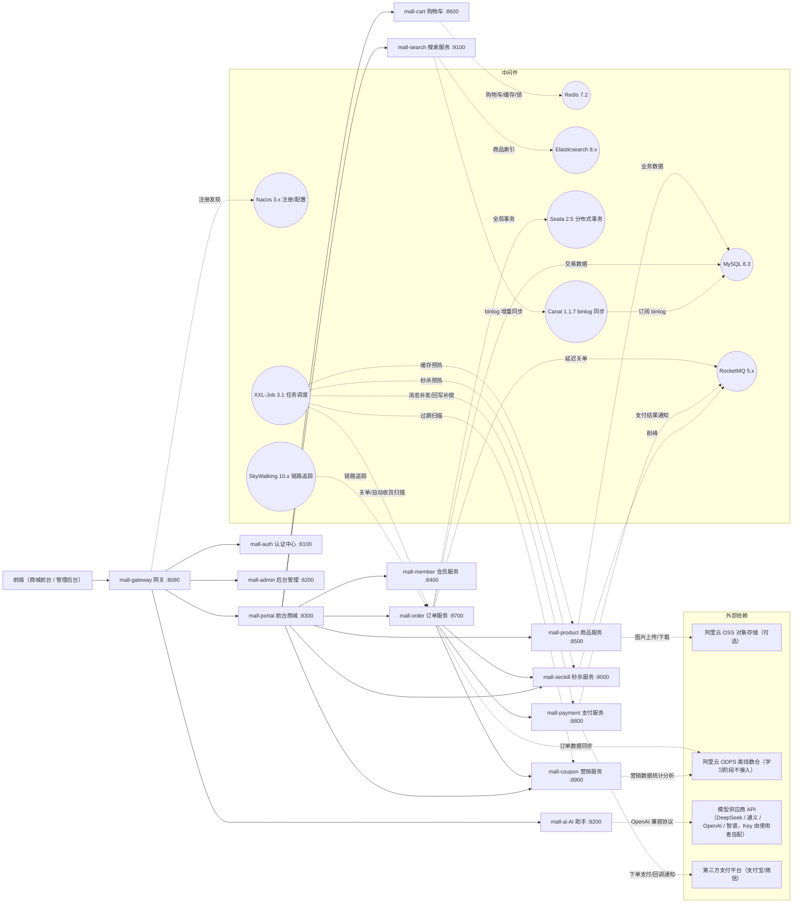
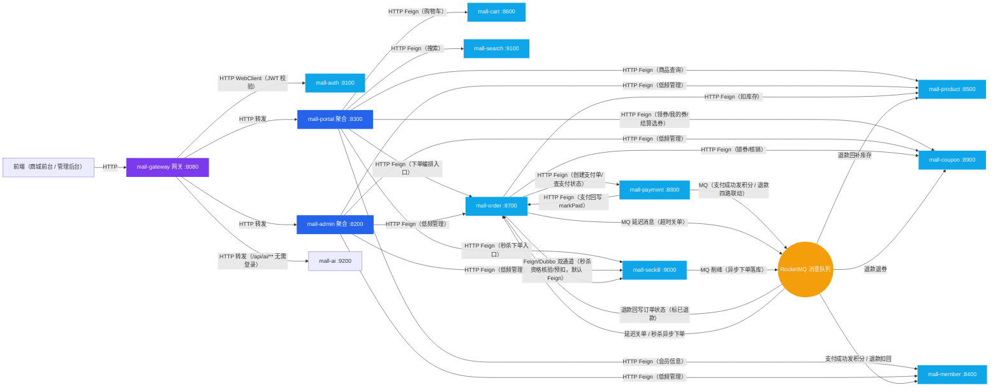
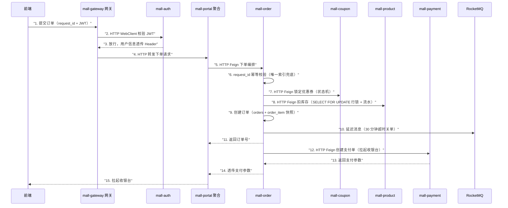

> 本文档为 mall-practice 项目 README 拆分出的专题说明，返回 [README](../README.md)。

## 系统架构（架构图汇总）

> 本章汇总 5 张架构图，按编号连读即完整架构视图：系统拓扑 → 调用协议 → 核心链路时序 → 工程结构 → 模块依赖。
> Mermaid 图渲染提示：GitHub 网页可直接渲染成图；IDEA 默认不渲染 Mermaid，需先安装 Mermaid 插件（Settings → Plugins → Marketplace 搜 Mermaid，安装后重启 IDEA，再打开 Preview/Split 面板）；编辑器源码视图中看到的是代码文本，属正常现象。

### 1. 系统架构图

- 所有请求经 `mall-gateway` 统一入口，网关过滤器调用 `mall-auth` 校验 JWT 后转发到业务服务
- `mall-portal` / `mall-admin` 为聚合层，服务间通过 Nacos 注册发现
- 支付链路：`mall-payment` 对接第三方支付平台（支付宝/微信），完成下单支付与回调通知
- OSS / ODPS 为阿里云公网服务，虚线表示外部依赖（均按需开通，详见"可选安装"）
- 中间件连线为代表性画法：MySQL 连 auth/member/product/order/payment/coupon/seckill/ai 共 8 个业务服务；Redis 供全部业务服务使用（缓存/锁/购物车）；Nacos 注册发现与 SkyWalking 链路追踪覆盖全部 13 服务；admin 对下游的管理调用见下图 2

### 2. 应用调用链路图

> 一眼看清每个服务间调用用的什么协议：核心链路全 Feign（扣库存/锁券/支付），order↔seckill 为 Feign/Dubbo 双通道（默认 Feign，可切换压测），异步场景走 RocketMQ。

- **调用规则**：聚合层（portal/admin）与网关全部走 HTTP；order 作为核心链路发起方对下游（product/coupon/payment）走 HTTP Feign；order↔seckill 为 Feign/Dubbo 双通道（`mall.seckill.remote` 切换，默认 feign，Dubbo 契约见 mall-dubbo-api）；领券/选券/秒杀下单由 portal 直达 coupon/seckill（下单锁券/核销与秒杀资格核验仍走 order）；支付回调成功由 payment 经 Feign markPaid 同步回写订单状态，发积分与退款四路联动（回补库存/退券/扣积分/标退款）走 RocketMQ 异步
- **演进路线**：第一阶段全 Feign 打通链路（已落地）；第二阶段 order→seckill 增加 Dubbo 3 双通道压测对比（`mall.seckill.remote=feign/dubbo` 切换，已落地）；其余链路维持 Feign（全量切 Dubbo 为可选扩展，详见「服务间通信」）

### 3. 核心业务链路时序图

> 下单主链路覆盖 HTTP / MQ 两种协议（order↔seckill 另有 Dubbo 双通道）；对照业务篇「核心业务链路」文字版阅读；支付回调、超时关单、退款、秒杀链路都是本图主链路的变体（详见业务篇「电商技术场景清单」对应场景）。

- 步骤 6～9 处于 Seata AT 全局事务范围（详见「分布式事务策略」）；步骤 10 的延迟消息超时未支付则触发关单：回补库存 + 退回优惠券
- 步骤 1～4 即「登录后进商城还是后台」的答案：入口天然分离（商城/后台是不同站点与路由前缀），登录后网关按 JWT 角色 + 路径前缀分流，不存在登录后二选一

### 4. 工程结构图

> 模块职责明细见「工程结构」章节速查表（按平台 / 层次分四类）；谁依赖谁见下图 5。

```mermaid
graph TB
    ROOT["mall-practice（后端 17 模块 + 前端 2 模块）"]
    ROOT --> BASE["基础 / 契约模块（4 个）"]
    ROOT --> SVC["服务模块（13 个）"]
    ROOT --> FRONT["前端模块（2 个，npm 独立部署）"]
    ROOT --> CFG["工程配置（非 Maven 模块）"]

    BASE --> COMMON["mall-common<br/>统一返回 / 异常 / 工具 / Redis<br/>xxl-job / Redisson / MQ 封装"]
    BASE --> MBG["mall-mbg<br/>实体 / Mapper 生成"]
    BASE --> API["mall-api<br/>Feign 接口契约"]
    BASE --> DUBBOAPI["mall-dubbo-api<br/>Dubbo 接口契约"]

    SVC --> EDGE["平台 / 网关（3 个，无表不落库）"]
    SVC --> BIZ["业务服务（10 个，数据归属）"]

    EDGE --> GW["mall-gateway 网关 :8080"]
    EDGE --> ADMIN["mall-admin 管理后台平台 :8200"]
    EDGE --> PORTAL["mall-portal 前台商城平台 :8300"]

    BIZ --> AUTH["mall-auth 认证中心 :8100<br/>（admin_* 五表）"]
    BIZ --> MEMBER["mall-member 会员服务 :8400"]
    BIZ --> PRODUCT["mall-product 商品服务 :8500"]
    BIZ --> CART["mall-cart 购物车服务 :8600"]
    BIZ --> ORDER["mall-order 订单服务 :8700"]
    BIZ --> PAY["mall-payment 支付服务 :8800"]
    BIZ --> COUPON["mall-coupon 营销服务 :8900"]
    BIZ --> SECKILL["mall-seckill 秒杀服务 :9000"]
    BIZ --> SEARCH["mall-search 搜索服务 :9100"]
    BIZ --> AI["mall-ai AI 助手 :9200<br/>（ai_chat_message 历史）"]

    CFG --> SQLDIR["sql/<br/>mall.sql（30 张表）<br/>xxl_job.sql（调度中心库）"]
    CFG --> DOCKERDIR["docker/<br/>docker-compose.yml + .env<br/>canal/ · rocketmq/ 配置<br/>9 个中间件（12 容器）一键编排"]

    FRONT --> WEBADMIN["mall-web-admin 管理后台<br/>Vue 3 + Element Plus :5173"]
    FRONT --> WEBPORTAL["mall-web-portal 前台商城<br/>Vue 3 + Vant :5174"]

    classDef root fill:#1e293b,stroke:none,color:#fff
    classDef base fill:#059669,stroke:none,color:#fff
    classDef edge fill:#2563eb,stroke:none,color:#fff
    classDef biz fill:#0ea5e9,stroke:none,color:#fff
    classDef cfg fill:#64748b,stroke:none,color:#fff
    classDef front fill:#d97706,stroke:none,color:#fff
    class ROOT root
    class COMMON,MBG,API,DUBBOAPI base
    class EDGE,GW,ADMIN,PORTAL edge
    class BIZ,AUTH,MEMBER,PRODUCT,CART,ORDER,PAY,COUPON,SECKILL,SEARCH,AI biz
    class SQLDIR,DOCKERDIR cfg
    class FRONT,WEBADMIN,WEBPORTAL front
```

### 5. 模块依赖关系图

**核心规则：服务模块之间互不依赖，A 服务不能 import B 服务的类**（微服务与单体架构的分水岭）。跨服务协作只能走两层：

1. **编译期**：依赖基础模块共享类（当前唯一的是 mall-common；将来还有 mall-mbg 实体、mall-api/mall-dubbo-api 接口契约）
2. **运行时**：HTTP / Dubbo RPC / MQ 调用（调用协议见上图 2）

契约消费模式：调用方依赖 mall-api 拿到 Feign 接口 → 运行时经 Nacos 找到提供方实例发起 HTTP 调用；提供方实现同款接口（契约定义在 mall-api，双方共享类）。

```mermaid
graph TB
    COMMON["mall-common<br/>统一返回 / 全局异常 / Redis 工具"]

    subgraph 服务模块
        GW["mall-gateway"]
        AUTH["mall-auth"]
        ADMIN["mall-admin"]
        PORTAL["mall-portal"]
        MEMBER["mall-member"]
        PRODUCT["mall-product"]
        CART["mall-cart"]
        COUPON["mall-coupon"]
        ORDER["mall-order"]
        PAY["mall-payment"]
        SECKILL["mall-seckill"]
        SEARCH["mall-search"]
        AI["mall-ai"]
    end

    MBG["mall-mbg<br/>实体 / Mapper 生成"]
    API["mall-api<br/>Feign 接口契约"]
    DUBBOAPI["mall-dubbo-api<br/>Dubbo 接口契约"]

    AUTH --> COMMON
    ADMIN --> COMMON
    PORTAL --> COMMON
    MEMBER --> COMMON
    PRODUCT --> COMMON
    CART --> COMMON
    COUPON --> COMMON
    ORDER --> COMMON
    PAY --> COMMON
    SECKILL --> COMMON
    SEARCH --> COMMON
    AI --> COMMON

    PORTAL -->|调用契约 已引入| API
    ADMIN -->|调用契约 已引入| API
    AUTH -->|调用契约 已引入| API
    ORDER -->|调用+实现 已引入| API
    PRODUCT -->|实现契约 已引入| API
    CART -->|实现契约 已引入| API
    MEMBER -->|实现契约 已引入| API
    COUPON -->|实现契约 已引入| API
    SECKILL -->|实现契约 已引入| API
    PAY -->|实现契约 已引入| API
    AI -->|调用契约 已引入| API
    ORDER -->|调用 已引入| DUBBOAPI
    SECKILL -->|实现 已引入| DUBBOAPI
    AUTH -->|实体已引入| MBG
    MEMBER -->|实体已引入| MBG
    PRODUCT -->|实体已引入| MBG
    COUPON -->|实体已引入| MBG
    ORDER -->|实体已引入| MBG
    PAY -->|实体已引入| MBG
    SECKILL -->|实体已引入| MBG
    AI -->|实体已引入| MBG

    classDef base fill:#059669,stroke:none,color:#fff
    classDef svc fill:#0ea5e9,stroke:none,color:#fff
    class COMMON,MBG,API,DUBBOAPI base
    class GW,AUTH,ADMIN,PORTAL,MEMBER,PRODUCT,CART,COUPON,ORDER,PAY,SECKILL,SEARCH,AI svc
```

- **实线**：当前编译期依赖（代码里可直接 import 对方的类）；无虚线（规划中的依赖均已落地）
- mall-gateway 零依赖（图中无任何边，属正常）：网关是 WebFlux 反应式栈，mall-common 含 web 注解不兼容
- mall-cart（纯 Redis）/ mall-search（ES 索引）不连 MySQL，因此无 mall-mbg 依赖；聚合层（gateway/admin/portal）无表亦不依赖
- Feign / Dubbo 契约双方共享契约模块：调用方拿接口、提供方实现接口（各自依赖一份，并非服务间直接依赖）
- mall-mbg：8 个有表服务（auth/member/product/order/payment/coupon/seckill/ai）+ mall-common（optional 条件装配）编译期依赖实体/Mapper
- mall-api：auth/admin/portal/member/product/cart/coupon/order/payment/seckill/ai 共 11 个服务依赖（Feign 契约；ai 为 AI 数据问答取数）；mall-search 无契约不依赖（ES 无 Feign 接口）；mall-api 已内置 openfeign 依赖（服务依赖 mall-api 即获得 Feign 能力）
- mall-dubbo-api：order（调用方）/ seckill（提供方）依赖（秒杀核验契约 SeckillDubboService）；product/coupon/payment 未切 Dubbo（维持 Feign）

## 技术栈

### 后端基础

| 技术 | 版本 | 用途 |
|---|---|---|
| JDK | 17 | 运行环境 |
| Maven | 3.9.x（3.9.16） | 构建工具（IDEA Bundled 或独立安装，最低 3.6.3） |
| Spring Boot | 4.0.7 | 核心框架，基于 Spring Framework 7 |
| Spring Cloud | 2025.1.0 | 微服务框架本体（官方组件：网关 Gateway、负载均衡、OpenFeign） |
| Spring Cloud Alibaba | 2025.1.0.0 | 阿里中间件的 Spring Cloud 适配实现：Nacos 注册/配置、Sentinel 限流、Seata 事务（版本前三位跟随 Spring Cloud 2025.1.0） |

### 微服务治理

| 技术 | 版本 | 用途 |
|---|---|---|
| Nacos | 3.x（服务端 3.0.0；客户端 3.1.1 由 SCA（Spring Cloud Alibaba 简写）管理，客户端向后兼容服务端，无需强制对齐） | 注册中心 + 配置中心 |
| Spring Cloud Gateway | 5.0.0（独立版本线，starter 为 spring-cloud-starter-gateway-server-webflux） | API 网关：路由转发、JWT 校验、跨域 |
| Sentinel | 由 SCA 管理 | 限流、熔断、降级（秒杀流量保护） |
| Apache Dubbo | 3.3.6（Boot 4 官方未声明适配；默认 dubbo.enabled=true 走 Triple，启动异常可关闭降级 Feign） | order↔seckill 双通道 RPC（长连接 + 二进制序列化，低延迟高吞吐） |
| OpenFeign | - | 边缘链路 HTTP 调用（契约定义在 `mall-api`） |
| Seata | 2.5.0（客户端与服务端版本已对齐） | 分布式事务：AT 模式（普通链路）；秒杀链路走最终一致性（Redis 预扣 + MQ + 补偿，不引入全局事务） |
| XXL-Job | 3.1.0（客户端 core 与服务端镜像版本对齐） | 分布式任务调度：关单扫描、秒杀预热 |
| SkyWalking | 10.x | 全链路追踪：调用链可视化、性能分析（javaagent 无侵入接入） |

### 数据与中间件

| 技术 | 版本 | 用途 |
|---|---|---|
| MySQL | 8.3 | 核心交易数据 |
| Redis | 7.2 | 缓存、分布式锁、购物车、秒杀预扣库存 |
| Elasticsearch | 8.x | 商品全文搜索 |
| RocketMQ | 5.x | 消息队列：延迟消息关单、削峰、事务消息 |
| 阿里云 OSS | aliyun-sdk-oss 3.18.2（版本随父 pom 管理） | 对象存储（商品图片上传）：UploadStorage 抽象 + 本地/OSS 双通道，`mall.product.oss.enabled=true` 启用 OSS（启动 fail-fast 校验必填配置）、未配置默认本地（阶段 3 已落地） |
| 阿里云 ODPS | 云服务 | 离线数仓（演进方向，学习阶段不接入） |

### 安全与开发

| 技术 | 版本 | 用途 |
|---|---|---|
| Spring Security | 7.x | 认证（登录/token 校验）+ 授权（角色权限） |
| JWT | - | 无状态令牌，网关校验、服务间传递用户信息 |
| MyBatis-Plus | 3.5.17 | ORM（必须用 Boot 4 专属 starter：mybatis-plus-spring-boot4-starter，3.5.13 起支持 Boot 4） |
| springdoc-openapi | 3.1.0（Knife4j 未适配 Boot 4，已改用 springdoc 原生 UI） | 接口文档（各服务 doc.html 在线调试，阶段 1 已落地） |
| JUnit 5 + Mockito | 最新版 | 单元测试（各模块 src/test 内，不建独立测试模块）；全链路联调用 springdoc（doc.html）页面手动验证 |
| Logback + SLF4J | 1.5.x（Boot 4 内置 spring-boot-starter-logging 默认日志栈，无需额外依赖） | 日志框架：控制台 + 滚动文件输出、MDC traceId 跨服务串链（见「日志方案」） |

**信任模型（服务间身份传递）**

- 鉴权只在**网关**：AuthGlobalFilter 校验 JWT（含 Redis 黑名单）后，将 X-User-Id / X-User-Type 注入请求头并**覆盖客户端原值**，再转发下游
- 下游服务（如 mall-ai resolveUser、各业务 UserContext）信任网关注入的头；服务内 AdminApiAuthFilter 仅作「未带头不得入」的直连兜底，**防不了伪造头**
- 因此**业务服务端口（92xx 等）不得直接对公网暴露**，仅网关 8080 对外；内网直连调试属信任环境（若需对公网暴露业务服务，须改用服务间签名/内部 token 方案）

### 前端（仓库内 npm 模块，独立部署）

| 模块 | 端 | 技术栈 | 部署 |
|---|---|---|---|
| mall-web-admin | 管理后台 | Vue 3.5 + TypeScript + Vite 6 + Pinia + Element Plus | Nginx 独立镜像（开发端口 5173） |
| mall-web-portal | 前台商城 | Vue 3.5 + TypeScript + Vite 6 + Pinia + Vant | Nginx 独立镜像（开发端口 5174） |

> 前端两个端为仓库内 npm 模块（mall-web-admin / mall-web-portal），与后端 17 个 Maven 模块独立构建、独立部署；阶段 1 已建立脚手架（路由 / 请求封装 / 状态管理），阶段 2 已交付登录 / 注册 / 个人中心 / 地址管理 / 后台登录 / 用户角色菜单管理页，开发期经 Vite 代理 `/api` → 网关 8080 与后端联调，其余页面随各阶段同步交付。

### 依赖引入状态（骨架 vs 业务开发阶段）

> 判断依据：当前 17 个模块 pom 的实际依赖。**✅ 已引入**的依赖写代码可直接使用；**⏳ 待引入**的依赖在对应场景开发时添加（版本见上方技术栈表，个别适配待验证的已标注）。

| 依赖 | 当前状态 | 归属模块 | 引入时机 |
|---|---|---|---|
| Spring Web / Actuator / Nacos 注册发现 / Lombok | ✅ 已引入 | 全部 13 服务 | - |
| Logback + SLF4J（日志） | ✅ 已内置（spring-boot-starter-logging 随 starter 自动引入，无需显式声明） | 全部服务 | 阶段 1 落地日志配置（滚动文件 + MDC traceId） |
| OpenFeign + LoadBalancer | ✅ 已引入 | mall-portal / mall-admin 各自直接引入；mall-auth 经 mall-api（内置 openfeign）调 mall-member 内部契约 | - |
| MyBatis-Plus + MySQL 驱动 | ✅ 已引入 | auth / member / product / order / payment / coupon / seckill / ai 共 8 个 | - |
| Redis（spring-data-redis） | ✅ 已引入 | mall-common（其余服务经 common 传递获得；gateway 不依赖 common 故无） | - |
| Redisson 分布式锁 | ✅ 已引入（org.redisson:redisson 3.52.0，纯核心库手动装配，避开 starter 的 Boot 4 适配风险） | mall-common（RedissonAutoConfiguration 条件装配，各服务直接注入 RedissonClient） | 领券分布式锁已落地（4.2） |
| RocketMQ 客户端 | ✅ 已引入（spring-cloud-starter-stream-rocketmq，SCA 2025.1.0.0 官方适配 Boot 4） | order/product/coupon/member（消费，含各自 DLQ 死信消费）+ order/seckill（MqSender 直接发送）/ payment（TxMessageService 事务消息发送）+ mall-common（MqSender/TxMessageService/DeadLetterService 封装） | 阶段 5/6/7 落地（8.x MQ 场景全部闭环） |
| Spring Security + JWT | ✅ 已引入 | mall-auth（登录/签发/校验 + @PreAuthorize 按钮级 RBAC）+ mall-gateway（AuthGlobalFilter 经 WebClient 调 auth 校验，/api/admin/** 额外校验 userType=ADMIN，网关自身无 Security/Redis 依赖）；业务服务侧 mall-common AdminApiAuthFilter 对 /api/admin/* 二次校验 X-User-Type（双层防护，防内网直连绕过网关） | 阶段 2 落地 |
| Sentinel 限流 | ✅ 已引入 | mall-seckill（接口限流 / 防刷 / 幂等 token）；网关限流用 Gateway RequestRateLimiter（13.4） | 阶段 7 落地（12.x） |
| Seata 客户端 | ✅ 已引入（SCA 2025.1.0.0 管理，客户端 2.5.0 与服务端镜像 apache/seata-server:2.5.0 对齐） | order（@GlobalTransactional 发起方）+ product/coupon（AT 参与方） | 阶段 5 下单链路落地 |
| XXL-Job core | ✅ 已引入（xxl-job-core 3.1.0，与调度中心镜像 xuxueli/xxl-job-admin:3.1.0 及 sql/xxl_job.sql 表结构版本一致） | mall-common（XxlJobAutoConfiguration 封装，配置 xxl.job.admin.addresses 即注册执行器）+ order/payment/coupon/product/seckill 共 5 个执行器（7 个任务，@Scheduled 本地双通道兜底） | 阶段 2.5/4/5/6/7/14.3 定时任务已接入 |
| Elasticsearch 客户端 | ✅ 已引入（elasticsearch-java 8.17.4，Boot 4 兼容） | mall-search | 阶段 8 落地（搜索 / 联想 / 高亮） |
| 阿里云 OSS SDK（aliyun-sdk-oss 3.18.2） | ✅ 已引入 | mall-product | 阶段 3 落地（图片上传双通道） |
| 接口文档 springdoc-openapi | ✅ 已引入（3.1.0，Boot 4 适配；Knife4j 未适配已弃用） | 全部 13 服务（Servlet 用 webmvc-ui，网关用 webflux-ui），doc.html 已验证 | 阶段 1 落地 |
| Apache Dubbo 3 | ✅ 已引入 | mall-dubbo-api（秒杀契约 SeckillDubboService）+ mall-seckill / mall-order；双通道 mall.seckill.remote=feign / dubbo | 阶段 7 落地（演进第三阶段） |
| SkyWalking | 无需 pom 依赖（javaagent 无侵入） | 全部服务 | 链路追踪演示 |

### 可选增强（暂不引入，刻意精简）

市面生产电商平台标配、但本学习项目刻意不引入的组件，均标注了替代方案与引入时机：

| 组件 | 市面用途 | 本项目替代方案 | 暂不引入理由 |
|---|---|---|---|
| Prometheus + Grafana | 指标监控告警 | Actuator 端点 + SkyWalking 性能分析 | 学习阶段无真实告警需求，SkyWalking 已覆盖观测性 |
| ELK（ES + Logstash + Kibana） | 集中日志检索 | Logback 文件日志 + MDC traceId 串链 | 单机调试场景下文件日志已够，traceId 可串起跨服务链路 |
| CI/CD（GitHub Actions 等） | 自动化构建部署 | IDEA 本地构建 + Docker Compose 手动部署 | 单人开发节奏下无自动化收益 |
| 三方短信服务 | 短信验证码 | Redis 存码 + 控制台日志打印模拟 | 需实名与费用，学习项目用模拟实现同样可演示验证码逻辑 |
| 数据字典 / 定时任务平台 | 配置项集中管理 | Nacos 配置中心 + xxl-job 控制台 | 能力已由现有组件覆盖 |

### 阶段 8 架构进阶验证入口（可选）

| 能力 | 入口 | 前置条件 |
|---|---|---|
| ES 商品搜索（联想 / 高亮） | 前台「商品搜索」页；`GET /api/search?keyword=手机`、`GET /api/search/suggest?prefix=手` | ES 9200 + mall-search 已启动，且已 reindex |
| ES 全量重建索引 | `POST /api/admin/search/reindex`（admin 后台或 curl） | 首次启动或商品数据变更后执行一次 |
| Canal binlog 增量同步 | mall-search 启动后自动订阅（无需接口） | canal-server 容器已启动（`docker compose --profile search up -d`，订阅配置 docker/canal/instance.properties）+ `elasticsearch.canal.enabled=true`（默认 false 演示关闭） |
| Caffeine 多级缓存 | 商品详情接口自动生效（L1 本地 60s → L2 Redis 随机 TTL → L3 DB） | mall-product 启动即可，无前置 |
| 网关限流 | 秒杀路由 20 请求/s、登录路由 10 请求/s（超限返回 429） | Redis 已启动（网关限流依赖 Redis 令牌桶计数） |
| 分库分表演示 | `GET /api/admin/order/sharding/demo?memberId=5` | mall-order 启动；Boot 4 未官方适配 ShardingSphere，以逻辑分表演示兜底 |

